- Table of Contents
  - Enumerations
    - *The **[AssertionValue](#_18_0_2_6340208_1455829091671_996796_4447)** Enumeration*
    - *The **[BallotReceiptMethod](#_18_0_2_6340208_1470255961792_690679_4334)** Enumeration*
    - *The **[ContactMethodType](#_18_0_2_6340208_1464893409742_774328_4470)** Enumeration*
    - *The **[IdentifierType](#_18_0_2_6340208_1446584873809_129867_6769)** Enumeration*
    - *The **[PhoneCapability](#_18_0_2_6340208_1465494051199_895769_4463)** Enumeration*
    - *The **[ReportingUnitType](#_18_0_2_6340208_1458229388461_823405_4464)** Enumeration*
    - *The **[RequestError](#_18_0_2_6340208_1455907053343_466207_4600)** Enumeration*
    - *The **[RequestForm](#_18_0_2_6340208_1452790695464_591325_4742)** Enumeration*
    - *The **[RequestMethod](#_18_0_2_6340208_1467134022102_846181_4446)** Enumeration*
    - *The **[RequestProxyType](#_18_0_2_6340208_1449004272911_37990_4395)** Enumeration*
    - *The **[SignatureSource](#_18_0_2_6340208_1452792593365_422705_4843)** Enumeration*
    - *The **[SignatureType](#_18_0_2_6340208_1452788065978_2204_4435)** Enumeration*
    - *The **[SuccessAction](#_18_0_2_6340208_1465405678263_931387_4502)** Enumeration*
    - *The **[VoterClassificationType](#_18_0_2_6340208_1448395608700_92014_4229)** Enumeration*
    - *The **[VoterHelperType](#_18_0_2_6340208_1470256949646_121440_4436)** Enumeration*
    - *The **[VoterIdType](#_18_0_2_6340208_1448398278987_184146_4431)** Enumeration*
    - *The **[VoterRequestType](#_18_0_2_6340208_1446583913045_906582_6615)** Enumeration*
    - *The **[VoterStatus](#_19_0_43701b0_1536088404947_60047_5153)** Enumeration*
  - Classes
    - *The **[AdditionalInfo](#_18_0_2_6340208_1446587509996_176108_6861)** Class*
    - *The **[BallotRequest](#_18_5_2_43701b0_1510599050811_549888_5731)** Class*
    - *The **[BallotStyle](#_18_5_3_43701b0_1523391256329_329490_7455)** Class*
    - *The **[ContactMethod](#_18_0_2_6340208_1464893400979_739933_4444)** Class*
    - *The **[Election](#_18_5_2_43701b0_1510603645561_775691_5960)** Class*
    - *The **[ElectionAdministration](#_18_0_2_6340208_1458237760549_706380_5243)** Class*
    - *The **[ElectionBasedBallotRequest](#_18_5_3_43701b0_1520358467277_635751_6047)** Class*
    - *The **[Error](#_18_5_3_43701b0_1527771278107_788121_5682)** Class*
    - *The **[ExternalIdentifier](#_18_0_2_6340208_1446584770723_729230_6705)** Class*
    - *The **[File](#_18_0_2_6340208_1452879654116_509055_5255)** Class*
    - *The **[Image](#_18_0_2_6340208_1452879607465_248768_5229)** Class*
    - *The **[LatLng](#_18_0_2_6340208_1458229746146_45435_4773)** Class*
    - *The **[Location](#_18_0_2_6340208_1460480132036_876890_4538)** Class*
    - *The **[Name](#_18_0_2_6340208_1446583854986_538708_5957)** Class*
    - *The **[Party](#_18_0_2_6340208_1446583854985_482559_5956)** Class*
    - *The **[PermanentBallotRequest](#_18_5_3_43701b0_1520358982522_606259_6124)** Class*
    - *The **[PhoneContactMethod](#_18_0_2_6340208_1465493970792_917703_4430)** Class*
    - *The **[ReportingUnit](#_18_0_2_6340208_1458229422042_966646_4539)** Class*
    - *The **[RequestAcknowledgement](#_18_0_2_6340208_1456261767184_144968_4436)** Class*
    - *The **[RequestHelper](#_18_0_2_6340208_1470256600538_323550_4366)** Class*
    - *The **[RequestProxy](#_18_0_2_6340208_1448401688329_700093_4402)** Class*
    - *The **[RequestRejection](#_18_0_2_6340208_1458226815148_390496_4430)** Class*
    - *The **[RequestSuccess](#_18_0_2_6340208_1460483674993_168854_4684)** Class*
    - *The **[Signature](#_18_0_2_6340208_1452788035217_489009_4409)** Class*
    - *The **[TemporalBallotRequest](#_18_5_3_43701b0_1520358515166_885840_6088)** Class*
    - *The **[Voter](#_18_5_3_43701b0_1520354792154_717315_5628)** Class*
    - *The **[VoterClassification](#_18_0_2_6340208_1452701375494_353834_4295)** Class*
    - *The **[VoterId](#_18_0_2_6340208_1448398278986_542661_4430)** Class*
    - *The **[VoterParticipation](#_18_5_3_43701b0_1523390807847_148436_7270)** Class*
    - *The **[VoterRecord](#_18_5_3_43701b0_1521144693004_190730_6034)** Class*
    - *The **[VoterRecords](#_18_5_3_43701b0_1523305927438_977151_6481)** Class*
    - *The **[VoterRecordsRequest](#_18_0_2_6340208_1446583854986_237644_5961)** Class*
    - *The **[VoterRecordsResponse](#_18_0_2_6340208_1455906719413_171772_4514)** Class*
# Enumerations
### <a name="_18_0_2_6340208_1455829091671_996796_4447"></a>*The **AssertionValue** Enumeration*
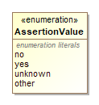
    
Name | Value
---- | -----
`no`|For a voter’s or third party’s assertion of “no” or “false”.
`yes`|For a voter’s or third party’s assertion of “yes” or “true”.
`unknown`|For a voter’s or third party’s assertion of “unknown”.
`other`|For a voter’s or third party’s assertion of “other”.
  ### <a name="_18_0_2_6340208_1470255961792_690679_4334"></a>*The **BallotReceiptMethod** Enumeration*
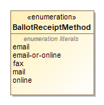
    
Name | Value
---- | -----
`email`|For email only.
`email-or-online`|For electronic mail or downloadable from a website (this value is ambiguous, thus the separate values for email and online).
`fax`|For use of a fax.
`mail`|For postal mail.
`online`|For downloadable from a website, e.g., the voter is sent a hypertext link to a ballot.
  ### <a name="_18_0_2_6340208_1464893409742_774328_4470"></a>*The **ContactMethodType** Enumeration*
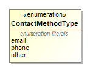
    
Name | Value
---- | -----
`email`|For electronic mail.
`phone`|For use of a phone.
`other`|Used when the type of contact method is not included in this enumeration.
  ### <a name="_18_0_2_6340208_1446584873809_129867_6769"></a>*The **IdentifierType** Enumeration*

    
Name | Value
---- | -----
`fips`|For FIPS codes.
`local-level`|For a code that is specific to a county or other similar locality.
`national-level`|For a code that is used at the national level other than ocd-id.
`ocd-id`|For Open Civic Data identifiers.
`state-level`|For a code that is specific to a state.
`other`|Used when the type of code is not included in this enumeration.
  ### <a name="_18_0_2_6340208_1465494051199_895769_4463"></a>*The **PhoneCapability** Enumeration*
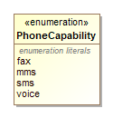
    
Name | Value
---- | -----
`fax`|For telephones that include facsimile capabilities.
`mms`|For telephones that contain Multimedia Messaging Service (MMS) capabilities.
`sms`|For telephones that contain Short Messaging Service (SMS) capabilities.
`voice`|For telephones that contain voice capabilities.
  ### <a name="_18_0_2_6340208_1458229388461_823405_4464"></a>*The **ReportingUnitType** Enumeration*
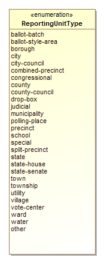
    
Name | Value
---- | -----
`ballot-batch`|Used for reporting batches of ballots that may cross precinct boundaries.
`ballot-style-area`|Used for ballot style areas generally composed of precincts.
`borough`|Used in CT, NJ, PA, other states, and New York City for boroughs. For AK and LA, see county.
`city`|Used for a city that reports results and/or for the district that encompasses it.
`city-council`|Used for city council districts.
`combined-precinct`|Used for one or more precincts that have been combined for the purposes of reporting. Used for “Ward” if “Ward” is used interchangeably with “CombinedPrecinct”.
`congressional`|Used for U.S. Congressional districts.
`county`|Used for a county and/or for the district that encompasses it. In AK, used for counties that are called boroughs. In LA, used for parishes.
`county-council`|Used for county council districts.
`drop-box`|Used for a dropbox for absentee ballots.
`judicial`|Used for judicial districts.
`municipality`|Used as applicable for various units such as towns, townships, villages that report votes and/or for the district that encompasses it.
`polling-place`|Used for a polling place.
`precinct`|Used also for “Ward” or “District” when these terms are used interchangeably with “Precinct”.
`school`|Used for a school district.
`special`|Used for a special district.
`split-precinct`|Used for splits of precincts.
`state`|Used for a state and/or for the district that encompasses it.
`state-house`|Used for a state house or assembly district.
`state-senate`|Used for a state senate district.
`town`|Used in some New England states as a type of municipality that reports votes and/or for the district that encompasses it.
`township`|Used in some mid-western states as a type of municipality that reports votes and/or for the district that encompasses it.
`utility`|Used for a utility district.
`village`|Used as a type of municipality that reports votes and/or for the district that encompasses it.
`vote-center`|Used for a vote center.
`ward`|Used for combinations or groupings of precincts or other units.
`water`|Used for a water district.
`other`|Used for other types of reporting units not included in this enumeration.
  ### <a name="_18_0_2_6340208_1455907053343_466207_4600"></a>*The **RequestError** Enumeration*
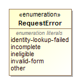
    
Name | Value
---- | -----
`identity-lookup-failed`|A lookup on the voter’s identity failed.
`incomplete`|The registration request is incomplete.
`incomplete-address`|An address is incomplete.
`incomplete-birth-date`|The registration request does not contain a birthdate.
`incomplete-name`|The voter’s name is incomplete.
`incomplete-signature`|The registration request does not contain a signature.
`ineligible`|The voter is ineligible to be registered.
`invalid-form`|The registration form specified is invalid.
`other`|Used when the type of error is not included in this enumeration.
  ### <a name="_18_0_2_6340208_1452790695464_591325_4742"></a>*The **RequestForm** Enumeration*
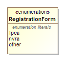
    
Name | Value
---- | -----
`fpca`|For the Federal Post Card Application form.
`nvra`|For the National Voter Registration Act form.
`other`|Used when the type of form is not included in this enumeration.
  ### <a name="_18_0_2_6340208_1467134022102_846181_4446"></a>*The **RequestMethod** Enumeration*
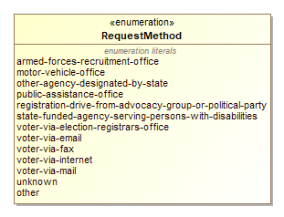
    
Name | Value
---- | -----
`armed-forces-recruitment-office`|The voter assisted by an armed forces recruitment office.
`motor-vehicle-office`|The voter via an MVA/DMV.
`other-agency-designated-by-state`|The voter assisted by an unspecified state-designated agency.
`public-assistance-office`|The voter assisted by a public assistance office.
`registration-drive-from-advocacy-group-or-political-party`|The voter via a registration drive.
`state-funded-agency-serving-persons-with-disabilities`|The voter assisted by a state-designated agency serving persons with disabilities.
`voter-via-election-registrars-office`|The voter via an election or registrar’s office.
`voter-via-email`|The voter via email.
`voter-via-fax`|The voter via fax.
`voter-via-internet`|The voter via the Internet, e.g., a website.
`voter-via-mail`|The voter via postal mail.
`unknown`|The method used is unknown.
`other`|Used when the type of method is not included in this enumeration.
  ### <a name="_18_0_2_6340208_1449004272911_37990_4395"></a>*The **RequestProxyType** Enumeration*
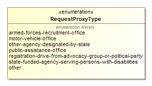
    
Name | Value
---- | -----
`armed-forces-recruitment-office`|The voter assisted by an armed forces recruitment office.
`motor-vehicle-office`|The voter via an MVA/DMV.
`other-agency-designated-by-state`|The voter assisted by an unspecified state-designated agency.
`public-assistance-office`|The voter assisted by a public assistance office.
`registration-drive-from-advocacy-group-or-political-party`|The voter via a registration drive.
`state-funded-agency-serving-persons-with-disabilities`|The voter assisted by a state-designated agency serving persons with disabilities.
`other`|Used when the type of source is not included in this enumeration.
  ### <a name="_18_0_2_6340208_1452792593365_422705_4843"></a>*The **SignatureSource** Enumeration*
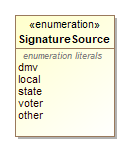
    
Name | Value
---- | -----
`dmv`|For the department of motor vehicles or motor vehicle authority.
`local`|For an unspecified local source.
`state`|For an unspecified state source.
`voter`|The voter has included a signature on the form.
`other`|Used when the source of the signature is not included in this enumeration.
  ### <a name="_18_0_2_6340208_1452788065978_2204_4435"></a>*The **SignatureType** Enumeration*
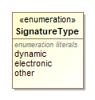
    
Name | Value
---- | -----
`dynamic`|For use with biometrics or other artifacts captured as part of the act of the voter signing the registration form.
`electronic`|For a facsimile of the signature applied to a marking surface, e.g., paper.
`other`|Used when the type of signature is not included in this enumeration.
  ### <a name="_18_0_2_6340208_1465405678263_931387_4502"></a>*The **SuccessAction** Enumeration*
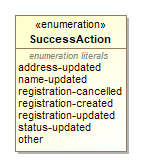
    
Name | Value
---- | -----
`address-updated`|For indicating that an address was updated.
`name-updated`|For indicating that a name was updated.
`registration-cancelled`|For indicating that a registration was cancelled.
`registration-created`|For indicating that a registration was created.
`registration-updated`|For indicating that a registration was updated.
`status-updated`|For indicating that a registration status was updated.
`other`|Used for other types of success actions not included in this enumeration.
  ### <a name="_18_0_2_6340208_1448395608700_92014_4229"></a>*The **VoterClassificationType** Enumeration*
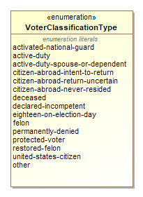
    
Name | Value
---- | -----
`activated-national-guard`|The voter is an activated National Guard member on State orders (FPCA).
`active-duty`|The voter is a member of the Uniformed Services or Merchant Marine on active duty (FPCA).
`active-duty-spouse-or-dependent`|The voter is an eligible spouse or dependent (FPCA).
`citizen-abroad-intent-to-return`|The voter is a US citizen residing outside the US and has intention to return (FPCA).
`citizen-abroad-return-uncertain`|The voter is a US citizen residing outside the US and their return is uncertain (FPCA).
`citizen-abroad-never-resided`|The voter is a US citizen and has never resided in the US (FPCA).
`deceased`|The voter is deceased (NVRA).
`declared-incompetent`|The voter has been declared incompetent (NVRA).
`eighteen-on-election-day`|The voter will be 18 on election day (NVRA).
`felon`|The voter is a felon (NVRA).
`permanently-denied`|The voter has not been permanently denied (NVRA).
`protected-voter`|The voter status is protected (NVRA).
`restored-felon`|The voter is a restored felon (NVRA).
`united-states-citizen`|The voter is a United States citizen (NVRA).
`other`|Used when the type of voter classification is not included in this enumeration.
  ### <a name="_18_0_2_6340208_1470256949646_121440_4436"></a>*The **VoterHelperType** Enumeration*
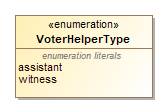
    
Name | Value
---- | -----
`assistant`|For a registration assistant.
`witness`|For a registration witness.
  ### <a name="_18_0_2_6340208_1448398278987_184146_4431"></a>*The **VoterIdType** Enumeration*
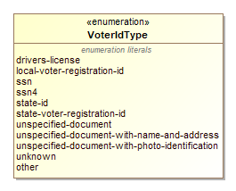
    
Name | Value
---- | -----
`drivers-license`|Used for a driver’s license.
`local-voter-registration-id`|Used for a local voter registration ID.
`ssn`|Used for a complete Social Security number.
`ssn4`|Used for the last four digits of a Social Security number.
`state-id`|Used for a state ID that is not a state voter registration ID.
`state-voter-registration-id`|Used for a state’s voter registration ID.
`unspecified-document`|Used for an unspecified document, not known whether the document contains name, address, or photo ID.
`unspecified-document-with-name-and-address`|Used for a document that contains the voter’s name and address, such as a utility bill.
`unspecified-document-with-photo-identification`|Used for a document that contains a photograph of the voter.
`unknown`|Used for documentation that was not captured.
`other`|Used when the type of ID is not included in this enumeration.
  ### <a name="_18_0_2_6340208_1446583913045_906582_6615"></a>*The **VoterRequestType** Enumeration*
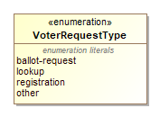
    
Name | Value
---- | -----
`ballot-request`|For requesting a ballot, possibly in conjunction with an FPCA registration request.
`lookup`|For a voter registration lookup.
`registration`|For a voter registration request.
`other`|Used when the type of request is not included in this enumeration.
  ### <a name="_19_0_43701b0_1536088404947_60047_5153"></a>*The **VoterStatus** Enumeration*
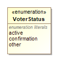
    
Name | Value
---- | -----
`active`|For a voter in active status.
`confirmation`|For a voter in confirmation status
`other`|Used when the type of voter status is not included in this enumeration.
  # Classes
### <a name="_18_0_2_6340208_1446587509996_176108_6861"></a>*The **AdditionalInfo** Class*
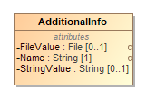

Class for specifying information not addressed in this model by other attributes, e.g. state-specific information that does not “fit” in any other attribute. The information will thus be highly specific to the generating application, and consuming applications must “know” the meaning of the information to make use of it. For this reason, use of this class is discouraged as much as is possible.

 

The [StringValue](#_18_0_2_6340208_1446587603679_902003_6890) and [FileValue](#_18_0_2_6340208_1464186843386_982801_4458) attributes are both optional, however exactly one of them must be included.

Attribute | Multiplicity | Type | Attribute Description
--------- | ------------ | ---- | ---------------------
`FileValue`|0..1|`File`|Used if the value is in a file; contains the filename and MIME type
`Name`|1|`String`|Name of the value.
`StringValue`|0..1|`String`|Used if the value is a string; contains the string.

#### Business Rules

FileValue or StringValue must be defined (but not both):

```OCL2.0
not self.StringValue.oclIsUndefined() xor not self.FileValue.oclIsUndefined()
```

### <a name="_18_5_2_43701b0_1510599050811_549888_5731"></a>*The **BallotRequest** Class*
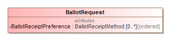

An abstract class representing a request for a ballot. Classes for specific types of BallotRequest inherit the attributes and define their own.

Attribute | Multiplicity | Type | Attribute Description
--------- | ------------ | ---- | ---------------------
`BallotReceiptPreference`|0..*|`BallotReceiptMethod`|The voter's preference on how to receive their ballot in order from their most preferred method to least, used if it is a pre-election day ballot request. If omitted, the default method for the [form](#_18_0_2_6340208_1452790770728_957008_4772) will be used.
`MailForwardingAddress`|0..1|`Address`|
### <a name="_18_5_3_43701b0_1523391256329_329490_7455"></a>*The **BallotStyle** Class*
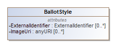

For referencing a ballot style defined elsewhere, such as in an Election Management System (EMS).

Attribute | Multiplicity | Type | Attribute Description
--------- | ------------ | ---- | ---------------------
`ExternalIdentifier`|0..*|`ExternalIdentifier`|For associating an ID with the ballot style.
`ImageUri`|0..*|`anyURI`|URI for a ballot image.
`Party`|0..*|`Party`|Unique identifier for one or more Party instances. For associating one or more parties with the ballot style.
### <a name="_18_0_2_6340208_1464893400979_739933_4444"></a>*The **ContactMethod** Class*
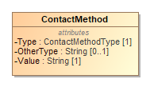

Used in request and response messages.

 

[ElectionAdministration](#_18_0_2_6340208_1458237760549_706380_5243) optionally includes this class to specify how to contact the election administration.

 

[Voter](#_18_5_3_43701b0_1520354792154_717315_5628) optionally includes this class to specify the method for contacting a voter regarding the voter’s request. If the voter can be contacted in multiple ways, the application creating the data should order the occurrences of [ContactMethod](#_18_0_2_6340208_1464893400979_739933_4444) by priority.

 

The [PhoneContactMethod](#_18_0_2_6340208_1465493970792_917703_4430) class uses [ContactMethod](#_18_0_2_6340208_1464893400979_739933_4444) as a base class, and should be used with when the contact method is for a telephone and it is necessary to describe the capabilities of the telephone.

 

The [Capability](#_18_0_2_6340208_1465493985158_54379_4458) attribute is provided by the [PhoneContactMethod](#_18_0_2_6340208_1465493970792_917703_4430) class.

Attribute | Multiplicity | Type | Attribute Description
--------- | ------------ | ---- | ---------------------
`OtherType`|0..1|`String`|Used when ContactMethodType value is other.
`Type`|1|`ContactMethodType`|The contact method type, e.g. email or phone.
`Value`|1|`String`|The value of the ContactMethod. This will be the text value of the phone number, email address, or other mechanism. The values must be free of any formatting characters, such as parentheses or dashes for a phone number.

#### Business Rules

OtherType must be defined when Type = other:

```OCL2.0
self.Type = ContactMethodType::other implies not self.OtherType.oclIsUndefined()
```

### <a name="_18_5_2_43701b0_1510603645561_775691_5960"></a>*The **Election** Class*
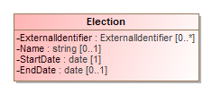

Used in request and response messages. Describes an election event. Only the date of the election is required. Other attributes may be used to describe the election for which a ballot is requested or a voter participated.

Attribute | Multiplicity | Type | Attribute Description
--------- | ------------ | ---- | ---------------------
`EndDate`|0..1|`date`|For an election that spans multiple days, the last day of the election.
`ExternalIdentifier`|0..*|`ExternalIdentifier`|For associating an ID with the election.
`Name`|0..1|`String`|For including a name for the election; the name could be the same name as appears on the ballot.
`StartDate`|1|`date`|The first day of the election.

#### Business Rules

The start date must occur before or at the end date:

```English
StartDate <= EndDate
```

### <a name="_18_0_2_6340208_1458237760549_706380_5243"></a>*The **ElectionAdministration** Class*
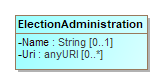

Used in response messages.

 
[ElectionAdministration](#_18_0_2_6340208_1458237760549_706380_5243) optionally includes [ContactMethod](#_18_0_2_6340208_1467137072139_851331_4587) to specify contact information for the election authority.

Attribute | Multiplicity | Type | Attribute Description
--------- | ------------ | ---- | ---------------------
`ContactMethod`|0..*|`ContactMethod`|For including various contact information.
`Location`|0..1|`Location`|Location of the election authority.
`Name`|0..1|`String`|Name of the election authority.
`Uri`|0..*|`anyURI`|A URL for the election authority.
### <a name="_18_5_3_43701b0_1520358467277_635751_6047"></a>*The **ElectionBasedBallotRequest** Class*
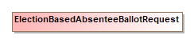

Used in request messages.

 

Implementation of [BallotRequest](#_18_5_2_43701b0_1510599050811_549888_5731) in which a ballot for a single election event is requested.

Attribute | Multiplicity | Type | Attribute Description
--------- | ------------ | ---- | ---------------------
`Election`|1|`Election`|The election for which the ballot is requested.
### <a name="_18_5_3_43701b0_1527771278107_788121_5682"></a>*The **Error** Class*
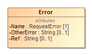

Used in response messages. RequestRejection includes this class to describe the errors that caused the rejection.

Attribute | Multiplicity | Type | Attribute Description
--------- | ------------ | ---- | ---------------------
`Name`|1|`RequestError`|Used to indicate the type of error.
`OtherError`|0..1|`String`|Used when RegistrationError value is other.
`Ref`|0..1|`String`|Reference (e.g. XPath) to the entity that the error applies.
### <a name="_18_0_2_6340208_1446584770723_729230_6705"></a>*The **ExternalIdentifier** Class*
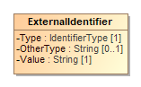

Used in request and response messages.

 

[BallotStyle](#_18_5_3_43701b0_1523391256329_329490_7455), [Election](#_18_5_2_43701b0_1510603645561_775691_5960), [Party](#_18_0_2_6340208_1446583854985_482559_5956) and [ReportingUnit](#_18_0_2_6340208_1458229422042_966646_4539) optionally include this class for associating a jurisdiction’s codes, i.e., identifiers, with political parties or geopolitical units such as counties, towns, precincts, etc. Multiple occurrences of [ExternalIdentifier](#_18_0_2_6340208_1446584770723_729230_6705) can be used to associate multiple codes, e.g., if there is a desire to associate multiple codes with an object such as state-specific codes as well as OCD-IDs (Open Civic Data Identifiers).

Attribute | Multiplicity | Type | Attribute Description
--------- | ------------ | ---- | ---------------------
`OtherType`|0..1|`String`|Used when Type value is other.
`Type`|1|`IdentifierType`|An identifier type, e.g., FIPS.
`Value`|1|`String`|The identifier used by the jurisdiction.

#### Business Rules

OtherType must be defined when Type = other:

```OCL2.0
self.Type = IdentifierType::other implies not self.OtherType.oclIsUndefined()
```

### <a name="_18_0_2_6340208_1452879654116_509055_5255"></a>*The **File** Class*
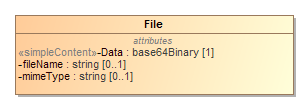

Used in request messages.

 

[VoterId](#_18_0_2_6340208_1448398278986_542661_4430) optionally uses this class for [FileValue](#_18_0_2_6340208_1464186405548_20750_4438) to specify a filename for voter identification purposes such as for a utility bill. [AdditionalInfo](#_18_0_2_6340208_1446587509996_176108_6861) also optionally includes [FileValue](#_18_0_2_6340208_1464186843386_982801_4458).

 

File extends the xsd:base64Binary type to add the attributes for filename and (Multi-Purpose Internet Mail Extensions) MIME type, e.g., application/pdf for a file of type PDF.

 

The [Image](#_18_0_2_6340208_1452879607465_248768_5229) element uses this class as an supertype, thus [Image](#_18_0_2_6340208_1452879607465_248768_5229) can be used when the type of file is for an image, e.g., image/png.

Attribute | Multiplicity | Type | Attribute Description
--------- | ------------ | ---- | ---------------------
`Data`|1|`base64Binary`|The file content encoded using base64.
`fileName`|0..1|`string`|The filename.
`mimeType`|0..1|`string`|The MIME type associated with the file.
### <a name="_18_0_2_6340208_1452879607465_248768_5229"></a>*The **Image** Class*


Used in request messages.

 

[Signature](#_18_0_2_6340208_1452788035217_489009_4409) optionally includes this class to indicate that a file contains an image of a voter’s signature. Image uses [File](#_18_0_2_6340208_1452879654116_509055_5255) as supertype, thus attributes of [File](#_18_0_2_6340208_1452879654116_509055_5255) can be included in Image.

Attribute | Multiplicity | Type | Attribute Description
--------- | ------------ | ---- | ---------------------
### <a name="_18_0_2_6340208_1458229746146_45435_4773"></a>*The **LatLng** Class*
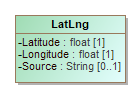

Used in response messages.

 

[Location](#_18_0_2_6340208_1460480132036_876890_4538) optionally includes this element to specify the latitude and longitude of a voter’s voting location.

Attribute | Multiplicity | Type | Attribute Description
--------- | ------------ | ---- | ---------------------
`Latitude`|1|`float`|Latitude of the location.
`Longitude`|1|`float`|Longitude of the location.
`Source`|0..1|`String`|System used to perform the lookup from location name to lat/lng, e.g., the name of a geocoding service.
### <a name="_18_0_2_6340208_1460480132036_876890_4538"></a>*The **Location** Class*
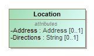

Used in response messages.

 

[ReportingUnit](#_18_0_2_6340208_1458229422042_966646_4539) and [ElectionAdministration](#_18_0_2_6340208_1458237760549_706380_5243) optionally include this element to specify the address and directions to a voter’s voting location. The [LatLng](#_18_0_2_6340208_1458229746146_45435_4773) element can be included to specify the latitude and longitude of the voting location.

Attribute | Multiplicity | Type | Attribute Description
--------- | ------------ | ---- | ---------------------
`Address`|0..1|`Address`|Address of the voting location.
`Directions`|0..1|`String`|Directions to the voting location.
`LatLng`|0..1|`LatLng`|Latitude/longitude of the voting location.
### <a name="_18_0_2_6340208_1446583854986_538708_5957"></a>*The **Name** Class*
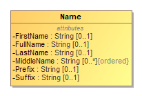

Used in request messages.

 

[Voter](#_18_5_3_43701b0_1520354792154_717315_5628) includes this class for specifying the name of a voter and, optionally, for specifying a previous name of the voter, using [PreviousName](#_18_5_3_43701b0_1520545273362_721771_5308) instead of Name. [RequestHelper](#_18_0_2_6340208_1470256600538_323550_4366) also includes this class for specifying the name of a registration helper.

 

Multiple occurrences of the [MiddleName](#_18_0_2_6340208_1453305616868_302875_4310) attribute can be used as needed, e.g., for names with additional middle names or nicknames such as “John Andrew Winston (Jack) Smith”.

 

All elements are optional, however at least [FullName](#_18_0_2_6340208_1446591484368_838009_7101) must be included if the other attributes are not.

Attribute | Multiplicity | Type | Attribute Description
--------- | ------------ | ---- | ---------------------
`FirstName`|0..1|`String`|Person’s first (given) name.
`FullName`|0..1|`String`|Person’s full name.
`LastName`|0..1|`String`|Person’s last (family) name.
`MiddleName`|0..*|`String`|Person’s middle name.
`Prefix`|0..1|`String`|A prefix associated with the person, e.g., Mr.
`Suffix`|0..1|`String`|A suffix associated with the person, e.g., Jr.

#### Business Rules

:

```OCL2.0
self.FirstName.oclIsUndefined() and self.LastName.oclIsUndefined() and self.MiddleName->size() = 0 and self.Prefix.oclIsUndefined() and self.Suffix..oclIsUndefined() 
implies not self.FullName.oclIsUndefined() 
```

### <a name="_18_0_2_6340208_1446583854985_482559_5956"></a>*The **Party** Class*
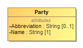

Used in request messages.

 

[BallotStyle](#_18_5_3_43701b0_1523391256329_329490_7455) optionally includes this attribute to specify the associated political party, such as for closed primaries.

 

[Voter](#_18_5_3_43701b0_1520354792154_717315_5628) optionally includes this attribute to specify a voter’s political party.

Attribute | Multiplicity | Type | Attribute Description
--------- | ------------ | ---- | ---------------------
`Abbreviation`|0..1|`String`|Short name for the party, e.g., “DEM”.
`ExternalIdentifier`|0..*|`ExternalIdentifier`|For associating an ID with the party.
`Name`|1|`String`|Official full name of the party, e.g., “Republican”.
### <a name="_18_5_3_43701b0_1520358982522_606259_6124"></a>*The **PermanentBallotRequest** Class*


Used in request messages.

 

Implementation of [BallotRequest](#_18_5_2_43701b0_1510599050811_549888_5731) which serves to request ballots for election events that the voter is qualified on a long term basis. Although "permanent", the request may be subject to renewal or cancellation procedures.

Attribute | Multiplicity | Type | Attribute Description
--------- | ------------ | ---- | ---------------------
### <a name="_18_0_2_6340208_1465493970792_917703_4430"></a>*The **PhoneContactMethod** Class*
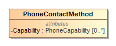

Used in request and response messages.

 

[RequestHelper](#_18_0_2_6340208_1470256600538_323550_4366), and [RequestProxy](#_18_0_2_6340208_1448401688329_700093_4402) use this class to specify a telephone number as well as the capabilities of the telephone, e.g., sms, fax, etc.

 

PhoneContactMethod is subtype of [ContactMethod](#_18_0_2_6340208_1464893400979_739933_4444). Thus, the elements that include [ContactMethod](#_18_0_2_6340208_1464893400979_739933_4444) could use PhoneContactMethod as applicable.

Attribute | Multiplicity | Type | Attribute Description
--------- | ------------ | ---- | ---------------------
`Capability`|0..*|`PhoneCapability`|Specifies the phone’s capabilities, e.g., fax, sms.
### <a name="_18_0_2_6340208_1458229422042_966646_4539"></a>*The **ReportingUnit** Class*
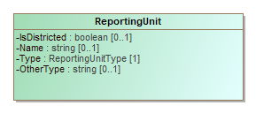

Used in response messages.

 

[RequestSuccess](#_18_0_2_6340208_1460483674993_168854_4684) and [VoterRecord](#_18_5_3_43701b0_1521144693004_190730_6034) include this class so as to provide a list of geopolitical geography associated with the voter’s registration, e.g., the voter’s precinct, polling place, districts, etc. The Type attribute uses the [ReportingUnitType](#_18_0_2_6340208_1458229388461_823405_4464) enumeration to specify the type of geopolitical geography being defined. If the reporting unit type is not listed in enumeration [ReportingUnitType](#_18_0_2_6340208_1458229388461_823405_4464), use other and include the reporting unit type (that is not listed in the enumeration) in OtherType.

 

The IsDistricted boolean is not strictly necessary, as it is possible to identify districts by their Type attribute. However, if the type of district is not listed in the [ReportingUnitType](#_18_0_2_6340208_1458229388461_823405_4464) enumeration and therefore OtherType is used, then IsDistricted is necessary. The IsDistricted boolean can also be used to signify that a ReportingUnit defined as a jurisdiction, e.g., a county, is also used as a district for, e.g., county-wide contests.

Attribute | Multiplicity | Type | Attribute Description
--------- | ------------ | ---- | ---------------------
`ExternalIdentifier`|0..*|`ExternalIdentifier`|For associating an ID with the ReportingUnit.
`IsDistricted`|0..1|`boolean`|Boolean to indicate that the reporting unit is a district.
`Location`|0..1|`Location`|Location of the district office.
`Name`|0..1|`String`|Name of the reporting unit.Name of the reporting unit.
`OtherType`|0..1|`String`|Used when ReportingUnitType value is other.
`Type`|1|`ReportingUnitType`|Enumerated type of reporting unit, e.g., district, precinct.
### <a name="_18_0_2_6340208_1456261767184_144968_4436"></a>*The **RequestAcknowledgement** Class*


Used in response messages. For indicating that the request was received but action on the request is pending.

Attribute | Multiplicity | Type | Attribute Description
--------- | ------------ | ---- | ---------------------
### <a name="_18_0_2_6340208_1470256600538_323550_4366"></a>*The **RequestHelper** Class*
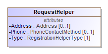

[VoterRecordsRequest](#_18_0_2_6340208_1446583854986_237644_5961) optionally includes this element to specify information about a request helper, i.e., a request assistant or witness involved in a voter’s request.

 

RequestHelper includes the [Name](#_18_0_2_6340208_1446583854986_538708_5957) element to specify the registration helper’s name and optionally includes the [Signature](#_18_0_2_6340208_1452788035217_489009_4409) element if a registration helper’s signature is required.

Attribute | Multiplicity | Type | Attribute Description
--------- | ------------ | ---- | ---------------------
`Address`|0..1|`Address`|Address of the request helper.
`Name`|0..1|`Name`|To specify the name of the helper.
`Phone`|0..1|`PhoneContactMethod`|Request helper’s phone number.
`Signature`|0..1|`Signature`|To specify the signature of the helper.
`Type`|1|`VoterHelperType`|To specify the type of helper, e.g., assistant.
### <a name="_18_0_2_6340208_1448401688329_700093_4402"></a>*The **RequestProxy** Class*
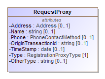

Used in request messages.

 

[VoterRecordsRequest](#_18_0_2_6340208_1446583854986_237644_5961) optionally includes this class to specify information about a request proxy involved in a voter records request.

 

OriginTransactionId can be used to include an optional identifier of the originating external transaction from the proxy, e.g., used for the transaction ID generated by a DMV application enacting a voter registration request to a registration portal application (on behalf of a citizen obtaining a driver’s license). This sub-element is not to be confused with TransactionId in [VoterRecordsRequest](#_18_0_2_6340208_1446583854986_237644_5961), which is used to include a transaction ID of the voter records request, e.g., the transaction ID of the registration portal’s voter records request.

Attribute | Multiplicity | Type | Attribute Description
--------- | ------------ | ---- | ---------------------
`Address`|0..1|`Address`|An address associated with the proxy.
`Name`|0..1|`String`|A name associated with the proxy.
`OriginTransactionId`|0..1|`String`|An identifier associated with the transaction between the proxy and, e.g., the registration portal.
`OtherType`|0..1|`String`|Used when RegistrationProxyType value is other.
`Phone`|0..1|`PhoneContactMethod`|A phone number associated with the proxy.
`TimeStamp`|0..1|`date`|The date of the request from the proxy.
`Type`|1|`RequestProxyType`|The type of the requesting proxy, e.g., motor-vehicle-office, voter-via-email.

#### Business Rules

OtherType must be defined when Type = other:

```OCL2.0
self.Type = RequestProxyType::other implies not self.OtherType.oclIsUndefined()
```

### <a name="_18_0_2_6340208_1458226815148_390496_4430"></a>*The **RequestRejection** Class*
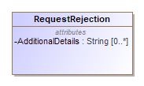

Used in responses. For indicating that the request failed. The Error attribute is used to indicate the type of error that occurred. The AdditionalDetails attribute can be used to provide more information as to the rejection.

Attribute | Multiplicity | Type | Attribute Description
--------- | ------------ | ---- | ---------------------
`AdditionalDetails`|0..*|`string`|Used to provide additional details as applicable.
`Error`|0..*|`Error`|For associating a RequestRejection with one or more Errors.
### <a name="_18_0_2_6340208_1460483674993_168854_4684"></a>*The **RequestSuccess** Class*
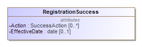

Used in responses. For indicating a successful response to a request. The Action attribute is used to indicate the action that occurred, which may differ from what was requested. For example, a request for a new voter registration may succeed, but if the voter was already registered, the response may indicate a registration update as opposed to a registration create. The response also includes, optionally, other information useful to the voter, including a description of the voter’s polling place, districts (i.e., contests) associated with the polling place, or other geopolitical geographies such as the voter’s precinct.

Attribute | Multiplicity | Type | Attribute Description
--------- | ------------ | ---- | ---------------------
`Action`|0..*|`SuccessAction`|Used to indicate the action that occurred.
`District`|0..*|`ReportingUnit`|One or more districts associated with the voter’s precinct.
`EffectiveDate`|0..1|`date`|The effective date of the action.
`ElectionAdministration`|0..1|`ElectionAdministration`|The election administration that conducts elections for the voter.
`Locality`|0..*|`ReportingUnit`|Other geographies such as the voter’s precinct.
`PollingPlace`|0..1|`ReportingUnit`|The voter’s polling place.
### <a name="_18_0_2_6340208_1452788035217_489009_4409"></a>*The **Signature** Class*
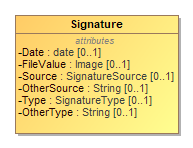

Used in request messages.

 

[Voter](#_18_5_3_43701b0_1520354792154_717315_5628) optionally includes this class for specifying information about a voter’s signature on a registration request. If there is a need to include previous signature that uses a different name, e.g., a maiden name, [Voter](#_18_5_3_43701b0_1520354792154_717315_5628) uses PreviousSignature instead of Signature.

 

[RequestHelper](#_18_0_2_6340208_1470256600538_323550_4366) optionally includes this class for specifying information about the helper's signature.

 

Source is used to specify the source of the voter’s signature, for example, on file at a department of motor vehicles. FileValue is used to include an image of the voter’s signature.

Attribute | Multiplicity | Type | Attribute Description
--------- | ------------ | ---- | ---------------------
`Date`|0..1|`date`|The date of the signature, i.e., when created.
`FileValue`|0..1|`Image`|The signature image in base 64 binary
`OtherSource`|0..1|`String`|Used when Source value is other.
`OtherType`|0..1|`String`|Used when SignatureType value is other.
`Source`|0..1|`SignatureSource`|A source for the signature, e.g., dmv.
`Type`|0..1|`SignatureType`|A signature type, e.g., dynamic.

#### Business Rules

OtherType must be defined when Type = other:

```OCL2.0
self.Type = SignatureType::other implies not self.OtherType.oclIsUndefined()
```

### <a name="_18_5_3_43701b0_1520358515166_885840_6088"></a>*The **TemporalBallotRequest** Class*
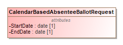

Implementation of [BallotRequest](#_18_5_2_43701b0_1510599050811_549888_5731) in which election opportunities that the voter is qualified during a given time frame will be requested.

Attribute | Multiplicity | Type | Attribute Description
--------- | ------------ | ---- | ---------------------
`EndDate`|1|`date`|The date at which the request is no longer effective.
`StartDate`|1|`date`|The date at which the request comes into effect.

#### Business Rules

The start date must occur before or at the end date:

```English
StartDate <= EndDate
```

### <a name="_18_5_3_43701b0_1520354792154_717315_5628"></a>*The **Voter** Class*
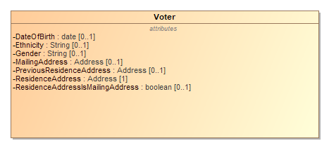

Voter contains attributes specific to identifying a voter.

Attribute | Multiplicity | Type | Attribute Description
--------- | ------------ | ---- | ---------------------
`ContactMethod`|0..*|`ContactMethod`|How to contact the voter, listed in order of preference.
`DateOfBirth`|0..1|`date`|The voter’s data of birth in YYYY-MM-DD format.
`Ethnicity`|0..1|`String`|The voter’s ethnicity.
`Gender`|0..1|`String`|Older systems may not understand values other than 'Male' or 'Female' (the only choices available on FPCA).
`MailingAddress`|0..1|`Address`|Where the voter receives postal mail, mapped to the FGDC specification Address classes.
`Name`|1|`Name`|Voter’s name.
`Party`|0..1|`Party`|Voter’s political party.
`PreviousName`|0..1|`Name`|A voter’s previous name.
`PreviousResidenceAddress`|0..1|`Address`|Where the voter was previously registered, mapped to the FGDC specification Address classes.
`PreviousSignature`|0..1|`Signature`|Information about a previous voter signature on the registration form.
`ResidenceAddress`|1|`Address`|Where the voter is registered or requests to be registered, mapped to the FGDC specification Address classes.
`ResidenceAddressIsMailingAddress`|0..1|`boolean`|If set to true, MailingAddress need not be included.
`Signature`|0..1|`Signature`|Information about the voter signature on the registration form.
`VoterClassification`|0..*|`VoterClassification`|How the voter is classified per assertions the voter has made on a registration form.
`VoterId`|0..*|`VoterId`|Information to provide voter identity.
### <a name="_18_0_2_6340208_1452701375494_353834_4295"></a>*The **VoterClassification** Class*
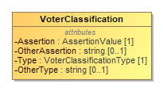

[Voter](#_18_5_3_43701b0_1520354792154_717315_5628) optionally includes this class to describe a voter’s classification per criteria on the voter’s request form, e.g., united-states-citizen or eighteen-on-election-day.

 

VoterClassification includes assertions of the voter in response to the voter request form criteria. For example, an assertion of true may be used with a criterion of united-states-citizen. Assertions can be negative, such as providing an assertion of false for a criterion of felon, an assertion of unknown to indicate that the voter does not know whether they meet or do not meet the specific criteria on the form or an assertion of other, in which the assertion is specified by the value of OtherAssertion.

Attribute | Multiplicity | Type | Attribute Description
--------- | ------------ | ---- | ---------------------
`Assertion`|1|`AssertionValue`|A positive, negative, other or unknown assertion
`OtherAssertion`|0..1|`String`|An locally defined assertion value.
`OtherType`|0..1|`String`|Used when VoterClassificationType value is other.
`Type`|1|`VoterClassificationType`|A classification type, e.g., felon.

#### Business Rules

OtherType must be defined when Type = other:

```OCL2.0
self.Type = VoterClassificationType::other implies not self.OtherType.oclIsUndefined()
```

When OtherType is defined, Type must be other:

```OCL2.0
not self.OtherType.oclIsUndefined() implies self.Type = VoterClassificationType::other
```

### <a name="_18_0_2_6340208_1448398278986_542661_4430"></a>*The **VoterId** Class*
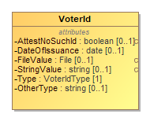

Used in request messages.

 

Used to include information about a voter’s identification that may be required in a registration request. [Voter](#_18_5_3_43701b0_1520354792154_717315_5628) includes VoterId.

 

AttestNoSuchId is used to attest that the voter has no ID of a specified type, thus it must be included with a value of true if attesting that the voter has no ID for that specified type. It can be included with a value of false to attest that the voter does have an ID of the specified type, in which case either StringValue or FileValue must be included; however, it is assumed to be false if not included. The StringValue and FileValue sub-elements are both optional, however at least one of them must be included.

Attribute | Multiplicity | Type | Attribute Description
--------- | ------------ | ---- | ---------------------
`AttestNoSuchId`|0..1|`boolean`|Used to attest that the voter has no ID. Assumed to be false if not present.
`DateOfIssuance`|0..1|`date`|Date the ID was issued.
`FileValue`|0..1|`File`|Used to include a file name for the ID.
`OtherType`|0..1|`String`|Used when VoterIdType value is other.
`StringValue`|0..1|`String`|Used to include the ID as a string.
`Type`|1|`VoterIdType`|The type of voter ID.

#### Business Rules

OtherType must be defined when Type = other:

```OCL2.0
self.Type = VoterIdType::other implies not self.OtherType.oclIsUndefined()
```

FileValue or StringValue must be defined (but not both):

```OCL2.0
not self.StringValue.oclIsUndefined() xor not self.FileValue.oclIsUndefined()
```

### <a name="_18_5_3_43701b0_1523390807847_148436_7270"></a>*The **VoterParticipation** Class*
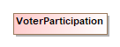

For indicating an election that the voter participated in. Participation does not imply a counted ballot.

Attribute | Multiplicity | Type | Attribute Description
--------- | ------------ | ---- | ---------------------
`BallotStyle`|0..1|`BallotStyle`|For associating the voter participation to a specific ballot style, such to a partisan ballot in a closed primary.
`Election`|1|`Election`|For associating the voter participation to a specific election event.
`PollingLocation`|0..1|`ReportingUnit`|The polling place used by the voter.
### <a name="_18_5_3_43701b0_1521144693004_190730_6034"></a>*The **VoterRecord** Class*
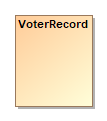

A subtype of Voter representing a voter record stored in a Voter Registration Database (VRDB). VoterRecord optionally contains additional information useful to the voter, including a description of the voter’s polling place, districts associated with the voter's precinct, or other geopolitical geographies such as the voter’s precinct.

Attribute | Multiplicity | Type | Attribute Description
--------- | ------------ | ---- | ---------------------
`District`|0..*|`ReportingUnit`|One or more districts associated with the voter’s precinct.
`ElectionAdministration`|0..1|`ElectionAdministration`|The election administration that conducts elections for the voter.
`HavaIdRequired`|0..1|`boolean`|Indicates that the voter must present identification at the polls per HAVA.
`Locality`|0..*|`ReportingUnit`|Other geographies such as the voter’s precinct.
`OtherStatus`|0..1|`String`|Used when VoterStatus value is other.
`PollingLocation`|0..1|`ReportingUnit`|The voter’s polling place.
`VoterParticipation`|0..*|`VoterParticipation`|For associating a VoterRecord to elections the voter has participated in.
`VoterStatus`|0..1|`VoterStatus`|The status of the VoterRecord, possibly to indicate the ability to receive a regular ballot.
### <a name="_18_5_3_43701b0_1523305927438_977151_6481"></a>*The **VoterRecords** Class*


Used in responses. For indicating a successful response to a lookup request. A lookup for a single voter may result in multiple VoterRecords being returned. This can occur if the voter has duplicate records in the VRDB, or if the criteria specified in the lookup request was broad.

Attribute | Multiplicity | Type | Attribute Description
--------- | ------------ | ---- | ---------------------
`VoterRecord`|0..*|`VoterRecord`|A particular voter record returned.
### <a name="_18_0_2_6340208_1446583854986_237644_5961"></a>*The **VoterRecordsRequest** Class*
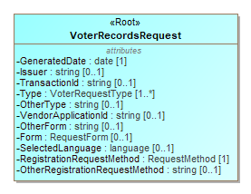

The root element for request messages.

 

For defining items pertaining to the status and type of the voter records request and when it was generated. VoterRecordsRequest includes the [Subject](#_18_0_2_6340208_1465929705246_568919_4464) association to specify various information about the voter in question. It includes the [BallotRequest](#_18_5_2_43701b0_1510599050811_549888_5731) association to handle a request for an ballot; this request may be part of an FPCA form registration or may be submitted independently.

Attribute | Multiplicity | Type | Attribute Description
--------- | ------------ | ---- | ---------------------
`AdditionalInfo`|0..*|`AdditionalInfo`|For including other information not specified by this model.
`BallotRequest`|0..1|`BallotRequest`|Specifies information relating to a request for a ballot.
`Form`|0..1|`RequestForm`|If the request is for a voter registration, the registration form used by the voter.
`GeneratedDate`|1|`date`|The date that the voter records request was generated.
`Issuer`|0..1|`string`|The name of the issuer of the voter records request transaction, e.g., State of West Virginia Voter Registration Portal.
`OtherForm`|0..1|`string`|Used when RegistrationForm value is other.
`OtherRequestMethod`|0..1|`String`|Used when RegistrationMethod value is other.
`OtherType`|0..1|`String`|Used when [RequestType](#_18_0_2_6340208_1446586298843_421997_6821) value is other.
`RequestHelper`|0..*|`RequestHelper`|Included if the registration involves a registration assistant organization.
`RequestMethod`|1|`RequestMethod`|The method used by the voter to register.
`RequestProxy`|0..1|`RequestProxy`|Included if the registration request is via a proxy, e.g., the DMV.
`SelectedLanguage`|0..1|`language`|The language specified by the voter, if any.
`Subject`|1|`Voter`|Specifies information about the voter who is the subject of the request.
`TransactionId`|0..1|`String`|An identifier of the voter records request transaction.
`Type`|1..*|`VoterRequestType`|The type of request, e.g., registration.
`VendorApplicationId`|0..1|`String`|An identifier of the vendor application generating the voter registration request, e.g., X-VRDB Version 3.1.a.

#### Business Rules

Ballot Request must have BallotRequest obj:

```OCL2.0
self.Type->exists(c | c = VoterRequestType::_'ballot-request') implies self.OtherType->size() = 1
```

### <a name="_18_0_2_6340208_1455906719413_171772_4514"></a>*The **VoterRecordsResponse** Class*
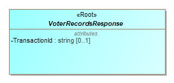

The root element for response messages. For defining items pertaining to the status of a response to a voter records request.  is an abstract element with three xsi:types that get used according to the type of response: • , used to indicate an acknowledgement only. • , used to indicate a failure and the type of failure. • , used to indication that a successful registration action occurred and the type of registration action, which may differ from the type of registration action requested.  optionally includes the  sub-element associated with the voter records request.

Attribute | Multiplicity | Type | Attribute Description
--------- | ------------ | ---- | ---------------------
`TransactionId`|0..1|`String`|Transaction ID associated with the voter records request.
