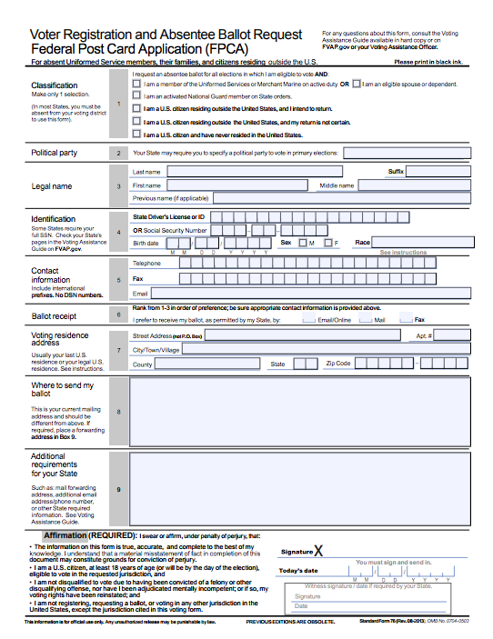
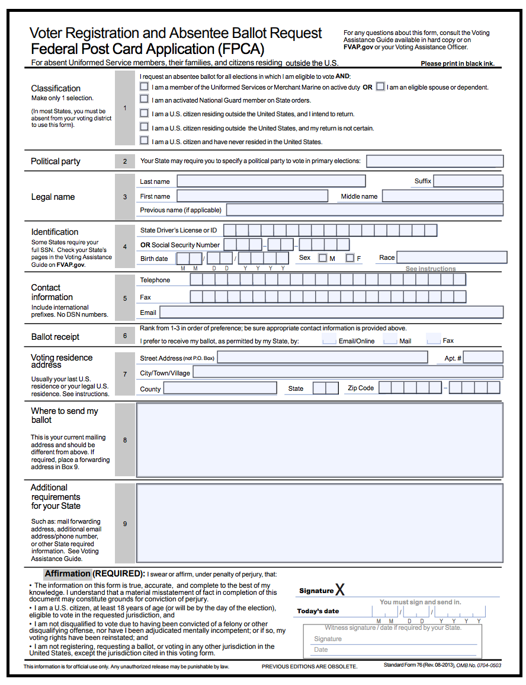
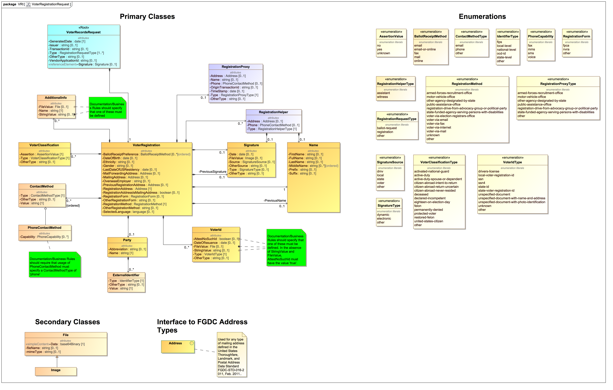
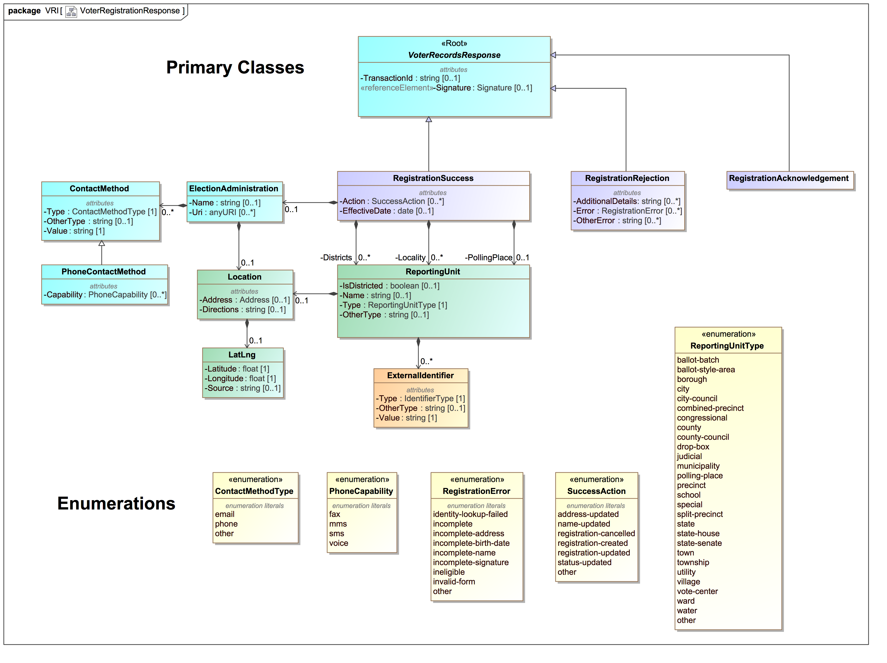
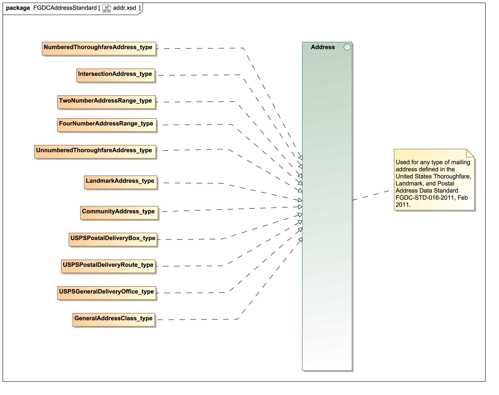
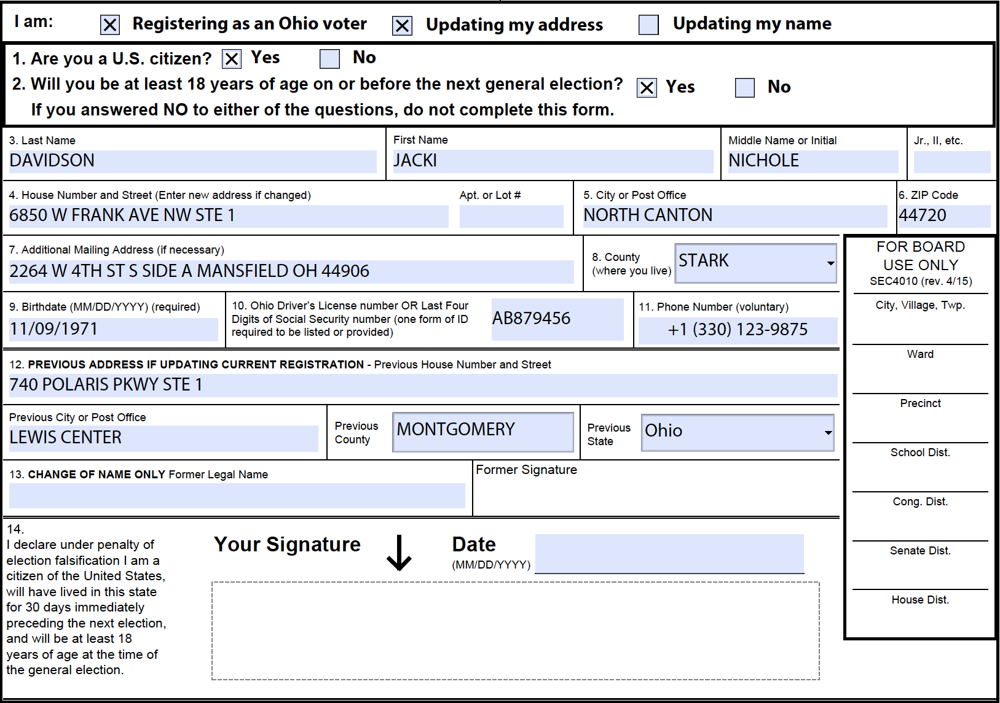
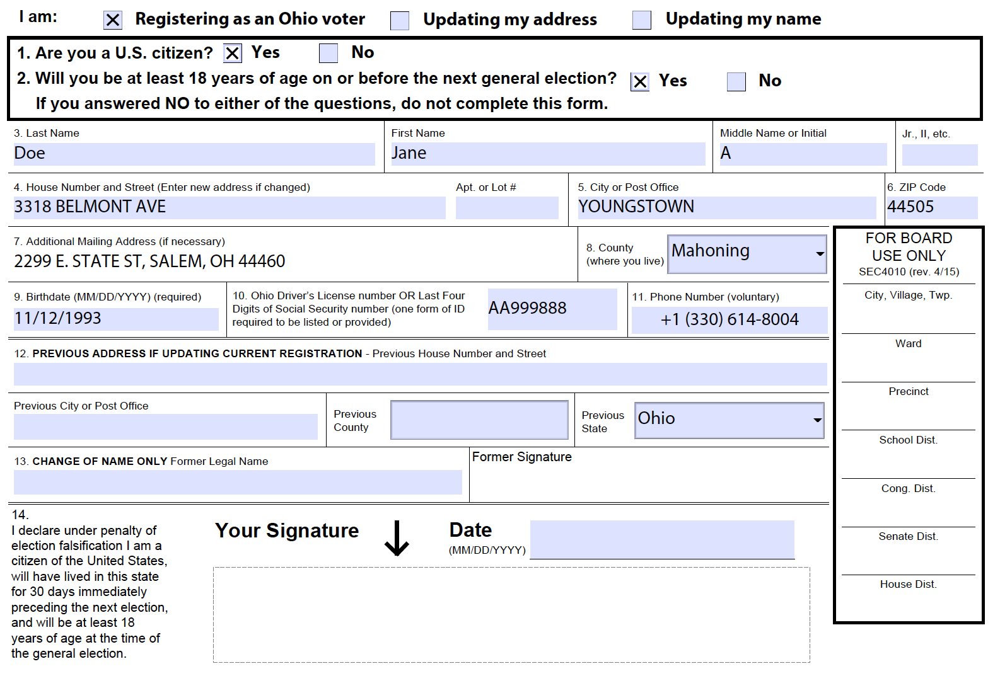
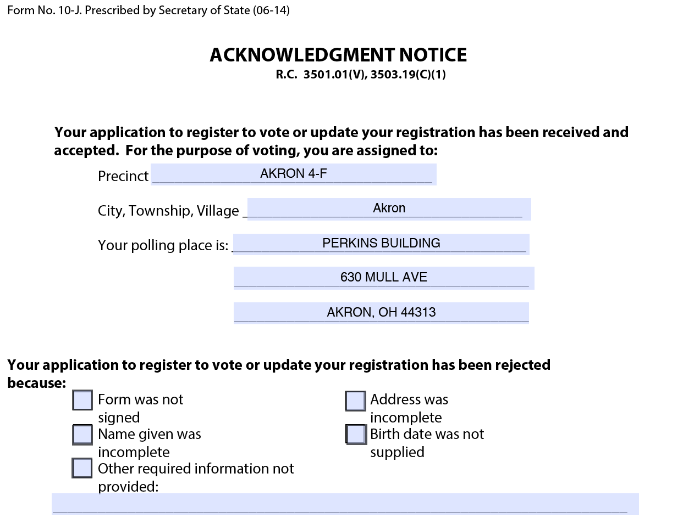

<title>NIST SP 1500-103 Voter Records Interchange Common Data Format Specification Draft Version 1.0</title>
# **NIST SP 1500-103 Voter Records Interchange Common Data Format Specification Draft Version 1.0**

**John P. Wack, editor**

**Primary Author Names...**

**August 2017**

*NOTE: this version of the VRI spec is the most recent and to be used for reviews; an older version in PDF is available on the VRI GitHub repository.  Once the VRI spec is finalized, both versions of the spec will be synced.*

    NIST Special Publication series 1500 is intended to capture external perspectives related to NIST
    standards, measurement, and testing-related efforts. These external perspectives can come from
    industry, academia, government, and others. These reports are intended to document external
    perspectives and do not necessarily represent official NIST positions.

    Certain commercial entities, equipment, or materials may be identified in this document in order
    to describe an experimental procedure or concept adequately. Such identification is not intended
    to imply recommendation or endorsement by NIST, nor is it intended to imply that the entities,
    materials, or equipment are necessarily the best available for the purpose.

    There may be references in this publication to other publications currently under development by
    NIST in accordance with its assigned statutory responsibilities. The information in this
    publication, including concepts and methodologies, may be used by federal agencies even before the
    completion of such companion publications. Thus, until each publication is completed, current
    requirements, guidelines, and procedures, where they exist, remain operative. For planning and
    transition purposes, federal agencies may wish to closely follow the development of these new
    publications by NIST.

    Organizations are encouraged to review all draft publications during public comment periods and
    provide feedback to NIST. All NIST publications are available at
    http://www.nist.gov/publication-portal.cfm.

    National Institute of Standards and Technology
    Attn: Software and Systems Division, Information Technology Laboratory
    100 Bureau Drive (Mail Stop 8970) Gaithersburg, MD 20899-8930
    Email: voting@nist.gov

## Table of Contents

<!-- TOC depthFrom:1 depthTo:6 withLinks:1 updateOnSave:1 orderedList:0 -->

- [**NIST SP 1500-103 Voter Records Interchange Common Data Format Specification Draft Version 1.0**](#nist-sp-1500-103-voter-records-interchange-common-data-format-specification-draft-version-10)
	- [Table of Contents](#table-of-contents)
	- [Acknowledgements](#acknowledgements)
- [Executive Summary](#executive-summary)
- [1. Introduction](#1-introduction)
	- [1.1 Purpose](#11-purpose)
	- [1.2 Audience](#12-audience)
	- [1.3 Motivation and Methodology](#13-motivation-and-methodology)
- [2. Overview of Digital OVR Transactions as Implemented by this Specification](#2-overview-of-digital-ovr-transactions-as-implemented-by-this-specification)
	- [2.1 Voter Records Request](#21-voter-records-request)
	- [2.2 Voter Records Response](#22-voter-records-response)
	- [2.3 State-specific Request and Responses](#23-state-specific-request-and-responses)
	- [2.4 The U.S. Thoroughfare, Landmark, and Postal Address Data Standard](#24-the-us-thoroughfare-landmark-and-postal-address-data-standard)
		- [2.4.1 Thoroughfare Classes](#241-thoroughfare-classes)
		- [2.4.2 Landmark Classes](#242-landmark-classes)
		- [2.4.3 Postal Delivery Classes](#243-postal-delivery-classes)
		- [2.4.4 General Class](#244-general-class)
- [3. Voter Records Interchange XML Schema](#3-voter-records-interchange-xml-schema)
	- [3.1 Schema Stylistic Conventions](#31-schema-stylistic-conventions)
	- [3.2 Roots](#32-roots)
	- [3.3 Imports](#33-imports)
	- [3.4 Interfaces](#34-interfaces)
	- [3.5 Enumerations](#35-enumerations)
		- [3.5.1 *The **AssertionValue** Enumeration*](#351-the-assertionvalue-enumeration)
		- [3.5.2 *The **BallotReceiptMethod** Enumeration*](#352-the-ballotreceiptmethod-enumeration)
		- [3.5.3 *The **ContactMethodType** Enumeration*](#353-the-contactmethodtype-enumeration)
		- [3.5.4 *The **IdentifierType** Enumeration*](#354-the-identifiertype-enumeration)
		- [3.5.5 *The **PhoneCapability** Enumeration*](#355-the-phonecapability-enumeration)
		- [3.5.6 *The **RegistrationError** Enumeration*](#356-the-registrationerror-enumeration)
		- [3.5.7 *The **RegistrationForm** Enumeration*](#357-the-registrationform-enumeration)
		- [3.5.8 *The **RegistrationHelperType** Enumeration*](#358-the-registrationhelpertype-enumeration)
		- [3.5.9 *The **RegistrationMethod** Enumeration*](#359-the-registrationmethod-enumeration)
		- [3.5.10 *The **RegistrationProxy** Enumeration*](#3510-the-registrationproxy-enumeration)
		- [3.5.11 *The **RegistrationRequestType** Enumeration*](#3511-the-registrationrequesttype-enumeration)
		- [3.5.12 *The **ReportingUnitType** Enumeration*](#3512-the-reportingunittype-enumeration)
			- [3.5.13 *The **SignatureSource** Enumeration*](#3513-the-signaturesource-enumeration)
		- [3.5.14 *The **SignatureType** Enumeration*](#3514-the-signaturetype-enumeration)
		- [3.5.15 *The **SuccessAction** Enumeration*](#3515-the-successaction-enumeration)
		- [3.5.16 *The **VoterClassificationType** Enumeration*](#3516-the-voterclassificationtype-enumeration)
		- [3.5.17 *The **VoterIdType** Enumeration*](#3517-the-voteridtype-enumeration)
	- [3.6 Interfaces](#36-interfaces)
	- [3.7 Classes (Elements)](#37-classes-elements)
		- [3.7.1 *The **AdditionalInfo** Element*](#371-the-additionalinfo-element)
		- [3.7.2 *The **ContactMethod** Element/Extension Base*](#372-the-contactmethod-elementextension-base)
			- [3.7.2.1 *The **PhoneContactMethod** xsi:type*](#3721-the-phonecontactmethod-xsitype)
		- [3.7.3 *The **ElectionAdministration** Element*](#373-the-electionadministration-element)
		- [3.7.4 *The **ExternalIdentifier** Element*](#374-the-externalidentifier-element)
			- [3.7.5 *The **File** Element/Extension Base*](#375-the-file-elementextension-base)
			- [3.7.5.1 *The **Image** xsi:type*](#3751-the-image-xsitype)
		- [3.7.6 *The **LatLng** Element*](#376-the-latlng-element)
		- [3.7.7 *The **Location** Element*](#377-the-location-element)
		- [3.7.8 *The **Name (and PreviousName)** Element*](#378-the-name-and-previousname-element)
		- [3.7.9 *The **Party** Element*](#379-the-party-element)
		- [3.7.10 *The **RegistrationHelper** Element*](#3710-the-registrationhelper-element)
		- [3.7.11 *The **RegistrationProxy** Element*](#3711-the-registrationproxy-element)
		- [3.7.12 *The **ReportingUnit** Element*](#3712-the-reportingunit-element)
		- [3.7.13 *The **Signature (and PreviousSignature)** Element*](#3713-the-signature-and-previoussignature-element)
		- [3.7.14 *The **VoterClassification** Element*](#3714-the-voterclassification-element)
		- [3.7.15 *The **VoterId** Element*](#3715-the-voterid-element)
		- [3.7.16 *The **VoterRecordsRequest** Element*](#3716-the-voterrecordsrequest-element)
		- [3.7.17 *The **VoterRecordsResponse** Element/Extension Base*](#3717-the-voterrecordsresponse-elementextension-base)
			- [3.7.17.1 *The **RegistrationAcknowledgement** xsi:type*](#37171-the-registrationacknowledgement-xsitype)
			- [3.7.17.2 *The **RegistrationRejection** xsi:type*](#37172-the-registrationrejection-xsitype)
			- [3.7.17.3 *The **RegistrationSuccess** xsi:type*](#37173-the-registrationsuccess-xsitype)
		- [3.7.18 *The **VoterRegistration** Element*](#3718-the-voterregistration-element)
- [4. XML/JSON Usage examples](#4-xmljson-usage-examples)
	- [4.1 Example 1: NVRA-style Voter Registration Request in XML](#41-example-1-nvra-style-voter-registration-request-in-xml)
	- [4.2 Example 2: NVRA Voter Registration Request in JSON](#42-example-2-nvra-voter-registration-request-in-json)
	- [4.3 Example 3: NVRA Voter Records Response in XML](#43-example-3-nvra-voter-records-response-in-xml)
- [Appendices](#appendices)
- [A. Acronyms](#a-acronyms)
- [B. Glossary](#b-glossary)
- [C. References](#c-references)
- [D. File Download Locations](#d-file-download-locations)
- [E. XML Schema](#e-xml-schema)
- [F. JSON schema](#f-json-schema)

<!-- /TOC -->

 

## Acknowledgements
The editor wishes to thank his colleagues of the National Institute of Standards and Technology Voter Records Interchange Public Working Group, who contributed to the specification's technical content.  The editor gratefully acknowledges and appreciates the following contributors for their keen and insightful assistance with developing this specification:

*Names of those to be acknowledged*

In addition to the above acknowledgments, the editor also gratefully acknowledges and appreciate other significant contributions from individuals and organizations involved in the NIST Voting Interoperability Public Working Group as well as in the public and private sectors, whose thoughtful and constructive comments improved the overall quality, thoroughness, and usefulness of this publication.

 

# Executive Summary

This is a draft specification of a Common Data Format (CDF) for Voter Record Interchange (VRI).  It has been developed by NIST and members of the Voting Interoperability Public Working Group to assist election officials and developers in supporting online voter registration (OVR) transactions with voter registration (VR) authorities.  The specification contains an overview of the supported use cases, which define interactions between actors and systems such as between voter registration applicants and online voter registration systems (OVR).  The CDF VRI specification also documents the use of XML (eXtensible Markup Language[\[1\]])(#references) and JSON (JavaScript Object Notation)[\[2\]](#references) schemas.

The VRI specification is transaction oriented, supporting digital VR application requests transmitted to VR systems from OVR sources including:

- State OVR systems to VR systems.
- Third-party jurisdiction-independent OVR systems.
- State motor vehicle departments or other voter registration-related agencies.  

It supports responses transmitted from VR systems to these OVR systems and state agencies. The registration forms supported include digital versions of the NVRA (National Voter Registration Act[\[3\]])(#references) form, the FPCA (Federal Post Card Application)[\[4\]](#references) form, or state specific forms. XML and JSON are used as data formats.

Future versions of this specification may contain support for additional use cases for other types of transactions, such as for voter record maintenance.

The XML/JSON schemas associated with this specification are generated from a UML (Unified Modeling Language[\[5\]])(#references) model that defines the types, structure, and interrelationships of the data used in voter registration transactions. The advantages to using a UML model include that data formats such as XML and JSON can be generated or derived from the UML model.

 

# 1. Introduction

This document is a specification for a common data format (CDF) for voter records data interchange related to voter registration, i.e., registration requests from online voter registration (OVR) made to voter registration (VR) systems, and responses to the requests returning from the VR system. The specification includes XML (eXtensible Markup Language)[\[1\]](#references) and JSON (JavaScript Object Notation)[\[2\]](#references) schemas.

Primary features of this specification include:

* Capability to specify voter registration requests and responses when using the NVRA (National Voter Registration Act)[\[3\]](#references))\ or FPCA (Federal Post Card Application)[\[4\]](#references) forms or other U.S. state-specific forms.
* A data model in UML (Unified Modeling Language)[\[5\]](#references) that itemizes and defines the data involved in voter records  interchange related to registration and that is used to derive the XML and JSON schemas.
* Detailed instructions for implementation and use of the XML and JSON schemas.
*	A flexible specification to cover additional use cases for other types of registration transactions, such as for voter record maintenance.

 

## 1.1 Purpose

The purpose of this specification is to provide data interchange formats in XML and JSON for voter registration requests and responses so as to assist election officials and developers in implementing and supporting the development of OVR systems within States. Advantages of using this specification include:

* A ready data interchange format for online voter registration systems to remove the need for individual OVR system development projects to define data models and formats.
* Applications for OVR systems currently being developed with early adoption and feedback for the CDF VRI to refine development of the CDF for additional use cases.
* A UML model that is easily extensible to additional use cases.

 

## 1.2 Audience
The intended audience of this specification includes election officials, VR system designers and developers, as well as others in the election community including the general public. Some background in election administration and registration is useful in understanding the material in this specification.

 

## 1.3 Motivation and Methodology
This document was motivated primarily to assist election officials and developers in implementing and supporting OVR systems by reducing or eliminating non-standard exchange formats for voter registration data. The current varying systems involved and data produced often do not interoperate, adding more complexity to the process. Additionally, there are sometimes significant variations among different jurisdictions within a state as well among the states themselves in the way they automate voter registration and related parts of voter record management.

NIST and a community of U.S. election officials, analysts, and election system technologists analyzed varying VR scenarios and use cases and their associated data interchanges, to analyze existing practices and to create a standard data interchange format for emerging OVR systems. This specification implements the following use cases:

1.	OVR Submission: Digital VR applications forms transmitted within state OVR systems or to state OVR systems by third party OVR systems, following the formats of the NVRA and FPCA voter registration application forms, including state-specific additions to these forms.

2.	VR Update Submission: Similar application forms including: voter registration update (change of name, change of address), change of voter status, and absentee ballot request.

3.	OVR Transfer: Subsets of such applications used for 3rd-party OVR registrars to transfer users and user data to state OVR systems.

A UML data model was subsequently generated to represent the data associated with OVR requests and responses and to show how the data elements are related and organized. Finally, XML and JSON schemas were generated from the UML data model.

The advantages of using a UML data model as an intermediate step to generating the XML and JSON schemas include that the model is independent of the concrete data formats (or other potential formats that could be derived), and relationships between data elements are easier to correctly define and visualize when they are independent of any specific data format. If changes are needed to the specific XML and JSON formats, one can make changes to the UML model and then generate or derive new versions of the formats.

Much of the data involved in voter registration requests consists of voter addresses: current registration addresses, postal addresses, previous registration addresses, etc.  Rather than implement new and complicated functionality in this specification for representing addresses, it was decided to use the existing U.S. Thoroughfare, Landmark, and Postal Address Data Standard [\[6\]](#references), which contains four major classes of addresses that are broken out into 11 different types of addresses.  These can be used to represent addresses where voters live and where they receive postal mail (if different), including overseas addresses.

While this specification is focused on digital OVR submission, subsequent versions of this specification may implement additional use cases, including:

-	DMV Match: Subsets of such digital applications exchanged between state VR systems and DMV or similar systems, to perform driver's license data matching (if required) as part of OVR processing.

-	DMV Notification: Data exchanged by DMV (Department of Motor Vehicles) or similar systems and VR systems, as part of NVRA compliance to digitally notify VR systems of DMV records of DMV customers that requested voter registration. May also include: similar data push from DMV of existing DMV records recently updated with change-of-address, as part of semi-automated steps toward permanent voter registration, or other forms of data exchange to VR systems that might facilitate elements of automatic and/or permanent voter registration.

-	Cross-State Records Match: Data interchange between state VR systems for and systems for records matching, e.g., the ERIC (Electronic Registration Information Center)[\[7\]](#references) system, or as part of inter-state cross-check activities.

-	EAVS Submission: Subsets of voter records externalized from voter records systems for purposes of data aggregation and reporting, including but not limited to EAVS (Election Administration Voting Survey)[\[8\]](#references)reporting.

Note that this specification addresses U.S. governmental elections and is not intended for use “as is” in other types of elections or in other countries. However, the specification was written with the intention that it be adaptable to other election environments.

 

# 2. Overview of Digital OVR Transactions as Implemented by this Specification

This section presents an overview of the digital OVR voter registration request and response transactions supported by this specification and examples of how these transactions are implemented using the NVRA and FPCA forms as well as with state-specific forms, e.g., modifications to the NVRA.  It also contains an overview of the U.S. Thoroughfare, Landmark, and Postal Address data standard [\[6\]](#references), used by this specification for representing voter addresses.

 

## 2.1 Voter Records Request

The digital NVRA and FPCA forms form the basis for digital OVR registration.  The NVRA form is used for U.S. non-military citizen registrations whereas the FPCA form is used by U.S. military, their families, and citizens residing outside the U.S. to register and, if desired, request a ballot at the same time.

(Note: the U.S. Department of Defense's Federal Voting Assistance Program (FVAP) is currently revising its August 2013 Standard Form 76, or the Federal Post Card Application, for release later in 2017.  XML and JSON schemas will be updated to reflect changes made to the FPCA form.)

**Figure 1 - National Voter Registration Act form**

 

**Figure 2 - Federal PostCard Application form**

 

The submission of a digital registration form to a VR authority represents a voter records request.  The response transmitted back from the VR authority to the submitter would include a status such as "registration-created" or would indicate an error for any number of reasons including “incomplete-address” or “incomplete-signature”.  The request consists of a registration request, e.g., initial registration, followed by various information about the voter and the submitter of the request.  The use case for the digital OVR request includes:

- A client IT “OVR submitter”,
- A service IT system “VR authority”, and
- The submission a digital NVRA, FPCA, or state-specific “form” via transmission from OVR submitter to VR authority.

Currently, VR authorities are typically the back-end components of actual state OVR systems, while submitters include clients of state OVR systems such as the DMV/MVA or other clients that are operated by 3rd party VR organizations and that integrate with OVR systems by sending all or part of an NVRA/FPCA dataset collected by the client from a human registrant.

An OVR transaction, as used in this specification, generally consists of a voter records request followed by a voter records response, although this may vary across U.S. states and territories.  The request can consist of multiple requests if multiple actions are being requested for the same voter.  As well, the response could consist of multiple responses.

The UML model shows 4 types of requests that would be sent from an OVR submitter to a VR system:

1.	Request a registration for a voter using the digital NVRA or FPCA form.
2.	In the case of a registration request using the FPCA form, also request a ballot for an election (FPCA registrations can include a ballot request).
3.	Request a state-specific action for a voter using possibly a state-specific digital form (covered in Section 2.3).

**Figure 3 - Voter Records Request UML class diagram**

 

An OVR submitter essentially specifies the type of registration form (“nvra” or “fpca”) and the registration action(s) being requested for the transaction.  In the case of “fpca” when a ballot is also requested, there could be two actions, “registration” and “ballot-request”. The VoterRegistration class contains the remaining data elements, all taken from information contained on the digital form.  

Both the registration request and response models contain a class ExternalIdentifier, which is used to associate an identifier with an item.  In the case of the request model, it is used optionally to associate an identifier to the political party, and in the response model, to optionally associate identifiers with political geography such as precincts and districts.

 

## 2.2 Voter Records Response
The voter records response simply returns a response to the voter records request. The UML model is simpler than the request model in that a response generally contains little data other than the results of the request, which are:

1.	The registration request was acknowledged, but no further status is available.
2.	The registration request was rejected, including a reason(s) for the rejection.
3.	The registration request succeeded, including the action(s) taken.

 

**Figure 4 - Voter Records Response UML class diagram**

The UML model shows the VoterRecordsResponse class, which has three corresponding types of responses.  The first, RegistrationAcknowledgement, represents the typical current practice in online voter registration, where a registration authority operates an online service that receives VR requests and saves them for later processing by local elections offices' staff. In this typical practice, the acceptance of an online VR request is simply an acknowledgement that the request was received without error.

The second type of response, RegistrationRejection, contains the reason(s) for the rejection as well as any additional details.

The third type of response, RegistrationSuccess, is used for cases where the receiving service is able to process a request to success and notify the sender synchronously. The contents of a RegistrationSuccess are modeled on the information that becomes available to a newly registered voter as a result of successful registration. In the UML model, the RegistrationSuccess class optionally includes these items: voter’s assigned polling place and precinct, the location of the local election authority, and a list of districts that the voter resides in, and if available a list of ballot items in an upcoming election that the voter is eligible to vote in. The successful registration also returns the registration action(s) that occurred, which may differ from what was requested. For example, a request for a new voter registration may succeed, but if the voter was already registered, the response may indicate a registration update as opposed to a registration create.

 

## 2.3 State-specific Request and Responses

The UML model and associated XML and JSON schemas contain several features to enable state-specific requests and responses.  Using these features, it is possible to use this specification when local modifications are needed.

The AdditionalInfo class is used for information
not addressed in this schema by other attributes, e.g., state-specific
data that does not "fit" in any other attribute. The type of data will thus be
highly specific to the generating application, and consuming applications must
"know" the meaning of the data to make use of it.  Each AdditionalInfo class would contain the name of the data, and then its value, depending on whether the data represents the value directly as a string or represents a file name.  

For example, if a state requires its registration form to include the voter's language, it would need to use the AdditionalInfo class to contain a value representing the voter's language.  An XML example is as follows, using English as the voter's language:

    <AdditionalInfo>
       <Name>Language</Name>
       <StringValue>en-US</StringValue>
    </AdditionalInfo>

The XML and JSON usage examples in Section 4 contain a number of examples showing usage of the AdditionalInfo class.

Additionally, each enumeration generally contains an "other" value that can be used when none of the enumeration values are sufficient.  If "other" is used as the enumeration value, there is an attribute named OtherType that can be used to hold the other data.  For example, a state may wish to implement a specific "address-update" transaction, and would thus need to use "other" for the Type attribute in the VoterRecordsRequest class.  The OtherType attribute would then contain the type of registration request, i.e., "address-update", e.g. in XML,

    <VoterRecordsRequest xmlns:xsd="http://www.w3.org/2001/XMLSchema" xmlns:xsi="http://www.w3.org/2001/XMLSchema-instance"
        xmlns="NIST_V0_voter_records_interchange.xsd"
        xsi:schemaLocation="NIST_V0_voter_records_interchange.xsd NIST_V0_voter_records_interchange.xsd"
        xmlns:addr="http://www.fgdc.gov/schemas/address/addr"
        xmlns:addr_type="http://www.fgdc.gov/schemas/address/addr_type">
        <GeneratedDate>2017-02-10</GeneratedDate>
        <Issuer>Ohio Secretary of State</Issuer>
        <TransactionId>2a642eb5-169e-4a3b-8899-adc7ea6d00d0</TransactionId>
        <Type>other</Type>
        <OtherType>address-update</OtherType>

 

## 2.4 The U.S. Thoroughfare, Landmark, and Postal Address Data Standard

Perhaps the most complex part of a voter registration request or other related data exchange of voter record data is the voter's address. There are multiple types of addresses for VR purposes, e.g., current registration address, previous registration address, postal mailing address, overseas address, and multiple types of addresses for location and mailing purposes, e.g., structured street address, unstructured street address, rural addresses, PO box addresses, military and diplomatic addresses, and mailing addresses outside the U.S.  Rather than revisit the complexities of address structure, this specification makes use of an existing XML-based standard for structuring addresses: the U.S. Thoroughfare, Landmark, and Postal Address Data Standard[\[6\]](#references), issued by the Federal Geographic Data Committee (FGDC)[\[9\]](#references) and covering the complexity of addresses managed by or encountered by organizations and agencies such as the United States Census and USPS (U.S. Postal Service). Use of the FGDC standard greatly simplifies this specification and leaves maintenance of the standard to the more appropriate management body.

Briefly, the FGDC standard classifies all US addresses into a simple, complete taxonomy of address classes organized into four groups consisting of 11 address types, with the fourth class being useful for unstructured and non-U.S. addresses:

1. Thoroughfare Classes - 5 address types
2. Landmark Classes - 2 address types
3. Postal Deliver Classes - 3 address types
4. General Class - 3 address types

The VoterRegistration class in the UML model has four distinct addresses: RegistrationAddress, PreviousRegistrationAddress, MailingAddress, and MailForwardingAddress, all of type Address.  Address is itself mapped to 11 address types taken from the FGDC standard, as shown in the figure:

 

**Figure 5 - multiple FGDC address types mapped to a single Address type**

Accordingly, the XML and JSON schemas generated from the UML model include the FGDC XML schema and map the use of the `<Address>` type to one of the 11 different address types in the FGDC schema, as shown below using XML:

    <!-- === Interface Address === -->
    <xsd:group name="Address">
      <xsd:choice>
        <xsd:element name="CommunityAddress_type" type="addr:CommunityAddress_type"/>
        <xsd:element name="FourNumberAddressRange_type" type="addr:FourNumberAddressRange_type"/>
        <xsd:element name="GeneralAddressClass_type" type="addr:GeneralAddressClass_type"/>
        <xsd:element name="IntersectionAddress_type" type="addr:IntersectionAddress_type"/>
        <xsd:element name="LandmarkAddress_type" type="addr:LandmarkAddress_type"/>
        <xsd:element name="NumberedThoroughfareAddress_type" type="addr:NumberedThoroughfareAddress_type"/>
        <xsd:element name="TwoNumberAddressRange_type" type="addr:TwoNumberAddressRange_type"/>
        <xsd:element name="USPSGeneralDeliveryOffice_type" type="addr:USPSGeneralDeliveryOffice_type"/>
        <xsd:element name="USPSPostalDeliveryBox_type" type="addr:USPSPostalDeliveryBox_type"/>
        <xsd:element name="USPSPostalDeliveryRoute_type" type="addr:USPSPostalDeliveryRoute_type"/>
        <xsd:element name="UnnumberedThoroughfareAddress_type" type="addr:UnnumberedThoroughfareAddress_type"/>
      </xsd:choice>
    </xsd:group>

 

There are actually 13 different address types but only 11 are shown, as the General Class is implemented in XML as a choice of the 3 different types. The following XML example shows a use of the `<NumberedThoroughfareAddress_type>` for the `<MailingAddress>` element:

    <MailingAddress>
      <NumberedThoroughfareAddress_type>
        <addr:CompleteAddressNumber>
          <addr_type:AddressNumber>500</AddressNumber>
        </addr:CompleteAddressNumber>
        <addr:CompleteStreetName>
          <addr_type:StreetNamePreDirectional>W</StreetNamePreDirectional>
          <addr_type:StreetName>TUSCARAWAS</StreetName>
          <addr_type:StreetNamePostType>AVE</StreetNamePostType>
        </addr:CompleteStreetName>
        <addr_type:CompletePlaceName>
          <PlaceName PlaceNameType="MunicipalJurisdiction">BARBERTON</PlaceName>
        </CompletePlaceName>
        <addr_type:StateName>OH</StateName>
        <addr_type:ZipCode>44203</ZipCode>
      </NumberedThoroughfareAddress_type>
    </MailingAddress>

 

 The following sections contain brief overviews of each of the address classes and their types.

### 2.4.1 Thoroughfare Classes
Most business and residential addresses are Numbered Thoroughfare Addresses. They specify a location by reference to a thoroughfare, i.e., a road or part of a road or other access route along which a delivery point can be accessed.  A thoroughfare is typically but not always a road - it may be, for example, a walkway, a railroad, or a river. The thoroughfare address classes are:

- Numbered Thoroughfare Address, e.g., *123 Main Street*.
- Intersection Address, e.g., *Fifth Avenue and Main Street*.
- Two Number Address Range, e.g., *405-411 West Green Street*.
- Four Number Address Range, e.g., *900-962, 901-963 Milton Street*.
- Unnumbered Thoroughfare Address, e.g., *Forest Service Road 698*.

Most business and residential addresses are Numbered Thoroughfare Addresses. Unnumbered Thoroughfare Addresses are used for those areas where no address numbers have been assigned and the addresses often include only the thoroughfare name.

### 2.4.2 Landmark Classes
Landmark addresses specify a location by reference to a named landmark. A landmark is a relatively permanent feature of the manmade landscape that has recognizable identity within a particular cultural context, e.g., a large statue or structure such as an apartment complex. The landmark address classes are:

- Landmark Address, e.g., *Statue of Liberty*.
- Community Address, e.g., *123 Urbanizacion Los Olmos*.

### 2.4.3 Postal Delivery Classes
Postal delivery addresses specify points of postal delivery that have no definite relation to the location of the recipient, such as a post office box, rural route box, overseas military address, or general delivery office. The USPS specifies each class in detail in USPS Publication 28[\[10\]](#references). The postal delivery classes are:

- USPS Postal Delivery Box, e.g., *PO Box 16953*.
- USPS Postal Delivery Route, e.g., *RR 1, Box 100*.
- USPS General Delivery Office, e.g., *General Delivery*.

### 2.4.4 General Class
The general class provides a "catch-all" way to handle addresses that do not conform to any of the thoroughfare, landmark, or postal classes, including non-U.S. addresses. There are three types:

1. The complete address as a single unparsed string of text, e.g., *PO Box 1511, Ames, IA 50010*.
2. The complete address with place, state and zip code parsed out to a single field, e.g., *PO Box 1511; Place State ZIP = Ames, IA 50010*.
3. The complete address with place, state and zip code parsed out to separate fields, e.g., *PO Box 1511; Complete Place Name = Ames; State Name = IA; Zip Code = 50010*.

A complete overview of the FGDC standard and how to use it is beyond the scope of this specification, thus readers and developers are referred to the standard documentation, which contains complete descriptions and examples[\[6\]](#references).

 

#	3. Voter Records Interchange XML Schema
This section contains documentation and discussion of the features included in the VRI XML schema.  In the sections below, an XML element or enumeration name is denoted using
a fixed-font and angle brackets, e.g., `<ElectionReport>` or `<ReportingUnitType>`. Attributes, enumeration values, or other XML syntax are in a fixed-font, e.g., `label` or `geo-json`.  An element is sometimes referred to as a "sub-element" when it is included in another element, e.g., `<VoterRegistration>` is a sub-element of
`<VoterRecordsRequest>`.  "Includes" is used to denote that an element contains another
element as a sub-element, e.g., `<VoterRecordsRequest>` includes `<VoterRegistration>`.  

 

##	3.1 Schema Stylistic Conventions

The XML schema was written observing the following stylistic conventions:

*	Element, attribute, enumeration, and primitive names observe variations of
"CamelCase" conventions , that is:
	*	Element and enumeration names begin with a capital letter and the
names that consist of multiple words are concatenated and each word
begins with a capital letter, thus "CamelCase".  For example,
`<VoterRegistration>`.
	*	Attribute names begin with a non-capital (lower-case) letter and the
names that consist of multiple words are concatenated, with the first
word beginning in a non-capital letter and subsequent words
beginning in a capital letter, thus "camelCase".  For example,
`mimeType`.
*	Enumeration value names are in non-capital letters, and names that consist
of multiple words are separated by hyphens.  For example, `1-of-n`.
*	Element, attribute, and enumeration value ordering is generally alphabetical,
with the following exceptions:
	*	`<EndDate>` follows element names such as `<StartDate>`, or
`<OtherType>` follows `<Type>`.
	*	If there is an enumeration value of `other`, it comes last in the list of
values.

 

## 3.2 Roots
The schema contains two root elements:

1.	`<VoterRecordsRequest>`, used as a root for registration request transactions.
2.	`<VoterRecordsResponse>`, used as a root for registration response
transactions.

Schema Definition:

     <!--  === Roots ===  -->
     <xsd:element name="VoterRecordsRequest" type="VoterRecordsRequest"/>
     <xsd:element name="VoterRecordsResponse" type="VoterRecordsResponse"/>

 

## 3.3 Imports
The schema (and instance files) imports two external schemas:

1.	The W3C digital signature schema[\[11\]](#references), used in the optional `<Signature>` sub-element of `<VoterRecordsRequest>` and `<VoterRecordsResponse>` to
include a digital signature on XML instance files.
2.	The FGDC schema[\[6\]](#references), which contains 11 types of addresses that are used to specify postal and registration addresses for voters, used in the `<VoterRegistration>` element.

Schema Definition:

     <!--  === Imports ===  -->
     <xsd:import namespace="http://www.fgdc.gov/schemas/address/addr" schemaLocation=
      "addr.xsd"/>
     <xsd:import namespace="http://www.w3.org/2000/09/xmldsig#" schemaLocation=
      "http://www.w3.org/2000/09/xmldsig#"/>

 

## 3.4 Interfaces
The schema includes an interface that maps the `Address` type to a choice of one of the address types from the FGDC schema.

      <!-- === Interface Address === -->
      <xsd:group name="Address">
        <xsd:choice>
          <xsd:element name="CommunityAddress_type" type="addr:CommunityAddress_type"/>
          <xsd:element name="FourNumberAddressRange_type" type="addr:FourNumberAddressRange_type"/>
          <xsd:element name="GeneralAddressClass_type" type="addr:GeneralAddressClass_type"/>
          <xsd:element name="IntersectionAddress_type" type="addr:IntersectionAddress_type"/>
          <xsd:element name="LandmarkAddress_type" type="addr:LandmarkAddress_type"/>
          <xsd:element name="NumberedThoroughfareAddress_type" type="addr:NumberedThoroughfareAddress_type"/>
          <xsd:element name="TwoNumberAddressRange_type" type="addr:TwoNumberAddressRange_type"/>
          <xsd:element name="USPSGeneralDeliveryOffice_type" type="addr:USPSGeneralDeliveryOffice_type"/>
          <xsd:element name="USPSPostalDeliveryBox_type" type="addr:USPSPostalDeliveryBox_type"/>
          <xsd:element name="USPSPostalDeliveryRoute_type" type="addr:USPSPostalDeliveryRoute_type"/>
          <xsd:element name="UnnumberedThoroughfareAddress_type" type="addr:UnnumberedThoroughfareAddress_type"/>
        </xsd:choice>
      </xsd:group>

 

## 3.5 Enumerations
The following sections deal with the enumerations (i.e., simple types) in the
schema, which are generated from the enumerations in the UML models.

### 3.5.1 *The **AssertionValue** Enumeration*
Used in requests.  

Enumeration for assertions from a voter or a third party such as a department of motor
vehicles (DMV) in response to questions on a registration form, used in the
`<Assertion>` sub-element of `<VoterClassification>`.

Value | Definition
--- | ---
`no` | For a voter's or third party's assertion of "no" or "false".
`yes` | For a voter's or third party's assertion of "yes" or "true".
`unknown` | For a voter's or third party's assertion of "unknown".

Schema Definition:

    <xsd:simpleType name="AssertionValue">
        <xsd:restriction base="xsd:string">
            <xsd:enumeration value="no"/>
            <xsd:enumeration value="yes"/>
            <xsd:enumeration value="unknown"/>
        </xsd:restriction>
    </xsd:simpleType>

 
 
### 3.5.2 *The **BallotReceiptMethod** Enumeration*
Used in requests.  

Enumeration for methods for delivering a ballot to the voter, used in the
`<BallotReceiptPreference>` sub-element of `<VoterRegistration>`. The sub-element may be repeated multiple times with different values as applicable, e.g., to specify both `mail` and `online`.

Value | Definition
--- | ---
`email` | For email only.
`email-or-online` | For electronic mail or downloadable from a website (this value is ambiguous, thus the separate values for email and online).
`fax` | For use of a fax.
`mail` | For postal mail.
`online` | For downloadable from a website, e.g., the voter is sent a hypertext link to a ballot.

Schema Definition:

    <xsd:simpleType name="BallotReceiptMethod">
        <xsd:restriction base="xsd:string">
						<xsd:enumeration value="email"/>
            <xsd:enumeration value="email-or-online"/>
            <xsd:enumeration value="fax"/>
            <xsd:enumeration value="mail"/>
						<xsd:enumeration value="online"/>
        </xsd:restriction>
    </xsd:simpleType>

 
 
### 3.5.3 *The **ContactMethodType** Enumeration*
Used in requests AND responses.   

Enumeration for methods for contacting a voter or an election administration office, used in the `<Type>` sub-element of `<ContactMethod>`.

Value | Definition
--- | ---
`email` | The entity can be contacted via email.
`phone` | The entity can be contacted via telephone.
`other` | Used when the type of contact method is not included in this enumeration.

Schema Definition:

    <xsd:simpleType name="ContactMethodType">
        <xsd:restriction base="xsd:string">
            <xsd:enumeration value="email"/>
            <xsd:enumeration value="phone"/>
            <xsd:enumeration value="other"/>
        </xsd:restriction>
    </xsd:simpleType>

 
 
### 3.5.4 *The **IdentifierType** Enumeration*
Used in requests.  

Enumeration for election data-related codes in the `<ExternalIdentifiers>`
element, used to describe a type of identifier for political geography.

Value | Definition
--- | ---
`fips` | For FIPS codes.
`local-level` | For a code that is specific to a county or other similar locality.
`national-level`  | For a code that is used at the national level other than `ocd-id` or `fips`.
`ocd-id` | For Open Civic Data identifiers[\[12\]](#references).
`state-level` | For a code that is specific to a state.
`other` | Used when the type of code is not included in this enumeration.

Schema Definition:

    <xsd:simpleType name="IdentifierType">
        <xsd:restriction base="xsd:string">
            <xsd:enumeration value="fips"/>
            <xsd:enumeration value="local-level"/>
            <xsd:enumeration value="national-level"/>
            <xsd:enumeration value="ocd-id"/>
            <xsd:enumeration value="state-level"/>
            <xsd:enumeration value="other"/>
        </xsd:restriction>
    </xsd:simpleType>

 
 
### 3.5.5 *The **PhoneCapability** Enumeration*
Used in requests AND responses.   

Enumeration for telephone capabilities, used in the `<Capability>` sub-element of `<PhoneContactMethod>`.  The sub-element may be used multiple times as applicable, e.g., to include both `sms` and `voice`.

Value | Definition
--- | ---
`fax` | For telephones that include facsimile capabilities.
`mms` | For telephones that contain Multimedia Messaging Service (MMS) capabilities.
`sms` | For telephones that contain Short Messaging Service (SMS) capabilities (for text messages).
`voice` | For telephones that contain voice capabilities.

Schema Definition:

    <xsd:simpleType name="PhoneCapability">
        <xsd:restriction base="xsd:string">
            <xsd:enumeration value="fax"/>
            <xsd:enumeration value="mms"/>
            <xsd:enumeration value="sms"/>
            <xsd:enumeration value="voice"/>
        </xsd:restriction>
    </xsd:simpleType>

 
 
### 3.5.6 *The **RegistrationError** Enumeration*
Used in responses.

Enumeration for registration-related errors, used in the `<Error>` sub-element of `<RegistrationRejection>`. The sub-element may be used multiple times as applicable.

Value | Definition
--- | ---
`identity-lookup-failed` | A lookup on the voter's identity failed.
`incomplete` | The registration request is incomplete, without specifying the specific error(s).
`incomplete-address` | An address is incomplete.
`incomplete-birth-date` | The registration request does not contain a birthdate.
`incomplete-name` | The voter's name is incomplete.
`incomplete-signature` | The registration request does not contain a signature.
`ineligible` | The voter is ineligible to be registered.
`invalid-form` | The registration form specified is invalid.
`other` | Used when the type of error is not included in this enumeration.

Schema Definition:

    <xsd:simpleType name="RegistrationError">
        <xsd:restriction base="xsd:string">
            <xsd:enumeration value="identity-lookup-failed"/>
            <xsd:enumeration value="incomplete"/>
            <xsd:enumeration value="incomplete-address"/>
            <xsd:enumeration value="incomplete-birth-date"/>
            <xsd:enumeration value="incomplete-name"/>
            <xsd:enumeration value="incomplete-signature"/>
            <xsd:enumeration value="ineligible"/>
            <xsd:enumeration value="invalid-form"/>
            <xsd:enumeration value="other"/>
        </xsd:restriction>

 

### 3.5.7 *The **RegistrationForm** Enumeration*
Used in requests.  

Enumeration for types of registration forms, used in the `<RegistrationForm>` sub-element of `<VoterRegistration>`.

Value | Definition
--- | ---
`fpca` | For the Federal Post Card Application form.
`nvra` | For the National Voter Registration Act form.
`other` | Used when the type of form is not included in this enumeration.

Schema Definition:

    <xsd:simpleType name="RegistrationForm">
        <xsd:restriction base="xsd:string">
            <xsd:enumeration value="fpca"/>
            <xsd:enumeration value="nvra"/>
            <xsd:enumeration value="other"/>
        </xsd:restriction>
    </xsd:simpleType>

 
		 
### 3.5.8 *The **RegistrationHelperType** Enumeration*
Used in requests.  

Enumeration for types of registration helpers, used in the `<Type>` sub-element of `<RegistrationHelper>`.

Value | Definition
--- | ---
`assistant` | For a registration assistant.
`witness` | For a witness, only.

Schema Definition:

    <xsd:simpleType name="RegistrationHelperType">
        <xsd:restriction base="xsd:string">
            <xsd:enumeration value="assistant"/>
            <xsd:enumeration value="witness"/>
        </xsd:restriction>
    </xsd:simpleType>

 

### 3.5.9 *The **RegistrationMethod** Enumeration*
Used in requests.  

Enumeration for the method used by the voter to register, used in the
`<RegistrationMethod>` sub-element of `<VoterRegistration>`.

Value | Definition
--- | ---
`armed-forces-recruitment-office` | The voter is assisted by an armed forces recruitment office.
`motor-vehicle-office` | The voter is registering via an MVA/DMV.
`other-agency-designated-by-state` | The voter is assisted by an unspecified state-designated agency.
`public-assistance-office` | The voter is assisted by a public assistance office.
`registration-drive-from-advocacy-group-or-political-party` | The voter is registering via a registration drive.
`state-funded-agency-serving-persons-with-disabilities` | The voter is assisted by a state-designated agency serving persons with disabilities.
`voter-via-election-registrars-office` | The voter is registering via an election or registrar's office.
`voter-via-email` | The voter is registering via email.
`voter-via-fax` | The voter is registering via fax.
`voter-via-internet` | The voter is registering via the Internet, e.g., a website.
`voter-via-mail` | The voter is registering via postal mail.
`unknown` |
`other` | Used when the type of method is not included in this enumeration.

Schema Definition:

    <xsd:simpleType name="RegistrationMethod">
        <xsd:restriction base="xsd:string">
            <xsd:enumeration value="armed-forces-recruitment-office"/>
            <xsd:enumeration value="motor-vehicle-office"/>
            <xsd:enumeration value="other-agency-designated-by-state"/>
            <xsd:enumeration value="public-assistance-office"/>
            <xsd:enumeration value="registration-drive-from-advocacy-group-or-political-party"/>
            <xsd:enumeration value="state-funded-agency-serving-persons-with-disabilities"/>
            <xsd:enumeration value="voter-via-election-registrars-office"/>
            <xsd:enumeration value="voter-via-email"/>
            <xsd:enumeration value="voter-via-fax"/>
            <xsd:enumeration value="voter-via-internet"/>
            <xsd:enumeration value="voter-via-mail"/>
            <xsd:enumeration value="unknown"/>
            <xsd:enumeration value="other"/>
        </xsd:restriction>
    </xsd:simpleType>

 

### 3.5.10 *The **RegistrationProxy** Enumeration*
Used in requests.  

Enumeration for the proxy used for the voter's registration request, used in the
`<Type>` sub-element of `<RegistrationProxy>`.

Value | Definition
--- | ---
`armed-forces-recruitment-office` | The voter is assisted by an armed forces recruitment office.
`motor-vehicle-office` | The voter is registering via an MVA/DMV.
`other-agency-designated-by-state` | The voter is assisted by an unspecified state-designated agency.
`public-assistance-office` | The voter is assisted by a public assistance office.
`registration-drive-from-advocacy-group-or-political-party` | The voter is registering via a registration drive.
`state-funded-agency-serving-persons-with-disabilities` | The voter is assisted by a state-designated agency serving persons with disabilities.
`other` | Used when the type of source is not included in this enumeration.

Schema Definition:

    <xsd:simpleType name="RegistrationProxyType">
        <xsd:restriction base="xsd:string">
            <xsd:enumeration value="armed-forces-recruitment-office"/>
            <xsd:enumeration value="motor-vehicle-office"/>
            <xsd:enumeration value="other-agency-designated-by-state"/>
            <xsd:enumeration value="public-assistance-office"/>
            <xsd:enumeration value="registration-drive-from-advocacy-group-or-political-party"/>
            <xsd:enumeration value="state-funded-agency-serving-persons-with-disabilities"/>
            <xsd:enumeration value="other"/>
        </xsd:restriction>
    </xsd:simpleType>

 

### 3.5.11 *The **RegistrationRequestType** Enumeration*
Used in requests.  

Enumeration for the type of voter records request, used in the `<Type>` sub-element
of `<VoterRecordsRequest>`.

Value | Definition
--- | ---
`ballot-request` | For requesting a ballot, possibly in conjunction with an FPCA registration request.
`registration` | For a voter registration request.
`other` | Used when the type of request is not included in this enumeration.

Schema Definition:

    <xsd:simpleType name="RegistrationRequestType">
        <xsd:restriction base="xsd:string">
            <xsd:enumeration value="ballot-request"/>
            <xsd:enumeration value="registration"/>
            <xsd:enumeration value="other"/>
        </xsd:restriction>
    </xsd:simpleType>

 

### 3.5.12 *The **ReportingUnitType** Enumeration*
Used in responses.  

Enumeration for the type of geopolitical unit, used in the `<Type>` sub-element in
the `<ReportingUnit>` element .  

Value | Definition
--- | ---
`ballot-batch` | Used for reporting batches of ballots that may cross precinct boundaries.
`ballot-style-area` | Used for a ballot style areas generally composed of precincts
`borough` | Used in CT, NJ, PA, other states, and New York City for boroughs. For AK and LA, see `county`.
`city` | Used for a city that reports results and/or for the district that encompasses it.
`city-council` | Used for city council districts.
`combined-precinct` | Used for one or more precincts that have been combined for the purposes of reporting.  Used for "Ward" if "Ward" is used interchangeably with "CombinedPrecinct".
`congressional` | Used for U.S. Congressional districts.
`county` | Used for a county and/or for the district that encompasses it.  In AK, used for counties that are called boroughs.  In LA, used for parishes.
`county-council` | Used for county council districts.
`drop-box` | Used for a dropbox for absentee ballots.
`judicial` | Used for judicial districts.
`municipality` | Used as applicable for various units such as towns, townships, villages that report votes and/or for the district that encompasses it.
`polling-place` | Used for a polling place.
`precinct` | Used also for "Ward" or "District" when these terms are used interchangeably with "Precinct".
`school` | Used for a school district.
`special` | Used for a special district.
`split-precinct` | Used for splits of precincts.
`state` | Used for a state and/or for the district that encompasses it.
`state-house` | Used for a state house or assembly district.
`state-senate` | Used for a state senate district.
`town` | Used in some New England states as a type of municipality that reports votes and/or for the district that encompasses it.
`township` | Used in some mid-western states as a type of municipality that reports votes and/or for the district that encompasses it.
`utility` | Used for a utility district.
`village` | Used as a type of municipality that reports votes and/or for the district that encompasses it.
`vote-center` | Used for a vote center.
`ward` | Used for combinations or groupings of precincts or other units.
`water` | Used for a water district.
`other` | Used for other types of reporting units not included in this enumeration.

Schema Definition:

    <xsd:simpleType name="ReportingUnitType">
        <xsd:restriction base="xsd:string">
            <xsd:enumeration value="ballot-batch"/>
            <xsd:enumeration value="ballot-style-area"/>
            <xsd:enumeration value="borough"/>
            <xsd:enumeration value="city"/>
            <xsd:enumeration value="city-council"/>
            <xsd:enumeration value="combined-precinct"/>
            <xsd:enumeration value="congressional"/>
            <xsd:enumeration value="county"/>
            <xsd:enumeration value="county-council"/>
            <xsd:enumeration value="drop-box"/>
            <xsd:enumeration value="judicial"/>
            <xsd:enumeration value="municipality"/>
            <xsd:enumeration value="polling-place"/>
            <xsd:enumeration value="precinct"/>
            <xsd:enumeration value="school"/>
            <xsd:enumeration value="special"/>
            <xsd:enumeration value="split-precinct"/>
            <xsd:enumeration value="state"/>
            <xsd:enumeration value="state-house"/>
            <xsd:enumeration value="state-senate"/>
            <xsd:enumeration value="town"/>
            <xsd:enumeration value="township"/>
            <xsd:enumeration value="utility"/>
            <xsd:enumeration value="village"/>
            <xsd:enumeration value="vote-center"/>
            <xsd:enumeration value="ward"/>
            <xsd:enumeration value="water"/>
            <xsd:enumeration value="other"/>
        </xsd:restriction>
    </xsd:simpleType>

 

#### 3.5.13 *The **SignatureSource** Enumeration*
Used in requests.  

Enumeration for source of the voter's signature, used in the `<SignatureSource>` sub-
element of `<Signature>`.

Value | Definition
--- | ---
`dmv` | For the department of motor vehicles or motor vehicle authority.
`local` | For an unspecified local source.
`state` | For an unspecified state source.
`voter` | The voter has included a signature on the form.
`other` | Used when the source of the signature is not included in this enumeration.

Schema Definition:

    <xsd:simpleType name="SignatureSource">
        <xsd:restriction base="xsd:string">
            <xsd:enumeration value="dmv"/>
            <xsd:enumeration value="local"/>
            <xsd:enumeration value="state"/>
            <xsd:enumeration value="voter"/>
            <xsd:enumeration value="other"/>
        </xsd:restriction>
    </xsd:simpleType>

 

### 3.5.14 *The **SignatureType** Enumeration*
Used in requests.  

Enumeration for the type of voter signature, used in the `<Type>` sub-element of
`<Signature>`.

Value | Definition
--- | ---
`dynamic` | For use with biometrics or other artifacts captured as part of the act of the voter signing the registration form.
`electronic` | For a facsimile of the signature applied to a marking surface such as paper, e.g., a PDF or JPG of the voter's signature.
`other` | Used when the type of signature is not included in this enumeration.

Schema Definition:

    <xsd:simpleType name="SignatureType">
        <xsd:restriction base="xsd:string">
            <xsd:enumeration value="dynamic"/>
            <xsd:enumeration value="electronic"/>
            <xsd:enumeration value="other"/>
        </xsd:restriction>
    </xsd:simpleType>

 

### 3.5.15 *The **SuccessAction** Enumeration*
Used in responses.

Enumeration for a response to a voter records request, indicating that the response
to the request is successful and the action that occurred, used in the `<Action>` sub-element of `<RegistrationSuccess>`.  
The success action may not necessarily match the requested action.

Value | Definition
--- | ---
`address-updated` | For indicating that an address was updated.
`name-updated` | For indicating that a name was updated.
`registration-cancelled` | For indicating that a registration was cancelled.
`registration-created` | For indicating that a registration was created.
`registration-updated` | For indicating that a registration was updated.
`status-updated` | For indicating that a registration status was updated.
`other` | Used for other types of success actions not included in this enumeration.

Schema Definition:

    <xsd:simpleType name="SuccessAction">
        <xsd:restriction base="xsd:string">
            <xsd:enumeration value="address-updated"/>
            <xsd:enumeration value="name-updated"/>
            <xsd:enumeration value="registration-cancelled"/>
            <xsd:enumeration value="registration-created"/>
            <xsd:enumeration value="registration-updated"/>
            <xsd:enumeration value="status-updated"/>
            <xsd:enumeration value="other"/>
        </xsd:restriction>
    </xsd:simpleType>

 

### 3.5.16 *The **VoterClassificationType** Enumeration*
Used in requests.  

Enumeration for voter status classifications, used in the `<Type>` sub-element of
`<VoterClassification>`. Whether the voter status, e.g., `eighteen-on-election-day`, is
true, false, or unknown depends on the value of the `<Assertion>` sub-element.

Value | Definition
--- | ---
`activated-national-guard` | The voter is an activated National Guard member on State orders (FPCA).
`active-duty` | The voter is a member of the Uniformed Services or Merchant Marine on active duty (FPCA)
`active-duty-spouse-or-dependent` | The voter is an eligible spouse or dependent (FPCA).
`citizen-abroad-intent-to-return` | The voter is a US citizen residing outside the US and has intention to return (FPCA).
`citizen-abroad-never-resided` | The voter is a US citizen and has never resided in the US (FPCA).
`citizen-abroad-return-uncertain` | The voter is a US citizen residing outside the US and their return is uncertain (FPCA).
`deceased` | The voter is deceased (NVRA).
`declared-incompetent` | The voter has been declared incompetent (NVRA).
`eighteen-on-election-day` | The voter will be 18 on election day (NVRA).
`non-felon` | The voter is not a felon (NVRA).
`permanently-denied` | The voter has been permanently denied (NVRA).
`protected` | The voter status is protected (NVRA).
`restored-felon` | The voter is a restored felon (NVRA).
`united-states-citizen` | The voter is a United States citizen (NVRA).
`other` | Used when the type of voter classification is not included in this enumeration.

Schema Definition:

    <xsd:simpleType name="VoterClassificationType">
        <xsd:restriction base="xsd:string">
            <xsd:enumeration value="activated-national-guard"/>
            <xsd:enumeration value="active-duty"/>
            <xsd:enumeration value="active-duty-spouse-or-dependent"/>
            <xsd:enumeration value="citizen-abroad-intent-to-return"/>
            <xsd:enumeration value="citizen-abroad-never-resided"/>
            <xsd:enumeration value="citizen-abroad-return-uncertain"/>
            <xsd:enumeration value="deceased"/>
            <xsd:enumeration value="declared-incompetent"/>
            <xsd:enumeration value="eighteen-on-election-day"/>
            <xsd:enumeration value="felon"/>
            <xsd:enumeration value="permanently-denied"/>
            <xsd:enumeration value="protected-voter"/>
            <xsd:enumeration value="restored-felon"/>
            <xsd:enumeration value="united-states-citizen"/>
            <xsd:enumeration value="other"/>
        </xsd:restriction>
    </xsd:simpleType>

 

### 3.5.17 *The **VoterIdType** Enumeration*  
Used in requests.  

Enumeration for the type of voter ID, used in the `<Type>` sub-element of
`<VoterId>`.

Value | Definition
--- | ---
`drivers-license` | Used for a driver's license.
`local-voter-registration-id` | Used for a local voter registration ID.
`ssn` | Used for a complete Social Security number.
`ssn4` | Used for the last four digits of a Social Security number.
`state-id` | Used for a state ID that is not a state voter registration ID.
`state-voter-registration-id` | Used for a state's voter registration ID.
`unspecified-document` | Used for an unspecified document, not known whether the document contains name, address, or photo ID.
`unspecified-document-with-name-and-address` | Used for a document that contains the voter's name and address, such as a utility bill.
`unspecified-document-with-photo-identification` | Used for a document that contains a photograph of the voter.
`unknown` |
`other` | Used when the type of ID is not included in this enumeration.

Schema Definition:

    <xsd:simpleType name="VoterIdType">
        <xsd:restriction base="xsd:string">
            <xsd:enumeration value="drivers-license"/>
            <xsd:enumeration value="local-voter-registration-id"/>
            <xsd:enumeration value="unspecified-document"/>
            <xsd:enumeration value="unspecified-document-with-name-and-address"/>
            <xsd:enumeration value="unspecified-document-with-photo-identification"/>
            <xsd:enumeration value="ssn"/>
            <xsd:enumeration value="ssn4"/>
            <xsd:enumeration value="state-id"/>
            <xsd:enumeration value="state-voter-registration-id"/>
            <xsd:enumeration value="unknown"/>
            <xsd:enumeration value="other"/>
        </xsd:restriction>
    </xsd:simpleType>

 

## 3.6 Interfaces
The UML model includes an interface to the FGDC address schema, which permits
any one of the 11 address subtypes to be used in any of the address elements that
are of type `<Address>`.

Schema Definition:

    <xsd:group name="Address">
        <xsd:choice>
            <xsd:element name="CommunityAddress_type"
             type="addr:CommunityAddress_type"/>
            <xsd:element name="FourNumberAddressRange_type"
             type="addr:FourNumberAddressRange_type"/>
            <xsd:element name="GeneralAddressClass_type"
             type="addr:GeneralAddressClass_type"/>
            <xsd:element name="IntersectionAddress_type"
             type="addr:IntersectionAddress_type"/>
            <xsd:element name="LandmarkAddress_type"
             type="addr:LandmarkAddress_type"/>
            <xsd:element name="NumberedThoroughfareAddress_type"
             type="addr:NumberedThoroughfareAddress_type"/>
            <xsd:element name="TwoNumberAddressRange_type"
             type="addr:TwoNumberAddressRange_type"/>
            <xsd:element name="USPSGeneralDeliveryOffice_type"
             type="addr:USPSGeneralDeliveryOffice_type"/>
            <xsd:element name="USPSPostalDeliveryBox_type"
             type="addr:USPSPostalDeliveryBox_type"/>
            <xsd:element name="USPSPostalDeliveryRoute_type"
             type="addr:USPSPostalDeliveryRoute_type"/>
            <xsd:element name="UnnumberedThoroughfareAddress_type"
             type="addr:UnnumberedThoroughfareAddress_type"/>
        </xsd:choice>
    </xsd:group>

 

## 3.7 Classes (Elements)
The following sections deal with the elements (i.e., complex types) in the schema,
which are generated from the UML model classes.

### 3.7.1 *The **AdditionalInfo** Element*
Used in requests.  

`<VoterRegistration>` optionally includes this element for specifying information
not addressed in this schema by other elements and attributes, e.g., state-specific
information that does not "fit" in any other element. The information will thus be
highly specific to the generating application, and consuming applications must
"know" the meaning of the information to make use of it.  This element is useful for state-specific data and transactions.  

The `<StringValue>` and `<FileValue>` sub-elements are both optional, however at
least one of them must be included.

Element | Multiplicity | Type | Element Description
--- | :---: | --- | ---
`<FileValue>` | 0 or 1 | `File` | Used if the value is in a file; contains the filename, MIME type.
`<Name>` | 1 | `xsd:string` | Name of the value.
`<StringValue>` | 0 or 1 | `xsd:string` | Used if the value is a string; contains the string.

Schema definition:

    <xsd:complexType name="AdditionalInfo">
        <xsd:sequence>
            <xsd:element name="FileValue" type="File" minOccurs="0"/>
            <xsd:element name="Name" type="xsd:string"/>
            <xsd:element name="StringValue" type="xsd:string" minOccurs="0"/>
        </xsd:sequence>
    </xsd:complexType>

 

### 3.7.2 *The **ContactMethod** Element/Extension Base*
Used in requests AND responses.

`<ElectionAdministration>` optionally includes this element to specify how to
contact the election administration.

`<VoterRegistration>` optionally includes this element to specify the method for
contacting a voter regarding the voter's registration request.  If the voter can be
contacted in multiple ways, the application creating the XML instance file should
order the occurrences of `<ContactMethod>` by priority.

The `<PhoneContactMethod>` element uses `<ContactMethod>` as an extension base, thus `<ContactMethod>` can be used with `xsi:type="PhoneContactMethod"` when the contact method is for a telephone and it is necessary to describe the capabilities of the telephone.  For example, to indicate that a telephone number can receive voice and text messages, the following could be used:

    <ContactMethod xsi:type="PhoneContactMethod">
        <Type>phone</Type>
        <Value>3041234567</Value>
        <Capability>sms</Capability>
        <Capability>voice</Capability>
    </ContactMethod>

The `<Capability>` sub-element is provided by the `<PhoneContactMethod>` element.

Attribute | Required | Type | Attribute Description
--- | :---: | --- | ---
`xsi:type="PhoneContactMethod"` | no | `xsi:type` | Used to describe capabilities of the telephone when contact method is for a telephone.

 

Element | Multiplicity | Type | Element Description
--- | :---: | --- | ---
`<Type>` | 1 | `ContactMethodType` | The contact method type, e.g., `email` or `phone`.
`<OtherType>` | 0 or 1 | `xsd:string` | Used when `<ContactMethodType>` value is `other`.
`<Value>` | 1 | `xsd:string` | Contains an email address or phone number, etc. The values must be free of any formatting characters, such as parentheses or dashes for a phone number.

Schema definition:

    <xsd:complexType name="ContactMethod">
        <xsd:sequence>
            <xsd:element name="OtherType" type="xsd:string" minOccurs="0"/>
            <xsd:element name="Type" type="ContactMethodType"/>
            <xsd:element name="Value" type="xsd:string"/>
        </xsd:sequence>
    </xsd:complexType>

 

#### 3.7.2.1 *The **PhoneContactMethod** xsi:type*
Used in requests AND responses.   

`<RegistrationHelper>`, and `<RegistrationProxy>` use this element to specify a telephone number as well as the capabilities of the telephone, e.g., `sms`, `fax`, etc.

`<PhoneContactMethod>` is an `xsi:type of <ContactMethod>`, i.e., it uses `<ContactMethod>` as an extension base.  Thus, the elements that include `<ContactMethod>` could use `xsi:type="PhoneContactMethod"`  as applicable.  An example, using sub-elements defined in `<ContactMethod>`, is as follows:

    <ContactMethod xsi:type="PhoneContactMethod">
        <Type>phone</Type>
        <Value>3041234567</Value>
        <Capability>sms</Capability>
        <Capability>voice</Capability>
    </PhoneContactMethod>

Element | Multiplicity | Type | Element Description
--- | :---: | --- | ---
`<Capability>` | 0 or more | `PhoneCapability` | Specifies the phone's capabilities, e.g., `fax`, `sms`.

Schema definition:

    <xsd:complexType name="PhoneContactMethod">
        <xsd:complexContent>
            <xsd:extension base="ContactMethod">
                <xsd:sequence>
                    <xsd:element name="Capability" type="PhoneCapability" minOccurs="0"
                     maxOccurs="unbounded"/>
                </xsd:sequence>
            </xsd:extension>
        </xsd:complexContent>
    </xsd:complexType>

 

### 3.7.3 *The **ElectionAdministration** Element*
Used in responses.

`<ElectionAdministration>` optionally includes the `<ContactInformation>` element to specify contact information for the election authority.

Element | Multiplicity | Type | Element Description
--- | :---: | --- | ---
`<ContactMethod>` | 0 or more | `ContactMethod` | For including various contact information.
`<Location>` | 0 or 1 | `Location` | Location of the election authority.
`<Name>` | 0 or 1 | `xsd:string` | Name of the election authority.
`<Uri>` | 0 or more | `xsd:anyURI` | A URL for the election authority.

Schema Definition:

    <xsd:complexType name="ElectionAdministration">
        <xsd:sequence>
            <xsd:element name="Location" type="Location" minOccurs="0"/>
            <xsd:element name="ContactMethod" type="ContactMethod" minOccurs="0" maxOccurs="unbounded"/>
            <xsd:element name="Name" type="xsd:string" minOccurs="0"/>
            <xsd:element name="Uri" type="xsd:anyURI" minOccurs="0" maxOccurs="unbounded"/>
        </xsd:sequence>
    </xsd:complexType>

 

### 3.7.4 *The **ExternalIdentifier** Element*
Used in requests AND responses.   

`<Party>` and `<ReportingUnit>` optionally include this element for associating a jurisdiction's
codes, i.e., identifiers, with political parties or geopolitical units such as counties, towns,
precincts, etc. Multiple occurrences of `<ExternalIdentifier>` can be used to associate
multiple codes, e.g., if there is a desire to associate multiple codes with an object such as state-
specific codes as well as OCD-IDs (Open Civic Data Identifiers [\[11\]](#references)), as follows:

        <ExternalIdentifier>
            <Type>state-level</Type>
            <Value>54</Value>
        </ExternalIdentifier>
        <ExternalIdentifier>
            <Type>ocd-id</Type>
            <Value>ocd-division/country:us/state:wv</Value>
        </ExternalIdentifier>

If the type of identifier is not listed in enumeration `<IdentifierType>`, use `other` and include the type (that is not listed in the enumeration) in `OtherType`, e.g.,

    <ExternalIdentifier>
        <Type>other</Type>
        <Value>101-A</Value>
        <OtherType>Ohio County Precinct Numbers</OtherType>
    </ExternalIdentifier>

Element | Multiplicity | Type | Element Description
--- | :---: | --- | ---
`<Type>` | 1 | `IdentifierType` | An identifier type, e.g., FIPS.
`<OtherType>` | 0 or 1 | `xsd:string` | Used when `<IdentifierType>` value is `other`.
`<Value>` | 1 | `xsd:string` | The identifier used by the jurisdiction.

Schema definition:

    <xsd:complexType name="ExternalIdentifier">
        <xsd:sequence>
            <xsd:element name="Type" type="IdentifierType"/>
            <xsd:element name="OtherType" type="xsd:string" minOccurs="0"/>
            <xsd:element name="Value" type="xsd:string"/>
        </xsd:sequence>
    </xsd:complexType>

 

#### 3.7.5 *The **File** Element/Extension Base*
Used in requests.  

`<VoterId>` optionally includes this element to specify a filename for voter identification
purposes such as for a utility bill. `<AdditionalInfo>` also optionally includes this element.  

`<File>` extends the `xsd:base64Binary` simple type to add the attributes for filename and (Multi-Purpose Internet Mail Extensions) MIME type, e.g., `application/pdf` for a file of type PDF.

The `<Image>` element uses this element as an extension base, thus `<File>` can be used with `xsi:type="Image"` when the type of file is for an image, e.g., `image/png`.

Attribute | Required | Type | Attribute Description
--- | :---: | --- | ---
`<fileName>` | no | `xsd:string` | The filename.
`<mimeType>` | no | `xsd:string` | The MIME type associated with the file.
`xsi:type="Image"` | no | `xsi:type` | Used if the type of file is for an image.

Schema definition:

    <xsd:complexType name="File">
        <xsd:simpleContent>
            <xsd:extension base="xsd:base64Binary">
                <xsd:attribute name="fileName" type="xsd:string"/>
                <xsd:attribute name="mimeType" type="xsd:string"/>
            </xsd:extension>
        </xsd:simpleContent>
    </xsd:complexType>

 

#### 3.7.5.1 *The **Image** xsi:type*
Used in requests.  

`<Signature>` optionally includes this element to indicate that a file contains an image of a voter's signature.  `<Image>` uses `<File>` as an extension base, thus attributes and elements of `<File>` can be included in `<Image>`.

Schema definition:

    <xsd:complexType name="Image">
        <xsd:complexContent>
            <xsd:extension base="File"/>
        </xsd:complexContent>
    </xsd:complexType>

 

### 3.7.6 *The **LatLng** Element*
Used in responses.  

`<Location>` optionally includes this element to specify the latitude and longitude of a voter's voting location.

Element | Multiplicity | Type | Element Description
--- | :---: | --- | ---
`<Latitude>` | 1 | `xsd:float` | Latitude of the voting location.
`<Longitude>` | 1 | `xsd:float` | Longitude of the voting location.
`<Source>` | 0 or 1 | `xsd:string` | System used to perform the lookup from location name to lat/lng, e.g., the name of a geocoding service.

Schema definition:

    <xsd:complexType name="LatLng">
        <xsd:sequence>
            <xsd:element name="Latitude" type="xsd:float"/>
            <xsd:element name="Longitude" type="xsd:float"/>
            <xsd:element name="Source" type="xsd:string" minOccurs="0"/>
        </xsd:sequence>
    </xsd:complexType>

 

### 3.7.7 *The **Location** Element*
Used in responses.  

`<ReportingUnit>` and `<ElectionAdministration>` optionally include this element to specify the address and directions to a voting location or election administration office location, respectively. The `<LatLng>` element can be included to specify the latitude and longitude of the location.

Element | Multiplicity | Type | Element Description
--- | :---: | --- | ---
`<Address>` | 0 or 1 | `Address` | Address of the location.
`<Directions>` | 0 or 1 | `xsd:string` | Directions to the location.
`<LatLng>` | 0 or 1 | `LatLng` | Latitude/longitude of the location.

Schema definition:

    <xsd:complexType name="Location">
        <xsd:sequence>
            <xsd:element name="LatLng" type="LatLng" minOccurs="0"/>
            <xsd:element name="Address" minOccurs="0">
                <xsd:complexType>
                    <xsd:sequence>
                        <xsd:group ref="Address" minOccurs="0" maxOccurs="1"/>
                    </xsd:sequence>
                </xsd:complexType>
            </xsd:element>
            <xsd:element name="Directions" type="xsd:string" minOccurs="0"/>
        </xsd:sequence>
    </xsd:complexType>

 

### 3.7.8 *The **Name (and PreviousName)** Element*
Used in requests.  

`<VoterRegistration>` includes this element for specifying the name of a voter and, optionally, for specifying a previous name of the voter, using `<PreviousName>` instead of `<Name>`.
`<RegistrationHelper>` also includes this element for specifying the name of a registration helper.

Multiple occurrences of the `<MiddleName>` sub-element can be used as needed, e.g., for names
with additional middle names or nicknames such as "John Andrew Winston (Jack) Smith", as
follows:

    <Name>
        <FirstName>John</FirstName>
        <MiddleName>Andrew</MiddleName>
        <MiddleName>Winston</MiddleName>
        <MiddleName>(Jack)</MiddleName>
        <LastName>Smith</LastName>
    </Name>

Element | Multiplicity | Type | Element Description
--- | :---: | --- | ---
`<FirstName>` | 0 or 1 | `xsd:string` | Person's first (given) name.
`<FullName>` | 0 or 1 | `xsd:string` | Person's full name.
`<LastName>` | 0 or 1 | `xsd:string` | Person's last (family) name.
`<MiddleName>` | 0 or more | `xsd:string` | Person's middle name.
`<Prefix>` | 0 or 1 | `xsd:string` | A prefix associated with the person, e.g., Mr.
`<Suffix>` | 0 or 1 | `xsd:string` | A suffix associated with the person, e.g., Jr.

Schema definition:

    <xsd:complexType name="Name">
        <xsd:sequence>
            <xsd:element name="FirstName" type="xsd:string" minOccurs="0"/>
            <xsd:element name="FullName" type="xsd:string" minOccurs="0"/>
            <xsd:element name="LastName" type="xsd:string" minOccurs="0"/>
            <xsd:element name="MiddleName" type="xsd:string" minOccurs="0" maxOccurs="unbounded"/>
            <xsd:element name="Prefix" type="xsd:string" minOccurs="0"/>
            <xsd:element name="Suffix" type="xsd:string" minOccurs="0"/>
        </xsd:sequence>
    </xsd:complexType>

 

### 3.7.9 *The **Party** Element*
Used in requests.  

`<VoterRegistration>` includes this element to specify a voter's political party.

Element | Multiplicity | Type | Element Description
--- | :---: | --- | ---
`<Abbreviation>` | 0 or 1 | `xsd:string` | Short name for the party, e.g., "DEM".
`<ExternalIdentifier>` | 0 or 1 | `ExternalIdentifier` | For associating an ID with the party.
`<Name>` | 1 | `xsd:string` | Official full name of the party, e.g., "Republican".

Schema Definition:

    <xsd:complexType name="Party">
        <xsd:sequence>
            <xsd:element name="Abbreviation" type="xsd:string" minOccurs="0"/>
            <xsd:element name="ExternalIdentifier" type="ExternalIdentifier"
             minOccurs="0" maxOccurs="unbounded"/>
            <xsd:element name="Name" type="xsd:string"/>
        </xsd:sequence>
    </xsd:complexType>

 

### 3.7.10 *The **RegistrationHelper** Element*
Used in requests.  

`<VoterRegistration>` optionally includes this element to specify information about a registration assistant involved in a voter's registration request.

`<RegistrationHelper>` includes the `<Name>` element to specify the registration assistant's name and optionally includes the `<Signature>` element if a registration assistant's signature is
required.

Element | Multiplicity | Type | Element Description
--- | :---: | --- | ---
`<Address>` | 0 or 1 | `Address` | Address of the registration assistant.
`<Name>` | 1 | `Name` | To specify the name of the assistant.
`<Phone>` | 0 or 1 | `PhoneContactMethod` | Registration assistant's phone number.
`<Signature>` | 0 or 1 | `Signature` | To specify the signature of the assistant.
`<Type>` | 1 | `RegistrationHelperType` | To specify the type of helper, e.g., `assistant`.

Schema definition:

    <xsd:complexType name="RegistrationHelper">
        <xsd:sequence>
            <xsd:element name="Name" type="Name" minOccurs="0"/>
            <xsd:element name="Signature" type="Signature" minOccurs="0"/>
            <xsd:element name="Address" minOccurs="0">
                <xsd:complexType>
                    <xsd:sequence>
                        <xsd:group ref="Address" minOccurs="0" maxOccurs="1"/>
                    </xsd:sequence>
                </xsd:complexType>
            </xsd:element>
            <xsd:element name="Phone" type="PhoneContactMethod" minOccurs="0"/>
            <xsd:element name="Type" type="RegistrationHelperType"/>
        </xsd:sequence>
    </xsd:complexType>

 

### 3.7.11 *The **RegistrationProxy** Element*
Used in requests.  

`<VoterRegistration>` optionally includes this element to specify information about the proxy for a voter records request.

`<OriginTransactionId>` can be used to include an optional identifier of the originating external
transaction from the proxy, e.g., used for the transaction ID generated by a DMV application
enacting a voter registration request to a registration portal application (on behalf of a citizen
obtaining a driver's license). This sub-element is not to be confused with `<TransactionId>` in
`<VoterRecordsRequest>`, which is used to include a transaction ID of the voter records request,
e.g., the transaction ID of the registration portal's voter records request.

Element | Multiplicity | Type | Element Description
--- | :---: | --- | ---
`<Address>` | 0 or 1 | `Address` | An address associated with the proxy.
`<Name>` | 0 or 1 | `xsd:string` | A name associated with the proxy.
`<OriginTransactionId>` | 0 or 1 | `xsd:string` | An identifier of the originating external transaction from the proxy.
`<Phone>` | 0 or 1 | `PhoneContactMethod` | A phone number associated with the proxy.
`<TimeStamp>` | 0 or 1 | `xsd:date` | The date of the request from the proxy.
`<Type>` | 1 | `RegistrationProxyType` | The type of the requesting proxy, e.g., `motor-vehicle-office`, `armed-forces-recruitment-office`.
`<OtherType>` | 0 or 1 | `xsd:string` | Used when `<RegistrationProxyType>` value is other.

Schema definition:

    <xsd:complexType name="RegistrationProxy">
        <xsd:sequence>
            <xsd:element name="Address" minOccurs="0">
                <xsd:complexType>
                    <xsd:sequence>
                        <xsd:group ref="Address" minOccurs="0" maxOccurs="1"/>
                    </xsd:sequence>
                </xsd:complexType>
            </xsd:element>
            <xsd:element name="Name" type="xsd:string" minOccurs="0"/>
            <xsd:element name="OriginTransactionId" type="xsd:string" minOccurs="0"/>
            <xsd:element name="OtherType" type="xsd:string" minOccurs="0"/>
            <xsd:element name="Phone" type="PhoneContactMethod" minOccurs="0"/>
            <xsd:element name="TimeStamp" type="xsd:date" minOccurs="0"/>
            <xsd:element name="Type" type="RegistrationProxyType"/>
        </xsd:sequence>
    </xsd:complexType>

 

### 3.7.12 *The **ReportingUnit** Element*
Used in responses.

`<VoterRecordsResponse>` includes this element when a registration request is successful so as to provide a list of geopolitical geography associated with the voter's registration, e.g., the voter's precinct, polling place, districts, etc.  The `<Type>` sub-element uses the `<ReportingUnitType>` enumeration to specify the type of geopolitical geography being defined. If the reporting unit type is not listed in enumeration `<ReportingUnitType>`, use `other` and include the reporting unit type (that is not listed in the enumeration) in `<OtherType>`.  

The `<IsDistricted>` boolean is not strictly necessary, as it is possible to identify districts by their `<Type>` sub-element.  However, if the type of district is not listed in the `<ReportingUnitType>` enumeration and therefore `<OtherType>` is used, then `<IsDistricted>` is necessary.  The `<IsDistricted>` boolean can also be used to signify that a `<ReportingUnit>` defined as a jurisdiction, e.g., a county, is also used as a district for, e.g., county-wide contests.   

Element | Multiplicity | Type | Element Description
--- | :---: | --- | ---
`<ExternalIdentifier>` | 0 or more | `<ExternalIdentifier>` | Used to associate an identifier with the reporting unit.
`<IsDistricted>` | 0 or 1 | `xsd:boolean` | Boolean to indicate that the reporting unit is a district.
`<Name>` | 0 or 1 | `xsd:string` | Name of the reporting unit.
`<Type>` | 1 | `ReportingUnitType` | Enumerated type of reporting unit, e.g., `county`, `district`, `precinct`, etc.
`<OtherType>` | 0 or 1 | `xsd:string` | For use when `<ReportingUnitType>` value is `other`.

Schema definition:

    <xsd:complexType name="ReportingUnit">
      <xsd:sequence>
        <xsd:element name="ExternalIdentifier" type="ExternalIdentifier" minOccurs="0" maxOccurs="unbounded"/>
        <xsd:element name="IsDistricted" type="xsd:boolean" minOccurs="0"/>
        <xsd:element name="Location" type="Location" minOccurs="0"/>
        <xsd:element name="Name" type="xsd:string" minOccurs="0"/>
        <xsd:element name="OtherType" type="xsd:string" minOccurs="0"/>
        <xsd:element name="Type" type="ReportingUnitType"/>
      </xsd:sequence>
    </xsd:complexType>

 

### 3.7.13 *The **Signature (and PreviousSignature)** Element*
Used in requests.  

`<VoterRegistration>` includes this element for specifying information about a voter's signature on a registration request, whereas `<RegistrationHelper>` includes it to specify information about a registration helper's signature. If there is a need to include a previous signature that uses a different name, e.g., a maiden name, `<VoterRegistration>` uses `<PreviousSignature>`
instead of `<Signature>`.

`<Source>` is used to specify the source of the voter's signature, for example, on file at a department of motor vehicles. `<FileValue>` is used to include an image of the voter's signature.

Element | Multiplicity | Type | Element Description
--- | :---: | --- | ---
`<Date>` | 0 or 1 | `xsd:date` | The date of the signature, i.e., when created.
`<FileValue>` | 0 or 1 | `Image` | The signature image in base 64 binary.
`<Source>` | 0 or 1 | `SignatureSource` | A source for the signature, e.g., `dmv`.
`<OtherSource>` | 0 or 1 | `xsd:string` | Used when `<Source>` value is `other`.
`<Type>` | 0 or 1 | `SignatureType` | A signature type, e.g., `electronic`.
`<OtherType>` | 0 or 1 | `xsd:string` | Used when `<SignatureType>` value is `other`.

Schema definition:

    <xsd:complexType name="Signature">
        <xsd:sequence>
            <xsd:element name="Date" type="xsd:date" minOccurs="0"/>
            <xsd:element name="FileValue" type="Image" minOccurs="0"/>
            <xsd:element name="OtherSource" type="xsd:string" minOccurs="0"/>
            <xsd:element name="OtherType" type="xsd:string" minOccurs="0"/>
            <xsd:element name="Source" type="SignatureSource" minOccurs="0"/>
            <xsd:element name="Type" type="SignatureType" minOccurs="0"/>
        </xsd:sequence>
    </xsd:complexType>

 

### 3.7.14 *The **VoterClassification** Element*
Used in requests.  

`<VoterRegistration>` includes this element to describe a voter's classification per criteria on the voter's registration form, e.g., `united-states-citizen` or `eighteen-on-election-day`.

`<VoterClassification>` includes assertions of the voter in response to the voter registration form criteria. For example, an assertion of `true` may be used with a criterion of `united-states-citizen`. Assertions can be negative, such as providing an assertion of `false` for a criterion of
`felon`, or an assertion of `unknown` to indicate that the voter does not know whether they meet or do not meet the specific criteria on the form.

Element | Multiplicity | Type | Element Description
--- | :---: | --- | ---
`<Assertion>` | 1 | `AssertionValue` | A positive, negative or unknown assertion.
`<Type>` | 1 | `VoterClassificationType` | A classification type, e.g., `united-state-citizen`.
`<OtherType>` | 0 or 1 | `xsd:string` | Used when `<VoterClassificationType>` value is `other`.

Schema definition:

    <xsd:complexType name="VoterClassification">
        <xsd:sequence>
            <xsd:element name="Assertion" type="AssertionValue"/>
            <xsd:element name="OtherType" type="xsd:string" minOccurs="0"/>
            <xsd:element name="Type" type="VoterClassificationType"/>
        </xsd:sequence>
    </xsd:complexType>

 

### 3.7.15 *The **VoterId** Element*
Used in requests.  

Used to include information about a voter's identification that may be required in a registration request. `<VoterRegistration>` includes `<VoterId>`.

`<AttestNoSuchId>` is used to attest that the voter has no ID, thus if it is included, the value should be `true`. The `<StringValue>` and `<FileValue>` sub-elements are both optional, however at least one of them must be included.

Element | Multiplicity | Type | Element Description
--- | :---: | --- | ---
`<AttestNoSuchId>` | 0 or 1 | `xsd:boolean` | Used to attest that the voter has no ID. Assumed to be `false` if not present.
`<DateOfIssuance>` | 0 or 1 | `xsd:date` | Date the ID was issued.
`<FileValue>` | 0 or 1 | `File` | Used to include a file name for the ID.
`<StringValue>` | 0 or 1 | `xsd:string` | Used to include the ID as a string.
`<Type>` | 1 | `VoterIdType` | The type of voter ID.
`<OtherType>` | 0 or 1 | `xsd:string` | Used when `<VoterIdType>` value is `other`.

Schema definition:

    <xsd:complexType name="VoterId">
        <xsd:sequence>
            <xsd:element name="AttestNoSuchId" type="xsd:boolean" minOccurs="0"/>
            <xsd:element name="DateOfIssuance" type="xsd:date" minOccurs="0"/>
            <xsd:element name="FileValue" type="File" minOccurs="0"/>
            <xsd:element name="StringValue" type="xsd:string" minOccurs="0"/>
            <xsd:element name="Type" type="VoterIdType"/>
            <xsd:element name="OtherType" type="xsd:string" minOccurs="0"/>
        </xsd:sequence>
    </xsd:complexType>

 

### 3.7.16 *The **VoterRecordsRequest** Element*
The root element for requests.  

For defining items pertaining to the status and type of the voter records request and when it was
generated.  `<VoterRecordsRequest>` includes the `<VoterRegistration>` element to specify
various information about the voter in question. The optional `<Signature>` sub-element is

used for an XML digital signature[\[11\]](#references) on XML instance files. `<Signature>` must be the last
sub-element of `<VoterRecordsRequest>`.

Element | Multiplicity | Type | Element Description
--- | :---: | --- | ---
`<GeneratedDate>` | 1 | `xsd:date` | The date that the voter records request was generated.
`<Issuer>` | 0 or 1 | `xsd:string` | The name of the issuer of the voter records request, e.g., `State of West Virginia Voter Registration Portal`.
`<TransactionId>` | 0 or 1 | `xsd:string` | An identifier of the voter records request transaction.
`<Type>` | 1 or more | `RegistrationRequestType` | The type of request, e.g., `registration`.
`<OtherType>` | 0 or 1 | `xsd:string` | Used when `<RequestType>` value is `other`.
`<VendorApplicationId>` | 0 or 1 | `xsd:string` | An identifier of the vendor application generating the voter registration request, e.g., X-VRDB Version 3.1.a.
`<VoterRegistration>` | 1 | `VoterRegistration` | Specifies information about the voter who is the subject of the request.
`<Signature>` | 0 or 1 | `Signature` | Reference to the `<Signature>` element of the W3C digital signature schema imported into this schema.

Schema definition:

    <xsd:complexType name="VoterRecordsRequest">
        <xsd:sequence>
            <xsd:element name="VoterRegistration" type="VoterRegistration"/>
            <xsd:element name="GeneratedDate" type="xsd:date"/>
            <xsd:element name="Issuer" type="xsd:string" minOccurs="0"/>
            <xsd:element name="OtherType" type="xsd:string" minOccurs="0"/>
            <xsd:element name="TransactionId" type="xsd:string" minOccurs="0"/>
            <xsd:element name="Type" type="RegistrationRequestType" maxOccurs="unbounded"/>
            <xsd:element name="VendorApplicationId" type="xsd:string" minOccurs="0"/>
            <xsd:element ref="ds:Signature" minOccurs="0"/>
        </xsd:sequence>
    </xsd:complexType>
    <xsd:complexType name="VoterRecordsResponse" abstract="true">
        <xsd:sequence>
            <xsd:element name="ElectionAdministration" type="ElectionAdministration" minOccurs="0"/>
            <xsd:element ref="ds:Signature" minOccurs="0"/>
            <xsd:element name="TransactionId" type="xsd:string" minOccurs="0"/>
        </xsd:sequence>
    </xsd:complexType>

 

### 3.7.17 *The **VoterRecordsResponse** Element/Extension Base*
The root element for responses.  

For defining items pertaining to the status of a response to a voter records request.  

`<VoterRecordsResponse>` is an abstract element with three types that get used according to the type of response:

*	`<VoterRecordsResponse xsi:type="RegistrationAcknowledgement">`, used to indicate
an acknowledgement.
*	`<VoterRecordsResponse xsi:type="RegistrationRejection">`, used to indicate a
failure and the type of failure.
*	`<VoterRecordsResponse xsi:type="RegistrationSuccess">`, used to indication that a
successful registration action occurred as well as the type of registration action that occurred, which may
differ from the type of registration action requested.

`<VoterRecordsResponse>` optionally includes the `<TransactionId>` sub-element associated
with the voter records request.  The optional `<Signature>` sub-element is used for an XML
digital signature[\[11\]](#references) on XML instance files.
`<Signature>` must be the last sub-element of `<VoterRecordsResponse>`.

Element | Multiplicity | Type | Element Description
--- | :---: | --- | ---
`<TransactionId>` | 0 or 1 | `xsd:string` | Transaction ID associated with the voter records request.
`<Signature>` | 0 or 1 | `Signature` | Reference to the `<Signature>` element of the W3C digital signature schema imported into this schema.

Schema definition:

    <xsd:complexType name="VoterRecordsResponse" abstract="true">
        <xsd:sequence>
            <xsd:element name="TransactionId" type="xsd:string" minOccurs="0"/>
            <xsd:element ref="ds:Signature" minOccurs="0"/>
        </xsd:sequence>
    </xsd:complexType>

 

#### 3.7.17.1 *The **RegistrationAcknowledgement** xsi:type*
Used in responses.  

For indicating that the request was received but action on the request is pending.

Schema Definition:

    <xsd:complexType name="RegistrationAcknowledgement">
        <xsd:complexContent>
            <xsd:extension base="VoterRecordsResponse"/>
        </xsd:complexContent>
    </xsd:complexType>

 

#### 3.7.17.2 *The **RegistrationRejection** xsi:type*
Used in responses.

For indicating that the request failed.  The `<Error>` sub-element is used to indicate the type of error that occurred. The `<AdditionalDetails>` sub-element can be used to provide more information as to the rejection.

Element | Multiplicity | Type | Element Description
--- | :---: | --- | ---
`<AdditionalDetails>` | 0 or more | `xsd:string` | Used to provide additional details as applicable.
`<Error>` | 0 or more | `RegistrationError` | Used to indicate the type of error.
`<OtherError>` | 0 or more | `xsd:string` | Used when `<RegistrationError>` value is `other`.

Schema definition:

    <xsd:complexType name="RegistrationRejection">
        <xsd:complexContent>
            <xsd:extension base="VoterRecordsResponse">
                <xsd:sequence>
                    <xsd:element name="AdditionalDetails" type="xsd:string" minOccurs="0"
                     maxOccurs="unbounded"/>
                    <xsd:element name="Error" type="RegistrationError" minOccurs="0"
                     maxOccurs="unbounded"/>
                    <xsd:element name="OtherError" type="xsd:string" minOccurs="0"
                     maxOccurs="unbounded"/>
                </xsd:sequence>
            </xsd:extension>
        </xsd:complexContent>
    </xsd:complexType>

 

#### 3.7.17.3 *The **RegistrationSuccess** xsi:type*
Used in responses.

For indicating a successful response to a request.  The `<Action>` sub-element is used to
indicate the action that occurred, which may differ from what was requested.  For example, a
request for a new voter registration may succeed, but if the voter was already registered, the
response may indicate a registration update as opposed to a registration create.

The response also includes, optionally, other information useful to the voter, including a description of
the voter's polling place, districts (i.e., contests) associated with the
polling place, or other geopolitical geographies such as the voter's precinct.

Element | Multiplicity | Type | Element Description
--- | :---: | --- | ---
`<Action>` | 0 or 1 | `SuccessAction` | Used to indicate the action that occurred.
`<OtherAction>` | 0 or 1 | `xsd:string` | Used when `<SuccessAction>` value is other.
`<District>` | 0 or more | `ReportingUnit` | One or more districts associated with the voter's precinct.
`<EffectiveDate>` | 0 or 1 | `xsd:date` | The effective date of the action.

`<Locality>` | 0 or more | `ReportingUnit` | Other geographies such as the voter's precinct.
`<PollingPlace>` | 0 or 1 | `ReportingUnit` | The voter's polling place.

Schema definition:

    <xsd:complexType name="RegistrationSuccess">
        <xsd:complexContent>
            <xsd:extension base="VoterRecordsResponse">
                <xsd:sequence>
                    <xsd:element name="Action" type="SuccessAction" minOccurs="0"
                     maxOccurs="unbounded"/>
                    <xsd:element name="OtherAction" type="xsd:string" minOccurs="0"
                     maxOccurs="1"/>
                    <xsd:element name="District" type="ReportingUnit" minOccurs="0"
                     maxOccurs="unbounded"/>
                    <xsd:element name="EffectiveDate" type="xsd:date" minOccurs="0"/>
                    <xsd:element name="Locality" type="ReportingUnit" minOccurs="0"
                    maxOccurs="unbounded"/>
                    <xsd:element name="PollingPlace" type="ReportingUnit" minOccurs="0"/>
                </xsd:sequence>
            </xsd:extension>
        </xsd:complexContent>
    </xsd:complexType>

 

### 3.7.18 *The **VoterRegistration** Element*
Used in requests.  

`<VoterRecordsRequest>` includes this element to specify information about the voter.

All sub-elements are optional excepting `<Name>` and `<RegistrationAddress>` and
`<RegistrationMethod>`.  If the `<RegistrationAddressIsMailingAddress>` boolean is `true`,
`<MailingAddress>` need not be included.

Element | Multiplicity | Type | Element Description
--- | :---: | --- | ---
`<AdditionalInfo>` | 0 or more | `AdditionalInfo` | For including other information not specified by this schema.
`<BallotReceiptPreference>` | 0 or more | `BallotReceiptMethod` | The voter's preference on how to receive their ballot in order from their most preferred method to least, used if an absentee ballot request.
`<ContactMethod>` | 0 or more | `ContactMethod` | How to contact the voter, listed in order of preference.
`<DateOfBirth>` | 0 or 1 | `xsd:date` |
`<Ethnicity>` | 0 or 1 | `xsd:string` |
`<Gender>` | 0 or 1 | `xsd:string` | Older systems may not understand values other than 'Male' or 'Female' (the only choices available on FPCA).
`<LastDateOfUSResidency>` | 0 or 1 | `xsd:date` |
`<MailingAddress>` | 0 or 1 | `Address` | Where the voter receives postal mail.
`<Name>` | 1 | `Name` | Voter's name.
`<OverseasEmployer>` | 0 or 1 | `xsd:string` | Name of the voter's employer if the voter is employed in a non-U.S. location.
`<Party>` | 0 or 1 | `Party` | Voter's political party.
`<PreviousName>` | 0 or 1 | `Name` | A voter's previous name.
`<PreviousRegistrationAddress>` | 0 or 1 | `Address` | Where the voter was previously registered.
`<PreviousSignature>` | 0 or 1 | `Signature` | Information about a previous voter signature on the registration form.
`<RegistrationAddress>` | 1 | `Address` | Where the voter is registered or requests to be registered.
`<RegistrationAddressIsMailingAddress>` | 0 or 1 | `xsd:boolean` | If set to true, `<MailingAddress>` need not be included.
`<RegistrationForm>` | 0 or 1 | `RegistrationForm` | If the request is for a voter registration, the registration form used by the voter.
`<RegistrationHelper>` | 0 or 1 | `RegistrationHelper` | Included if the registration involves a registration assistant organization.
`<OtherRegistrationForm>` | 0 or 1 | `xsd:string` | Used when `<RegistrationForm>` value is other.
`<RegistrationMethod>` | 1 | `RegistrationMethod` | The method used by the voter to register.
`<OtherRegistrationForm>` | 0 or 1 | `xsd:string` | Used when `<RegistrationMethod>` value is other.
`<RegistrationProxy>` | 0 or 1 | `RegistrationMethod` | Included if the registration request is via a proxy, e.g., the DMV.
`<Signature>` | 0 or 1 | `Signature` | Information about the voter signature on the registration form.
`<VoterClassification>` | 0 or more | `VoterClassification` | How the voter is classified per assertions the voter has made on a registration form.
`<VoterId>` | 0 or more | `VoterId` | Information to provide voter identity.

Schema definition:

    <xsd:complexType name="VoterRegistration">
        <xsd:sequence>
            <xsd:element name="Party" type="Party" minOccurs="0"/>
            <xsd:element name="AdditionalInfo" type="AdditionalInfo" minOccurs="0" maxOccurs="unbounded"/>
            <xsd:element name="VoterId" type="VoterId" minOccurs="0" maxOccurs="unbounded"/>
            <xsd:element name="Name" type="Name"/>
            <xsd:element name="VoterClassification" type="VoterClassification" minOccurs="0" maxOccurs="unbounded"/>
            <xsd:element name="Signature" type="Signature" minOccurs="0"/>
            <xsd:element name="ContactMethod" type="ContactMethod" minOccurs="0" maxOccurs="unbounded">
                <xsd:annotation>
                    <xsd:documentation xml:lang="en">
                Contact methods, listed in order of contact preference.
             </xsd:documentation>
                </xsd:annotation>
            </xsd:element>
            <xsd:element name="RegistrationHelper" type="RegistrationHelper" minOccurs="0" maxOccurs="unbounded"/>
            <xsd:element name="RegistrationProxy" type="RegistrationProxy" minOccurs="0"/>
            <xsd:element name="BallotReceiptPreference" type="BallotReceiptMethod" minOccurs="0" maxOccurs="unbounded">
                <xsd:annotation>
                    <xsd:documentation xml:lang="en">
                     The voter's preference on how to receive their ballot in order from their most preferred method to least.
                     This property is only used if this request is an absentee ballot request.
             </xsd:documentation>
                </xsd:annotation>
            </xsd:element>
            <xsd:element name="DateOfBirth" type="xsd:date" minOccurs="0"/>
            <xsd:element name="Ethnicity" type="xsd:string" minOccurs="0"/>
            <xsd:element name="Gender" type="xsd:string" minOccurs="0">
                <xsd:annotation>
                    <xsd:documentation xml:lang="en">
                     Older systems may not understand values other than 'Male' or 'Female' (the only choices available on FPCA)
             </xsd:documentation>
                </xsd:annotation>
            </xsd:element>
            <xsd:element name="LastDateOfUSResidency" type="xsd:date" minOccurs="0"/>
            <xsd:element name="MailForwardingAddress" minOccurs="0">
                <xsd:complexType>
                    <xsd:sequence>
                        <xsd:group ref="Address" minOccurs="0" maxOccurs="1"/>
                    </xsd:sequence>
                </xsd:complexType>
            </xsd:element>
            <xsd:element name="MailingAddress" minOccurs="0">
                <xsd:complexType>
                    <xsd:sequence>
                        <xsd:group ref="Address" minOccurs="0" maxOccurs="1"/>
                    </xsd:sequence>
                </xsd:complexType>
            </xsd:element>
            <xsd:element name="OtherRegistrationForm" type="xsd:string" minOccurs="0"/>
            <xsd:element name="OtherRegistrationMethod" type="xsd:string" minOccurs="0"/>
            <xsd:element name="OverseasEmployer" type="xsd:string" minOccurs="0"/>
            <xsd:element name="PreviousName" type="Name" minOccurs="0"/>
            <xsd:element name="PreviousRegistrationAddress" minOccurs="0">
                <xsd:complexType>
                    <xsd:sequence>
                        <xsd:group ref="Address" minOccurs="0" maxOccurs="1"/>
                    </xsd:sequence>
                </xsd:complexType>
            </xsd:element>
            <xsd:element name="PreviousSignature" type="Signature" minOccurs="0"/>
            <xsd:element name="RegistrationAddress">
                <xsd:complexType>
                    <xsd:sequence>
                        <xsd:group ref="Address" minOccurs="1" maxOccurs="1"/>
                    </xsd:sequence>
                </xsd:complexType>
            </xsd:element>
            <xsd:element name="RegistrationAddressIsMailingAddress" type="xsd:boolean" minOccurs="0"/>
            <xsd:element name="RegistrationForm" type="RegistrationForm" minOccurs="0"/>
            <xsd:element name="RegistrationMethod" type="RegistrationMethod"/>
            <xsd:element name="SelectedLanguage" type="xsd:language" minOccurs="0">
                <xsd:annotation>
                    <xsd:documentation xml:lang="en">
                     The language specified by the voter, if any.
             </xsd:documentation>
                </xsd:annotation>
            </xsd:element>
        </xsd:sequence>
    </xsd:complexType>

 

# 4. XML/JSON Usage examples
This section contains several examples showing voter records request and responses in XML and JSON, all using the NVRA form.  The examples are:

- Voter Registration Request - [XML](#example-1-nvra-voter-registration-request-in-xml)
- Voter Registration Request - [JSON](#example-2-nvra-voter-registration-request-in-json)
- Voter Registration Response - [XML](#example-3-nvra-voter-records-response-in-xml)

In the voter records request examples, note that a significant majority of the statements deal with specifying addresses for `MailingAddress`, `PreviousRegistrationAddress`, and `RegistrationAddress` using the FGDC standard.  Thus, an understanding of the FGDC standard[\[6\]](#references) is vital.

 

## 4.1 Example 1: NVRA-style Voter Registration Request in XML
This example shows a fictitious digital NVRA-style registration request for "Jackie Nichole Davidson" in the State of Ohio using XML.  This request is for an address update, and an example of the filled-out NVRA form is as follows:

 

**Figure 7 - Example NVRA form for an address update request**

 

The XML for the voter registration request that contains the information exported from the form is as follows:

    <?xml version="1.0" encoding="UTF-8"?>
    <!-- DISCLAIMER: All persons and places listed below are fictitious -->
    <VoterRecordsRequest xmlns:xsd="http://www.w3.org/2001/XMLSchema"
        xmlns:xsi="http://www.w3.org/2001/XMLSchema-instance"
        xmlns="NIST_V0_voter_records_interchange.xsd"
        xsi:schemaLocation="NIST_V0_voter_records_interchange.xsd NIST_V0_voter_records_interchange.xsd"
        xmlns:addr="http://www.fgdc.gov/schemas/address/addr"
        xmlns:addr_type="http://www.fgdc.gov/schemas/address/addr_type">
        <GeneratedDate>2017-02-10</GeneratedDate>
        <Issuer>Ohio Secretary of State</Issuer>
        <TransactionId>2a642eb5-169e-4a3b-8899-adc7ea6d00d0</TransactionId>
        <Type>registration</Type>
        <VendorApplicationId>OLVR 2.0</VendorApplicationId>
        <VoterRegistration>
            <AdditionalInfo>
                <Name>Language</Name>
                <StringValue>en_US</StringValue>
            </AdditionalInfo>
            <ContactMethod>
                <Type>phone</Type>
                <Value>3301239875</Value>
            </ContactMethod>
            <ContactMethod>
                <Type>email</Type>
                <Value>FAKEEMAIL@AOL.COM</Value>
            </ContactMethod>
            <DateOfBirth>1971-11-09</DateOfBirth>
            <MailingAddress>
                <NumberedThoroughfareAddress_type>
                    <addr:CompleteAddressNumber>
                        <addr_type:AddressNumber>2264</addr_type:AddressNumber>
                    </addr:CompleteAddressNumber>
                    <addr:CompleteStreetName>
                        <addr_type:StreetNamePreDirectional>W</addr_type:StreetNamePreDirectional>
                        <addr_type:StreetName>4TH</addr_type:StreetName>
                        <addr_type:StreetNamePostType>ST</addr_type:StreetNamePostType>
                        <addr_type:StreetNamePostDirectional>S</addr_type:StreetNamePostDirectional>
                    </addr:CompleteStreetName>
                    <addr:CompleteSubaddress>
                        <addr_type:SubaddressElement>
                            <addr_type:SubaddressType>SIDE</addr_type:SubaddressType>
                            <addr_type:SubaddressIdentifier>A</addr_type:SubaddressIdentifier>
                        </addr_type:SubaddressElement>
                    </addr:CompleteSubaddress>
                    <addr_type:CompletePlaceName>
                        <addr_type:PlaceName PlaceNameType="MunicipalJurisdiction">MANSFIELD</addr_type:PlaceName>
                        <addr_type:PlaceName PlaceNameType="County"/>
                    </addr_type:CompletePlaceName>
                    <addr_type:StateName>OH</addr_type:StateName>
                    <addr_type:ZipCode>44906</addr_type:ZipCode>
                </NumberedThoroughfareAddress_type>
            </MailingAddress>
            <Name>
                <FirstName>JACKI</FirstName>
                <LastName>DAVIDSON</LastName>
                <MiddleName>NICHOLE</MiddleName>
            </Name>
            <PreviousRegistrationAddress>
                <NumberedThoroughfareAddress_type>
                    <addr:CompleteAddressNumber>
                        <addr_type:AddressNumber>740</addr_type:AddressNumber>
                    </addr:CompleteAddressNumber>
                    <addr:CompleteStreetName>
                        <addr_type:StreetNamePreDirectional/>
                        <addr_type:StreetName>POLARIS</addr_type:StreetName>
                        <addr_type:StreetNamePostType>PKWY</addr_type:StreetNamePostType>
                        <addr_type:StreetNamePostDirectional/>
                    </addr:CompleteStreetName>
                    <addr:CompleteSubaddress>
                        <addr_type:SubaddressElement>
                            <addr_type:SubaddressType>STE</addr_type:SubaddressType>
                            <addr_type:SubaddressIdentifier>1</addr_type:SubaddressIdentifier>
                        </addr_type:SubaddressElement>
                    </addr:CompleteSubaddress>
                    <addr_type:CompletePlaceName>
                        <addr_type:PlaceName PlaceNameType="MunicipalJurisdiction">LEWIS CENTER</addr_type:PlaceName>
                        <addr_type:PlaceName PlaceNameType="County">MONTGOMERY</addr_type:PlaceName>
                    </addr_type:CompletePlaceName>
                    <addr_type:StateName>OH</addr_type:StateName>
                    <addr_type:ZipCode>43035</addr_type:ZipCode>
                </NumberedThoroughfareAddress_type>
            </PreviousRegistrationAddress>
            <RegistrationAddress>
                <NumberedThoroughfareAddress_type>
                    <addr:CompleteAddressNumber>
                        <addr_type:AddressNumber>6850</addr_type:AddressNumber>
                    </addr:CompleteAddressNumber>
                    <addr:CompleteStreetName>
                        <addr_type:StreetNamePreDirectional>W</addr_type:StreetNamePreDirectional>
                        <addr_type:StreetName>FRANK</addr_type:StreetName>
                        <addr_type:StreetNamePostType>AVE</addr_type:StreetNamePostType>
                        <addr_type:StreetNamePostDirectional>NW</addr_type:StreetNamePostDirectional>
                    </addr:CompleteStreetName>
                    <addr:CompleteSubaddress>
                        <addr_type:SubaddressElement>
                            <addr_type:SubaddressType>STE</addr_type:SubaddressType>
                            <addr_type:SubaddressIdentifier>1</addr_type:SubaddressIdentifier>
                        </addr_type:SubaddressElement>
                    </addr:CompleteSubaddress>
                    <addr_type:CompletePlaceName>
                        <addr_type:PlaceName PlaceNameType="MunicipalJurisdiction">NORTH CANTON</addr_type:PlaceName>
                        <addr_type:PlaceName PlaceNameType="County">STARK </addr_type:PlaceName>
                    </addr_type:CompletePlaceName>
                    <addr_type:StateName>OH</addr_type:StateName>
                    <addr_type:ZipCode>44720</addr_type:ZipCode>
                </NumberedThoroughfareAddress_type>
            </RegistrationAddress>
            <RegistrationForm>nvra</RegistrationForm>
            <RegistrationMethod>voter-via-mail</RegistrationMethod>
            <VoterClassification>
                <Assertion>yes</Assertion>
                <Type>eighteen-on-election-day</Type>
            </VoterClassification>
            <VoterClassification>
                <Assertion>yes</Assertion>
                <Type>united-states-citizen</Type>
            </VoterClassification>
            <VoterClassification>
                <Assertion>yes</Assertion>
                <OtherType>ohio-resident</OtherType>
                <Type>other</Type>
            </VoterClassification>
            <VoterClassification>
                <Assertion>yes</Assertion>
                <OtherType>bmv-authorization</OtherType>
                <Type>other</Type>
            </VoterClassification>
            <VoterId>
                <AttestNoSuchId>false</AttestNoSuchId>
                <StringValue>AB879456</StringValue>
                <Type>drivers-license</Type>
            </VoterId>
            <VoterId>
                <AttestNoSuchId>true</AttestNoSuchId>
                <Type>ssn4</Type>
            </VoterId>
        </VoterRegistration>
    </VoterRecordsRequest>

 

## 4.2 Example 2: NVRA Voter Registration Request in JSON
This example shows a fictitious voter registration for Jane A. Doe in the State of Ohio using JSON:

 

**Figure 7 - Example NVRA form for an address update request**

An example of the JSON statements for the voter registration request is as follows:

 

    {
    	"GeneratedDate": "2017-7-30",
    	"Issuer": "Ohio Secretary of State",
    	"TransactionId": "0bb1bfd7-4316-42be-99d5-9c9e3bb9ccc0",
    	"Type": [
    		"registration"
    	],
    	"VendorApplicationId": "OLVR 2.0",
    	"VoterRegistration": {
    		"DateOfBirth": "1993-11-12T00:00:00",
    		"VoterId": [
    			{
    				"Type": "drivers-license",
    				"StringValue": "AA999888",
    				"AttestNoSuchId": false
    			},
    			{
    				"Type": "ssn4",
    				"StringValue": null,
    				"AttestNoSuchId": true
    			}
    		],
    		"Name": {
    			"FirstName": "JANE",
    			"MiddleName": [
    				"A"
    			],
    			"LastName": "DOE",
    			"Suffix": null
    		},
    		"VoterClassification": [
    			{
    				"Assertion": true,
    				"Type": "Item18onelectionday",
    				"OtherType": null
    			},
    			{
    				"Assertion": true,
    				"Type": "unitedstatescitizen",
    				"OtherType": null
    			},
    			{
    				"Assertion": true,
    				"Type": "other",
    				"OtherType": "swear-accuracy"
    			},
    			{
    				"Assertion": true,
    				"Type": "other",
    				"OtherType": "filled-on-own-behalf"
    			},
    			{
    				"Assertion": true,
    				"Type": "other",
    				"OtherType": "ohio-resident"
    			},
    			{
    				"Assertion": true,
    				"Type": "other",
    				"OtherType": "bmv-authorization"
    			},
    			{
    				"Assertion": true,
    				"Type": "other",
    				"OtherType": "meets-all-requirements"
    			}
    		],
    		"AdditionalInfo": [
    			{
    				"Name": "Language",
    				"StringValue": "en_US"
    			},
    			{
    				"Name": "IsPollWorker",
    				"StringValue": "false"
    			}
    		],
    		"ContactMethod": [
    			{
    				"Type": "phone",
    				"Value": "(330) 614-8004"
    			},
    			{
    				"Type": "email",
    				"Value": "JDOE@TESTEMAIL.COM"
    			}
    		],
    		"RegistrationAddress": {
    			"NumberedThoroughfareAddress_type": {
    				"CompleteAddressNumber": {
    					"AddressNumber": "3818"
    				},
    				"CompleteStreetName": {
    					"StreetNamePreDirectional": {
    						"Value": null
    					},
    					"StreetName": "BELMONT",
    					"StreetNamePostType": {
    						"Value": "AVE"
    					},
    					"StreetNamePostDirectional": {
    						"Value": null
    					}
    				},
    				"CompletePlaceName": [
    					{
    						"PlaceName": [
    							{
    								"PlaceNameTypeSpecified": true,
    								"PlaceNameType": "MunicipalJurisdiction",
    								"Value": "YOUNGSTOWN"
    							},
    							{
    								"PlaceNameTypeSpecified": true,
    								"PlaceNameType": "County",
    								"Value": "78"
    							}
    						]
    					}
    				],
    				"StateName": [
    					"OH"
    				],
    				"ZipCode": [
    					44505
    				],
    				"AddressId": 1368029993
    			}
    		},
    		"RegistrationMethod": "voterviamail",
    		"RegistrationFormSpecified": true,
    		"RegistrationForm": "other",
    		"OtherRegistrationForm": "4010",
    		"MailingAddress": {
    			"NumberedThoroughfareAddress_type": {
    				"CompleteAddressNumber": {
    					"AddressNumber": "2299"
    				},
    				"CompleteStreetName": {
    					"StreetNamePreDirectional": {
    						"Value": "E"
    					},
    					"StreetName": "STATE",
    					"StreetNamePostType": {
    						"Value": "ST"
    					},
    					"StreetNamePostDirectional": {
    						"Value": null
    					}
    				},
    				"CompletePlaceName": [
    					{
    						"PlaceName": [
    							{
    								"PlaceNameTypeSpecified": true,
    								"PlaceNameType": "MunicipalJurisdiction",
    								"Value": "SALEM"
    							},
    							{
    								"PlaceNameTypeSpecified": true,
    								"PlaceNameType": "County",
    								"Value": null
    							}
    						]
    					}
    				],
    				"StateName": [
    					"OH"
    				],
    				"ZipCode": [
    					44460
    				]
    			}
    		}
    	}
    }

 

## 4.3 Example 3: NVRA Voter Records Response in XML
This final example shows a fictitious digital NVRA registration response, successful, in the State of Ohio using XML.  An example of the populated response form is as follows:

 

**Figure 9 - Populated NVRA voter registration response form**

 

The XML for the voter registration response that contains the information used to populate the form is as follows:

    <?xml version="1.0" encoding="UTF-8"?>
    <!-- DISCLAIMER: All persons and places listed below are fictitious -->
    <VoterRecordsResponse xsi:type="RegistrationSuccess" xmlns:xsd="http://www.w3.org/2001/XMLSchema"
    	xmlns:xsi="http://www.w3.org/2001/XMLSchema-instance"
    	xmlns="NIST_V0_voter_records_interchange.xsd"
    	xsi:schemaLocation="NIST_V0_voter_records_interchange.xsd NIST_V0_voter_records_interchange.xsd"
    	xmlns:addr="http://www.fgdc.gov/schemas/address/addr"
    	xmlns:addr_type="http://www.fgdc.gov/schemas/address/addr_type">
    	<Action>registration-created</Action>
    	<Districts>
    		<Name>Akron</Name>
    		<Type>municipality</Type>
    	</Districts>
    	<EffectiveDate>2017-07-31</EffectiveDate>
    	<ElectionAdministration>
    		<ContactMethod>
    			<Type>phone</Type>
    			<Value>3306435200</Value>
    		</ContactMethod>
    		<Location>
    			<Address>
    				<GeneralAddressClass_type>
    					<addr:USPSGeneralDeliveryPoint>470 GRANT ST</addr:USPSGeneralDeliveryPoint>
    					<addr_type:PlaceStateZip>AKRON, OH 44311</addr_type:PlaceStateZip>
    				</GeneralAddressClass_type>
    			</Address>
    		</Location>
    		<Name>Summit</Name>
    	</ElectionAdministration>
    	<PollingPlace>
    		<Location>
    			<Address>
    				<GeneralAddressClass_type>
    					<addr:USPSGeneralDeliveryPoint>630 MULL AVE</addr:USPSGeneralDeliveryPoint>
    					<addr_type:PlaceStateZip>AKRON, OH 44313</addr_type:PlaceStateZip>
    				</GeneralAddressClass_type>
    			</Address>
    		</Location>
    		<Name>PERKINS BUILDING</Name>
    		<Type>polling-place</Type>
    	</PollingPlace>
    	<Locality>
    		<Name>AKRON 4-F</Name>
    		<Type>precinct</Type>
    	</Locality>
    </VoterRecordsResponse>

 

# Appendices

# A. Acronyms
Selected acronyms used in this document are defined below.

Acronym | Meaning
--- | ---
**CDF** | Common Data Format
**EAC** | Election Assistance Commission
**EAVS** | EAC Election Administration and Voting Survey
**FIPS** | Federal Information Processing Standard
**FPCA** | Federal Post Card Application
**FWAB** | Federal Write-in Absentee Ballot
**JSON** | JavaScript Object Notation
**MMS** | Multimedia Messaging Service
**MIME** | Multipurpose Internet Mail Extensions
**NIST** | National Institute of Standards and Technology
**NVRA** | National Voter Registration Act
**OCD-ID** | Open Civic Data Identifier
**OVR** | Online Voter Registration
**SMS** | Short Message Service
**UML** | Unified Modeling Language
**UOCAVA** | Uniform and Overseas Citizens Assistance in Voting Act
**VR** | Voter Registration
**VVSG** | Voluntary Voting Systems Guidelines
**XML** | eXtensible Markup Language

 

# B. Glossary
Selected terms used throughout this document are defined below. In some of the definitions, there is ancillary information that is not part of the definition but helpful in understanding the definition; this ancillary information is preceded with "Note:".  Synonyms are preceded with "Syn:".

**Election official**:
Any county clerk and recorder, election judge, member of a
canvassing board, member of a board of county commissioners,
member or secretary of a board of directors authorized to conduct
public elections, representative of a governing body, or other person
contracting for or engaged in the performance of election duties as
required by the election code.

**Electoral district**:
As used in elections, administrative divisions in which voters are
entitled to vote in contests that are specific to that division, such as
those for state senators and delegates.

**Polling place**:
Location at which voters cast ballots in-person on vote-capture
devices (e.g., DRE) under the supervision of poll workers usually on
election day.  Syn: polling station or poll.  Note: A polling place is
sometimes in 1-to-1 correspondence with a precinct but in some cases may represent multiple
precincts as with vote centers.

**Precinct**:
An election administration division corresponding to a contiguous
geographic area that is the basis for determining the contests and
measures on which the voters legally residing in that area are eligible
to vote.

**Registration assistant**:
An organization whose purpose includes assisting voters in
registering to vote.

**Registration proxy**:
An organization that submits a voter registration request on behalf of
the voter, e.g., a DMV office that submits a voter registration request
for a voter.

**Registration witness**:
An individual who witnesses a voter's registration, i.e., the voter
signing his/her registration form.

**Reporting unit**:
An administrative division that reports votes or to which votes are
associated, e.g., state, county, city, precinct, etc.

**Schema**:
A file containing definitions of data elements and attributes with
rules for usage, e.g., for XML.

**UOCAVA voter**:
From the Uniform and Overseas Citizens Assistance in Voting Act
(UOCAVA); A U.S. citizen who is an active member of the
Uniformed Services and the Merchant Marine, or the commissioned
corps of the Public Health Service or the National Oceanic and
Atmospheric Administration, their eligible family members, and
U.S. citizens residing outside the United States.

 

# C. References

[1] W3C, Extensible Markup Language (XML) 1.0 (Fifth Edition), W3C
Recommendation, November 26, 2008, [http://www.w3.org/TR/xml/](http://www.w3.org/TR/xml/).

[2] JavaScript Object Notation,
[http://www.ecma-international.org/publications/files/ECMA-ST/ECMA-404.pdf](http://www.ecma-international.org/publications/files/ECMA-ST/ECMA-404.pdf).

[3] Election Assistance Commission, National Voter Registration Form (NVRA), [https://www.eac.gov/voters/national-mail-voter-registration-form/](https://www.eac.gov/voters/national-mail-voter-registration-form/).

[4] Federal Voting Assistance Program (FVAP), Federal Post Card Application (FPCA), [https://www.fvap.gov/eo/overview/materials/forms](https://www.fvap.gov/eo/overview/materials/forms).

[5] Object Management Group (OMG), UML Specification version 1.1 (OMG
document ad/97-08-11) September 22, 2011, [http://omg.org/](http://omg.org/).

[6] Federal Geographic Data Committee (FGDC), United States Thoroughfare,
Landmark, and Postal Address Data Standard, FGDC-STD-016-2011, Feb. 2011,
[http://www.fgdc.gov/standards/projects/FGDC-standards-projects/address-data/index_html](http://www.fgdc.gov/standards/projects/FGDC-standards-projects/address-data/index_html).

[7] Electronic Registration Information Center (ERIC), [http://www.ericstates.org/](http://www.ericstates.org/).

[8] Election Assistance Commission, Election Administration and Voting Survey (EAVS),
[http://www.eac.gov](http://www.eac.gov).

[9] Federal Geographic Data Committee (FGDC), [https://www.fgdc.gov/](https://www.fgdc.gov/).

[10] U.S. Postal Service (USPS), "Postal Addressing Standards" Publication 28, April 2010, [http://pe.usps.gov/cpim/ftp/pubs/Pub28/Pub28.pdf](http://pe.usps.gov/cpim/ftp/pubs/Pub28/Pub28.pdf).

[11] W3C, XML Signature Syntax and Processing (Second Edition), W3C
Recommendation, June 10, 2008, [http://www.w3.org/TR/xmldsig-core/](http://www.w3.org/TR/xmldsig-core/).

[12] Open Civic Data, OCD Identifiers,
[http://opencivicdata.readthedocs.org/en/latest/ocdids.html](http://opencivicdata.readthedocs.org/en/latest/ocdids.html).

 

# D. File Download Locations
The files associated with this specification are available for download from a NIST website:

[http://vote.nist.gov](http://vote.nist.gov)

These files are:

*	This specification,
* UML model,
*	XML and JSON schemas,
*	Example files, and
*	Validation tools.

 

# E. XML Schema
    <?xml version="1.0" encoding="UTF-8"?>
    <xsd:schema elementFormDefault="qualified" targetNamespace="NIST_V0_voter_records_interchange.xsd" version="0.0" xmlns="NIST_V0_voter_records_interchange.xsd" xmlns:addr="http://www.fgdc.gov/schemas/address/addr" xmlns:ds="http://www.w3.org/2000/09/xmldsig#" xmlns:xsd="http://www.w3.org/2001/XMLSchema">
      <!-- ========== Imports ========== -->
      <xsd:import namespace="http://www.fgdc.gov/schemas/address/addr" schemaLocation="https://www.fgdc.gov/schemas/address/addr.xsd"/>
      <xsd:import namespace="http://www.w3.org/2000/09/xmldsig#" schemaLocation="http://www.w3.org/2000/09/xmldsig#"/>
      <!-- ========== Roots ========== -->
      <xsd:element name="VoterRecordsRequest" type="VoterRecordsRequest"/>
      <xsd:element name="VoterRecordsResponse" type="VoterRecordsResponse"/>
      <!-- ========== Enumerations ========== -->
      <xsd:simpleType name="AssertionValue">
        <xsd:restriction base="xsd:string">
          <xsd:enumeration value="no"/>
          <xsd:enumeration value="yes"/>
          <xsd:enumeration value="unknown"/>
        </xsd:restriction>
      </xsd:simpleType>
      <xsd:simpleType name="BallotReceiptMethod">
        <xsd:restriction base="xsd:string">
          <xsd:enumeration value="email"/>
          <xsd:enumeration value="email-or-online"/>
          <xsd:enumeration value="fax"/>
          <xsd:enumeration value="mail"/>
          <xsd:enumeration value="online"/>
        </xsd:restriction>
      </xsd:simpleType>
      <xsd:simpleType name="ContactMethodType">
        <xsd:restriction base="xsd:string">
          <xsd:enumeration value="email"/>
          <xsd:enumeration value="phone"/>
          <xsd:enumeration value="other"/>
        </xsd:restriction>
      </xsd:simpleType>
      <xsd:simpleType name="IdentifierType">
        <xsd:restriction base="xsd:string">
          <xsd:enumeration value="fips"/>
          <xsd:enumeration value="local-level"/>
          <xsd:enumeration value="national-level"/>
          <xsd:enumeration value="ocd-id"/>
          <xsd:enumeration value="state-level"/>
          <xsd:enumeration value="other"/>
        </xsd:restriction>
      </xsd:simpleType>
      <xsd:simpleType name="PhoneCapability">
        <xsd:restriction base="xsd:string">
          <xsd:enumeration value="fax"/>
          <xsd:enumeration value="mms"/>
          <xsd:enumeration value="sms"/>
          <xsd:enumeration value="voice"/>
        </xsd:restriction>
      </xsd:simpleType>
      <xsd:simpleType name="RegistrationError">
        <xsd:restriction base="xsd:string">
          <xsd:enumeration value="identity-lookup-failed"/>
          <xsd:enumeration value="incomplete"/>
          <xsd:enumeration value="incomplete-address"/>
          <xsd:enumeration value="incomplete-birth-date"/>
          <xsd:enumeration value="incomplete-name"/>
          <xsd:enumeration value="incomplete-signature"/>
          <xsd:enumeration value="ineligible"/>
          <xsd:enumeration value="invalid-form"/>
          <xsd:enumeration value="other"/>
        </xsd:restriction>
      </xsd:simpleType>
      <xsd:simpleType name="RegistrationForm">
        <xsd:restriction base="xsd:string">
          <xsd:enumeration value="fpca"/>
          <xsd:enumeration value="nvra"/>
          <xsd:enumeration value="other"/>
        </xsd:restriction>
      </xsd:simpleType>
      <xsd:simpleType name="RegistrationHelperType">
        <xsd:restriction base="xsd:string">
          <xsd:enumeration value="assistant"/>
          <xsd:enumeration value="witness"/>
        </xsd:restriction>
      </xsd:simpleType>
      <xsd:simpleType name="RegistrationMethod">
        <xsd:restriction base="xsd:string">
          <xsd:enumeration value="armed-forces-recruitment-office"/>
          <xsd:enumeration value="motor-vehicle-office"/>
          <xsd:enumeration value="other-agency-designated-by-state"/>
          <xsd:enumeration value="public-assistance-office"/>
          <xsd:enumeration value="registration-drive-from-advocacy-group-or-political-party"/>
          <xsd:enumeration value="state-funded-agency-serving-persons-with-disabilities"/>
          <xsd:enumeration value="voter-via-election-registrars-office"/>
          <xsd:enumeration value="voter-via-email"/>
          <xsd:enumeration value="voter-via-fax"/>
          <xsd:enumeration value="voter-via-internet"/>
          <xsd:enumeration value="voter-via-mail"/>
          <xsd:enumeration value="unknown"/>
          <xsd:enumeration value="other"/>
        </xsd:restriction>
      </xsd:simpleType>
      <xsd:simpleType name="RegistrationProxyType">
        <xsd:restriction base="xsd:string">
          <xsd:enumeration value="armed-forces-recruitment-office"/>
          <xsd:enumeration value="motor-vehicle-office"/>
          <xsd:enumeration value="other-agency-designated-by-state"/>
          <xsd:enumeration value="public-assistance-office"/>
          <xsd:enumeration value="registration-drive-from-advocacy-group-or-political-party"/>
          <xsd:enumeration value="state-funded-agency-serving-persons-with-disabilities"/>
          <xsd:enumeration value="other"/>
        </xsd:restriction>
      </xsd:simpleType>
      <xsd:simpleType name="RegistrationRequestType">
        <xsd:annotation>
          <xsd:documentation xml:lang="en">
            The specific type of message being sent. Each type indicates a desired result by the system receiving the message. The meanings of each type will need to be explicitly stated.

            This attribute is optional, and if not specified (or other), the required Action attribute will determine the message semantics generically.

            For example: 'address update' indicates that only the voter's address should be updated on an existing voter registration.
            'address update' requests would specify the 'update' RegistrationAction.
          </xsd:documentation>
        </xsd:annotation>
        <xsd:restriction base="xsd:string">
          <xsd:enumeration value="ballot-request"/>
          <xsd:enumeration value="registration"/>
          <xsd:enumeration value="other"/>
        </xsd:restriction>
      </xsd:simpleType>
      <xsd:simpleType name="ReportingUnitType">
        <xsd:restriction base="xsd:string">
          <xsd:enumeration value="ballot-batch"/>
          <xsd:enumeration value="ballot-style-area"/>
          <xsd:enumeration value="borough"/>
          <xsd:enumeration value="city"/>
          <xsd:enumeration value="city-council"/>
          <xsd:enumeration value="combined-precinct"/>
          <xsd:enumeration value="congressional"/>
          <xsd:enumeration value="county"/>
          <xsd:enumeration value="county-council"/>
          <xsd:enumeration value="drop-box"/>
          <xsd:enumeration value="judicial"/>
          <xsd:enumeration value="municipality"/>
          <xsd:enumeration value="polling-place"/>
          <xsd:enumeration value="precinct"/>
          <xsd:enumeration value="school"/>
          <xsd:enumeration value="special"/>
          <xsd:enumeration value="split-precinct"/>
          <xsd:enumeration value="state"/>
          <xsd:enumeration value="state-house"/>
          <xsd:enumeration value="state-senate"/>
          <xsd:enumeration value="town"/>
          <xsd:enumeration value="township"/>
          <xsd:enumeration value="utility"/>
          <xsd:enumeration value="village"/>
          <xsd:enumeration value="vote-center"/>
          <xsd:enumeration value="ward"/>
          <xsd:enumeration value="water"/>
          <xsd:enumeration value="other"/>
        </xsd:restriction>
      </xsd:simpleType>
      <xsd:simpleType name="SignatureSource">
        <xsd:restriction base="xsd:string">
          <xsd:enumeration value="dmv"/>
          <xsd:enumeration value="local"/>
          <xsd:enumeration value="state"/>
          <xsd:enumeration value="voter"/>
          <xsd:enumeration value="other"/>
        </xsd:restriction>
      </xsd:simpleType>
      <xsd:simpleType name="SignatureType">
        <xsd:restriction base="xsd:string">
          <xsd:enumeration value="dynamic"/>
          <xsd:enumeration value="electronic"/>
          <xsd:enumeration value="other"/>
        </xsd:restriction>
      </xsd:simpleType>
      <xsd:simpleType name="SuccessAction">
        <xsd:restriction base="xsd:string">
          <xsd:enumeration value="address-updated"/>
          <xsd:enumeration value="name-updated"/>
          <xsd:enumeration value="registration-cancelled"/>
          <xsd:enumeration value="registration-created"/>
          <xsd:enumeration value="registration-updated"/>
          <xsd:enumeration value="status-updated"/>
          <xsd:enumeration value="other"/>
        </xsd:restriction>
      </xsd:simpleType>
      <xsd:simpleType name="VoterClassificationType">
        <xsd:restriction base="xsd:string">
          <xsd:enumeration value="activated-national-guard"/>
          <xsd:enumeration value="active-duty"/>
          <xsd:enumeration value="active-duty-spouse-or-dependent"/>
          <xsd:enumeration value="citizen-abroad-intent-to-return"/>
          <xsd:enumeration value="citizen-abroad-return-uncertain"/>
          <xsd:enumeration value="citizen-abroad-never-resided"/>
          <xsd:enumeration value="deceased"/>
          <xsd:enumeration value="declared-incompetent"/>
          <xsd:enumeration value="eighteen-on-election-day"/>
          <xsd:enumeration value="felon"/>
          <xsd:enumeration value="permanently-denied"/>
          <xsd:enumeration value="protected-voter"/>
          <xsd:enumeration value="restored-felon"/>
          <xsd:enumeration value="united-states-citizen"/>
          <xsd:enumeration value="other"/>
        </xsd:restriction>
      </xsd:simpleType>
      <xsd:simpleType name="VoterIdType">
        <xsd:restriction base="xsd:string">
          <xsd:enumeration value="drivers-license"/>
          <xsd:enumeration value="local-voter-registration-id"/>
          <xsd:enumeration value="ssn"/>
          <xsd:enumeration value="ssn4"/>
          <xsd:enumeration value="state-id"/>
          <xsd:enumeration value="state-voter-registration-id"/>
          <xsd:enumeration value="unspecified-document"/>
          <xsd:enumeration value="unspecified-document-with-name-and-address"/>
          <xsd:enumeration value="unspecified-document-with-photo-identification"/>
          <xsd:enumeration value="unknown"/>
          <xsd:enumeration value="other"/>
        </xsd:restriction>
      </xsd:simpleType>
      <!-- ========== Interfaces Defined ========== -->
      <!-- === Interface Address === -->
      <xsd:group name="Address">
        <xsd:choice>
          <xsd:element name="CommunityAddress_type" type="addr:CommunityAddress_type"/>
          <xsd:element name="FourNumberAddressRange_type" type="addr:FourNumberAddressRange_type"/>
          <xsd:element name="GeneralAddressClass_type" type="addr:GeneralAddressClass_type"/>
          <xsd:element name="IntersectionAddress_type" type="addr:IntersectionAddress_type"/>
          <xsd:element name="LandmarkAddress_type" type="addr:LandmarkAddress_type"/>
          <xsd:element name="NumberedThoroughfareAddress_type" type="addr:NumberedThoroughfareAddress_type"/>
          <xsd:element name="TwoNumberAddressRange_type" type="addr:TwoNumberAddressRange_type"/>
          <xsd:element name="USPSGeneralDeliveryOffice_type" type="addr:USPSGeneralDeliveryOffice_type"/>
          <xsd:element name="USPSPostalDeliveryBox_type" type="addr:USPSPostalDeliveryBox_type"/>
          <xsd:element name="USPSPostalDeliveryRoute_type" type="addr:USPSPostalDeliveryRoute_type"/>
          <xsd:element name="UnnumberedThoroughfareAddress_type" type="addr:UnnumberedThoroughfareAddress_type"/>
        </xsd:choice>
      </xsd:group>
      <!-- ========== Classes ========== -->
      <xsd:complexType name="AdditionalInfo">
        <xsd:sequence>
          <xsd:element name="FileValue" type="File" minOccurs="0"/>
          <xsd:element name="Name" type="xsd:string"/>
          <xsd:element name="StringValue" type="xsd:string" minOccurs="0"/>
        </xsd:sequence>
      </xsd:complexType>
      <xsd:complexType name="ContactMethod">
        <xsd:sequence>
          <xsd:element name="OtherType" type="xsd:string" minOccurs="0"/>
          <xsd:element name="Type" type="ContactMethodType"/>
          <xsd:element name="Value" type="xsd:string">
            <xsd:annotation>
              <xsd:documentation xml:lang="en">
                The value of the ContactMethod. This will be the text value of the phone number, email address, or other mechanism. The values must be free of any formatting characters, such as parentheses or dashes for a phone number.
              </xsd:documentation>
            </xsd:annotation>
          </xsd:element>
        </xsd:sequence>
      </xsd:complexType>
      <xsd:complexType name="ElectionAdministration">
        <xsd:sequence>
          <xsd:element name="ContactMethod" type="ContactMethod" minOccurs="0" maxOccurs="unbounded"/>
          <xsd:element name="Location" type="Location" minOccurs="0"/>
          <xsd:element name="Name" type="xsd:string" minOccurs="0"/>
          <xsd:element name="Uri" type="xsd:anyURI" minOccurs="0" maxOccurs="unbounded"/>
        </xsd:sequence>
      </xsd:complexType>
      <xsd:complexType name="ExternalIdentifier">
        <xsd:sequence>
          <xsd:element name="OtherType" type="xsd:string" minOccurs="0"/>
          <xsd:element name="Type" type="IdentifierType"/>
          <xsd:element name="Value" type="xsd:string"/>
        </xsd:sequence>
      </xsd:complexType>
      <xsd:complexType name="File">
        <xsd:simpleContent>
          <xsd:extension base="xsd:base64Binary">
            <xsd:attribute name="fileName" type="xsd:string"/>
            <xsd:attribute name="mimeType" type="xsd:string"/>
          </xsd:extension>
        </xsd:simpleContent>
      </xsd:complexType>
      <xsd:complexType name="Image">
        <xsd:complexContent>
          <xsd:extension base="File">
          </xsd:extension>
        </xsd:complexContent>
      </xsd:complexType>
      <xsd:complexType name="LatLng">
        <xsd:sequence>
          <xsd:element name="Latitude" type="xsd:float"/>
          <xsd:element name="Longitude" type="xsd:float"/>
          <xsd:element name="Source" type="xsd:string" minOccurs="0"/>
        </xsd:sequence>
      </xsd:complexType>
      <xsd:complexType name="Location">
        <xsd:sequence>
          <xsd:element name="Address" minOccurs="0">
            <xsd:complexType>
              <xsd:sequence>
                <xsd:group minOccurs="0" maxOccurs="1" ref="Address"/>
              </xsd:sequence>
            </xsd:complexType>
          </xsd:element>
          <xsd:element name="Directions" type="xsd:string" minOccurs="0"/>
          <xsd:element name="LatLng" type="LatLng" minOccurs="0"/>
        </xsd:sequence>
      </xsd:complexType>
      <xsd:complexType name="Name">
        <xsd:sequence>
          <xsd:element name="FirstName" type="xsd:string" minOccurs="0"/>
          <xsd:element name="FullName" type="xsd:string" minOccurs="0"/>
          <xsd:element name="LastName" type="xsd:string" minOccurs="0"/>
          <xsd:element name="MiddleName" type="xsd:string" minOccurs="0" maxOccurs="unbounded"/>
          <xsd:element name="Prefix" type="xsd:string" minOccurs="0"/>
          <xsd:element name="Suffix" type="xsd:string" minOccurs="0"/>
        </xsd:sequence>
      </xsd:complexType>
      <xsd:complexType name="Party">
        <xsd:sequence>
          <xsd:element name="Abbreviation" type="xsd:string" minOccurs="0"/>
          <xsd:element name="ExternalIdentifier" type="ExternalIdentifier" minOccurs="0" maxOccurs="unbounded"/>
          <xsd:element name="Name" type="xsd:string"/>
        </xsd:sequence>
      </xsd:complexType>
      <xsd:complexType name="PhoneContactMethod">
        <xsd:complexContent>
          <xsd:extension base="ContactMethod">
            <xsd:sequence>
              <xsd:element name="Capability" type="PhoneCapability" minOccurs="0" maxOccurs="unbounded"/>
            </xsd:sequence>
          </xsd:extension>
        </xsd:complexContent>
      </xsd:complexType>
      <xsd:complexType name="RegistrationAcknowledgement">
        <xsd:complexContent>
          <xsd:extension base="VoterRecordsResponse">
          </xsd:extension>
        </xsd:complexContent>
      </xsd:complexType>
      <xsd:complexType name="RegistrationHelper">
        <xsd:sequence>
          <xsd:element name="Address" minOccurs="0">
            <xsd:complexType>
              <xsd:sequence>
                <xsd:group minOccurs="0" maxOccurs="1" ref="Address"/>
              </xsd:sequence>
            </xsd:complexType>
          </xsd:element>
          <xsd:element name="Name" type="Name" minOccurs="0"/>
          <xsd:element name="Phone" type="PhoneContactMethod" minOccurs="0"/>
          <xsd:element name="Signature" type="Signature" minOccurs="0"/>
          <xsd:element name="Type" type="RegistrationHelperType"/>
        </xsd:sequence>
      </xsd:complexType>
      <xsd:complexType name="RegistrationProxy">
        <xsd:sequence>
          <xsd:element name="Address" minOccurs="0">
            <xsd:complexType>
              <xsd:sequence>
                <xsd:group minOccurs="0" maxOccurs="1" ref="Address"/>
              </xsd:sequence>
            </xsd:complexType>
          </xsd:element>
          <xsd:element name="Name" type="xsd:string" minOccurs="0"/>
          <xsd:element name="OriginTransactionId" type="xsd:string" minOccurs="0"/>
          <xsd:element name="OtherType" type="xsd:string" minOccurs="0"/>
          <xsd:element name="Phone" type="PhoneContactMethod" minOccurs="0"/>
          <xsd:element name="TimeStamp" type="xsd:date" minOccurs="0">
            <xsd:annotation>
              <xsd:documentation xml:lang="en">
                The date this source received the request.
              </xsd:documentation>
            </xsd:annotation>
          </xsd:element>
          <xsd:element name="Type" type="RegistrationProxyType"/>
        </xsd:sequence>
      </xsd:complexType>
      <xsd:complexType name="RegistrationRejection">
        <xsd:complexContent>
          <xsd:extension base="VoterRecordsResponse">
            <xsd:sequence>
              <xsd:element name="AdditionalDetails" type="xsd:string" minOccurs="0" maxOccurs="unbounded"/>
              <xsd:element name="Error" type="RegistrationError" minOccurs="0" maxOccurs="unbounded"/>
              <xsd:element name="OtherError" type="xsd:string" minOccurs="0" maxOccurs="unbounded"/>
            </xsd:sequence>
          </xsd:extension>
        </xsd:complexContent>
      </xsd:complexType>
      <xsd:complexType name="RegistrationSuccess">
        <xsd:complexContent>
          <xsd:extension base="VoterRecordsResponse">
            <xsd:sequence>
              <xsd:element name="Action" type="SuccessAction" minOccurs="0" maxOccurs="unbounded"/>
              <xsd:element name="District" type="ReportingUnit" minOccurs="0" maxOccurs="unbounded"/>
              <xsd:element name="EffectiveDate" type="xsd:date" minOccurs="0"/>
              <xsd:element name="ElectionAdministration" type="ElectionAdministration" minOccurs="0"/>
              <xsd:element name="Locality" type="ReportingUnit" minOccurs="0" maxOccurs="unbounded"/>
              <xsd:element name="PollingPlace" type="ReportingUnit" minOccurs="0"/>
            </xsd:sequence>
          </xsd:extension>
        </xsd:complexContent>
      </xsd:complexType>
      <xsd:complexType name="ReportingUnit">
        <xsd:sequence>
          <xsd:element name="ExternalIdentifier" type="ExternalIdentifier" minOccurs="0" maxOccurs="unbounded"/>
          <xsd:element name="IsDistricted" type="xsd:boolean" minOccurs="0"/>
          <xsd:element name="Location" type="Location" minOccurs="0"/>
          <xsd:element name="Name" type="xsd:string" minOccurs="0">
            <xsd:annotation>
              <xsd:documentation xml:lang="en">
                Name of the reporting unit.
              </xsd:documentation>
            </xsd:annotation>
          </xsd:element>
          <xsd:element name="OtherType" type="xsd:string" minOccurs="0"/>
          <xsd:element name="Type" type="ReportingUnitType">
            <xsd:annotation>
              <xsd:documentation xml:lang="en">
                Type of reporting unit, e.g., state, jurisdiction, district, etc.

                This field is a key into the NIST maintained registry of GpUnit types.
                The key specifies the geo-political category of the locality, the type of locality, and optionally a sub-type.

                If an 'Other' type or subtype is specified, then it will be defined via the OtherType value.
              </xsd:documentation>
            </xsd:annotation>
          </xsd:element>
        </xsd:sequence>
      </xsd:complexType>
      <xsd:complexType name="Signature">
        <xsd:sequence>
          <xsd:element name="Date" type="xsd:date" minOccurs="0"/>
          <xsd:element name="FileValue" type="Image" minOccurs="0"/>
          <xsd:element name="OtherSource" type="xsd:string" minOccurs="0"/>
          <xsd:element name="OtherType" type="xsd:string" minOccurs="0"/>
          <xsd:element name="Source" type="SignatureSource" minOccurs="0"/>
          <xsd:element name="Type" type="SignatureType" minOccurs="0"/>
        </xsd:sequence>
      </xsd:complexType>
      <xsd:complexType name="VoterClassification">
        <xsd:sequence>
          <xsd:element name="Assertion" type="AssertionValue"/>
          <xsd:element name="OtherType" type="xsd:string" minOccurs="0"/>
          <xsd:element name="Type" type="VoterClassificationType"/>
        </xsd:sequence>
      </xsd:complexType>
      <xsd:complexType name="VoterId">
        <xsd:sequence>
          <xsd:element name="AttestNoSuchId" type="xsd:boolean" minOccurs="0"/>
          <xsd:element name="DateOfIssuance" type="xsd:date" minOccurs="0"/>
          <xsd:element name="FileValue" type="File" minOccurs="0"/>
          <xsd:element name="OtherType" type="xsd:string" minOccurs="0"/>
          <xsd:element name="StringValue" type="xsd:string" minOccurs="0"/>
          <xsd:element name="Type" type="VoterIdType"/>
        </xsd:sequence>
      </xsd:complexType>
      <xsd:complexType name="VoterRecordsRequest">
        <xsd:sequence>
          <xsd:element name="GeneratedDate" type="xsd:date">
          </xsd:element>
          <xsd:element name="Issuer" type="xsd:string" minOccurs="0"/>
          <xsd:element name="OtherType" type="xsd:string" minOccurs="0"/>
          <xsd:element name="TransactionId" type="xsd:string" minOccurs="0"/>
          <xsd:element name="Type" type="RegistrationRequestType" maxOccurs="unbounded">
          </xsd:element>
          <xsd:element name="VendorApplicationId" type="xsd:string" minOccurs="0"/>
          <xsd:element name="VoterRegistration" type="VoterRegistration"/>
          <xsd:element minOccurs="0" ref="ds:Signature"/>
        </xsd:sequence>
      </xsd:complexType>
      <xsd:complexType name="VoterRecordsResponse" abstract="true">
        <xsd:sequence>
          <xsd:element name="TransactionId" type="xsd:string" minOccurs="0"/>
          <xsd:element minOccurs="0" ref="ds:Signature"/>
        </xsd:sequence>
      </xsd:complexType>
      <xsd:complexType name="VoterRegistration">
        <xsd:sequence>
          <xsd:element name="AdditionalInfo" type="AdditionalInfo" minOccurs="0" maxOccurs="unbounded"/>
          <xsd:element name="BallotReceiptPreference" type="BallotReceiptMethod" minOccurs="0" maxOccurs="unbounded">
          </xsd:element>
          <xsd:element name="ContactMethod" type="ContactMethod" minOccurs="0" maxOccurs="unbounded">
            <xsd:annotation>
              <xsd:documentation xml:lang="en">
                Contact methods, listed in order of contact preference.
              </xsd:documentation>
            </xsd:annotation>
          </xsd:element>
          <xsd:element name="DateOfBirth" type="xsd:date" minOccurs="0"/>
          <xsd:element name="Ethnicity" type="xsd:string" minOccurs="0"/>
          <xsd:element name="Gender" type="xsd:string" minOccurs="0">
            <xsd:annotation>
              <xsd:documentation xml:lang="en">
                Older systems may not understand values other than 'Male' or 'Female' (the only choices available on FPCA)
              </xsd:documentation>
            </xsd:annotation>
          </xsd:element>
          <xsd:element name="LastDateOfUSResidency" type="xsd:date" minOccurs="0"/>
          <xsd:element name="MailForwardingAddress" minOccurs="0">
            <xsd:complexType>
              <xsd:sequence>
                <xsd:group minOccurs="0" maxOccurs="1" ref="Address"/>
              </xsd:sequence>
            </xsd:complexType>
          </xsd:element>
          <xsd:element name="MailingAddress" minOccurs="0">
            <xsd:complexType>
              <xsd:sequence>
                <xsd:group minOccurs="0" maxOccurs="1" ref="Address"/>
              </xsd:sequence>
            </xsd:complexType>
          </xsd:element>
          <xsd:element name="Name" type="Name"/>
          <xsd:element name="OtherRegistrationForm" type="xsd:string" minOccurs="0"/>
          <xsd:element name="OtherRegistrationMethod" type="xsd:string" minOccurs="0"/>
          <xsd:element name="OverseasEmployer" type="xsd:string" minOccurs="0"/>
          <xsd:element name="Party" type="Party" minOccurs="0"/>
          <xsd:element name="PreviousName" type="Name" minOccurs="0"/>
          <xsd:element name="PreviousRegistrationAddress" minOccurs="0">
            <xsd:complexType>
              <xsd:sequence>
                <xsd:group minOccurs="0" maxOccurs="1" ref="Address"/>
              </xsd:sequence>
            </xsd:complexType>
          </xsd:element>
          <xsd:element name="PreviousSignature" type="Signature" minOccurs="0"/>
          <xsd:element name="RegistrationAddress">
            <xsd:complexType>
              <xsd:sequence>
                <xsd:group minOccurs="1" maxOccurs="1" ref="Address"/>
              </xsd:sequence>
            </xsd:complexType>
          </xsd:element>
          <xsd:element name="RegistrationAddressIsMailingAddress" type="xsd:boolean" minOccurs="0"/>
          <xsd:element name="RegistrationForm" type="RegistrationForm" minOccurs="0"/>
          <xsd:element name="RegistrationHelper" type="RegistrationHelper" minOccurs="0" maxOccurs="unbounded"/>
          <xsd:element name="RegistrationMethod" type="RegistrationMethod"/>
          <xsd:element name="RegistrationProxy" type="RegistrationProxy" minOccurs="0"/>
          <xsd:element name="SelectedLanguage" type="xsd:language" minOccurs="0">
            <xsd:annotation>
              <xsd:documentation xml:lang="en">
                The language specified by the voter, if any.
              </xsd:documentation>
            </xsd:annotation>
          </xsd:element>
          <xsd:element name="Signature" type="Signature" minOccurs="0"/>
          <xsd:element name="VoterClassification" type="VoterClassification" minOccurs="0" maxOccurs="unbounded"/>
          <xsd:element name="VoterId" type="VoterId" minOccurs="0" maxOccurs="unbounded"/>
        </xsd:sequence>
      </xsd:complexType>
    </xsd:schema>

 

# F. JSON schema
    {
      "$schema": "http://json-schema.org/draft-04/schema#",
      "definitions": {
        "FGDCAddressStandard.CommunityAddress_type": {
          "required": [
            "@type"
          ],
          "additionalProperties": false,
          "properties": {
            "@type": {
              "enum": [
                "FGDCAddressStandard.CommunityAddress_type"
              ],
              "type": "string"
            }
          },
          "type": "object"
        },
        "FGDCAddressStandard.FourNumberAddressRange_type": {
          "required": [
            "@type"
          ],
          "additionalProperties": false,
          "properties": {
            "@type": {
              "enum": [
                "FGDCAddressStandard.FourNumberAddressRange_type"
              ],
              "type": "string"
            }
          },
          "type": "object"
        },
        "FGDCAddressStandard.GeneralAddressClass_type": {
          "required": [
            "@type"
          ],
          "additionalProperties": false,
          "properties": {
            "@type": {
              "enum": [
                "FGDCAddressStandard.GeneralAddressClass_type"
              ],
              "type": "string"
            }
          },
          "type": "object"
        },
        "FGDCAddressStandard.IntersectionAddress_type": {
          "required": [
            "@type"
          ],
          "additionalProperties": false,
          "properties": {
            "@type": {
              "enum": [
                "FGDCAddressStandard.IntersectionAddress_type"
              ],
              "type": "string"
            }
          },
          "type": "object"
        },
        "FGDCAddressStandard.LandmarkAddress_type": {
          "required": [
            "@type"
          ],
          "additionalProperties": false,
          "properties": {
            "@type": {
              "enum": [
                "FGDCAddressStandard.LandmarkAddress_type"
              ],
              "type": "string"
            }
          },
          "type": "object"
        },
        "FGDCAddressStandard.NumberedThoroughfareAddress_type": {
          "required": [
            "@type"
          ],
          "additionalProperties": false,
          "properties": {
            "@type": {
              "enum": [
                "FGDCAddressStandard.NumberedThoroughfareAddress_type"
              ],
              "type": "string"
            }
          },
          "type": "object"
        },
        "FGDCAddressStandard.TwoNumberAddressRange_type": {
          "required": [
            "@type"
          ],
          "additionalProperties": false,
          "properties": {
            "@type": {
              "enum": [
                "FGDCAddressStandard.TwoNumberAddressRange_type"
              ],
              "type": "string"
            }
          },
          "type": "object"
        },
        "FGDCAddressStandard.USPSGeneralDeliveryOffice_type": {
          "required": [
            "@type"
          ],
          "additionalProperties": false,
          "properties": {
            "@type": {
              "enum": [
                "FGDCAddressStandard.USPSGeneralDeliveryOffice_type"
              ],
              "type": "string"
            }
          },
          "type": "object"
        },
        "FGDCAddressStandard.USPSPostalDeliveryBox_type": {
          "required": [
            "@type"
          ],
          "additionalProperties": false,
          "properties": {
            "@type": {
              "enum": [
                "FGDCAddressStandard.USPSPostalDeliveryBox_type"
              ],
              "type": "string"
            }
          },
          "type": "object"
        },
        "FGDCAddressStandard.USPSPostalDeliveryRoute_type": {
          "required": [
            "@type"
          ],
          "additionalProperties": false,
          "properties": {
            "@type": {
              "enum": [
                "FGDCAddressStandard.USPSPostalDeliveryRoute_type"
              ],
              "type": "string"
            }
          },
          "type": "object"
        },
        "FGDCAddressStandard.UnnumberedThoroughfareAddress_type": {
          "required": [
            "@type"
          ],
          "additionalProperties": false,
          "properties": {
            "@type": {
              "enum": [
                "FGDCAddressStandard.UnnumberedThoroughfareAddress_type"
              ],
              "type": "string"
            }
          },
          "type": "object"
        },
        "VRI.AdditionalInfo": {
          "required": [
            "@type",
            "Name"
          ],
          "additionalProperties": false,
          "properties": {
            "@type": {
              "enum": [
                "VRI.AdditionalInfo"
              ],
              "type": "string"
            },
            "FileValue": {
              "oneOf": [
                {
                  "$ref": "#/definitions/VRI.File"
                },
                {
                  "$ref": "#/definitions/VRI.Image"
                }
              ]
            },
            "Name": {
              "type": "string"
            },
            "StringValue": {
              "type": "string"
            }
          },
          "type": "object"
        },
        "VRI.ContactMethod": {
          "required": [
            "@type",
            "Type",
            "Value"
          ],
          "additionalProperties": false,
          "properties": {
            "@type": {
              "enum": [
                "VRI.ContactMethod"
              ],
              "type": "string"
            },
            "OtherType": {
              "type": "string"
            },
            "Type": {
              "$ref": "#/definitions/VRI.ContactMethodType"
            },
            "Value": {
              "type": "string"
            }
          },
          "type": "object"
        },
        "VRI.ElectionAdministration": {
          "required": [
            "@type"
          ],
          "additionalProperties": false,
          "properties": {
            "@type": {
              "enum": [
                "VRI.ElectionAdministration"
              ],
              "type": "string"
            },
            "ContactMethods": {
              "items": {
                "oneOf": [
                  {
                    "$ref": "#/definitions/VRI.ContactMethod"
                  },
                  {
                    "$ref": "#/definitions/VRI.PhoneContactMethod"
                  }
                ]
              },
              "minItems": 0,
              "type": "array"
            },
            "Location": {
              "$ref": "#/definitions/VRI.Location"
            },
            "Name": {
              "type": "string"
            },
            "Uri": {
              "items": {
                "type": "string",
                "format": "uri"
              },
              "minItems": 0,
              "type": "array"
            }
          },
          "type": "object"
        },
        "VRI.ExternalIdentifier": {
          "required": [
            "@type",
            "Type",
            "Value"
          ],
          "additionalProperties": false,
          "properties": {
            "@type": {
              "enum": [
                "VRI.ExternalIdentifier"
              ],
              "type": "string"
            },
            "OtherType": {
              "type": "string"
            },
            "Type": {
              "$ref": "#/definitions/VRI.IdentifierType"
            },
            "Value": {
              "type": "string"
            }
          },
          "type": "object"
        },
        "VRI.File": {
          "required": [
            "@type",
            "Data"
          ],
          "additionalProperties": false,
          "properties": {
            "@type": {
              "enum": [
                "VRI.File"
              ],
              "type": "string"
            },
            "Data": {
              "type": "string",
              "format": "byte"
            },
            "FileName": {
              "type": "string"
            },
            "MimeType": {
              "type": "string"
            }
          },
          "type": "object"
        },
        "VRI.Image": {
          "required": [
            "@type",
            "Data"
          ],
          "additionalProperties": false,
          "properties": {
            "@type": {
              "enum": [
                "VRI.Image"
              ],
              "type": "string"
            },
            "Data": {
              "type": "string",
              "format": "byte"
            },
            "FileName": {
              "type": "string"
            },
            "MimeType": {
              "type": "string"
            }
          },
          "type": "object"
        },
        "VRI.LatLng": {
          "required": [
            "@type",
            "Latitude",
            "Longitude"
          ],
          "additionalProperties": false,
          "properties": {
            "@type": {
              "enum": [
                "VRI.LatLng"
              ],
              "type": "string"
            },
            "Latitude": {
              "type": "number"
            },
            "Longitude": {
              "type": "number"
            },
            "Source": {
              "type": "string"
            }
          },
          "type": "object"
        },
        "VRI.Location": {
          "required": [
            "@type"
          ],
          "additionalProperties": false,
          "properties": {
            "@type": {
              "enum": [
                "VRI.Location"
              ],
              "type": "string"
            },
            "Address": {
              "$ref": "#/definitions/VRI.Address"
            },
            "Directions": {
              "type": "string"
            },
            "LatLng": {
              "$ref": "#/definitions/VRI.LatLng"
            }
          },
          "type": "object"
        },
        "VRI.Name": {
          "required": [
            "@type"
          ],
          "additionalProperties": false,
          "properties": {
            "@type": {
              "enum": [
                "VRI.Name"
              ],
              "type": "string"
            },
            "FirstName": {
              "type": "string"
            },
            "FullName": {
              "type": "string"
            },
            "LastName": {
              "type": "string"
            },
            "MiddleName": {
              "items": {
                "type": "string"
              },
              "minItems": 0,
              "type": "array"
            },
            "Prefix": {
              "type": "string"
            },
            "Suffix": {
              "type": "string"
            }
          },
          "type": "object"
        },
        "VRI.Party": {
          "required": [
            "@type",
            "Name"
          ],
          "additionalProperties": false,
          "properties": {
            "@type": {
              "enum": [
                "VRI.Party"
              ],
              "type": "string"
            },
            "Abbreviation": {
              "type": "string"
            },
            "ExternalIdentifiers": {
              "items": {
                "$ref": "#/definitions/VRI.ExternalIdentifier"
              },
              "minItems": 0,
              "type": "array"
            },
            "Name": {
              "type": "string"
            }
          },
          "type": "object"
        },
        "VRI.PhoneContactMethod": {
          "required": [
            "@type",
            "Type",
            "Value"
          ],
          "additionalProperties": false,
          "properties": {
            "@type": {
              "enum": [
                "VRI.PhoneContactMethod"
              ],
              "type": "string"
            },
            "Capability": {
              "items": {
                "$ref": "#/definitions/VRI.PhoneCapability"
              },
              "minItems": 0,
              "type": "array"
            },
            "OtherType": {
              "type": "string"
            },
            "Type": {
              "$ref": "#/definitions/VRI.ContactMethodType"
            },
            "Value": {
              "type": "string"
            }
          },
          "type": "object"
        },
        "VRI.RegistrationAcknowledgement": {
          "required": [
            "@type"
          ],
          "additionalProperties": false,
          "properties": {
            "@type": {
              "enum": [
                "VRI.RegistrationAcknowledgement"
              ],
              "type": "string"
            },
            "Signature": {
              "$ref": "#/definitions/Xmldsig.Signature"
            },
            "TransactionId": {
              "type": "string"
            }
          },
          "type": "object"
        },
        "VRI.RegistrationHelper": {
          "required": [
            "@type",
            "Type"
          ],
          "additionalProperties": false,
          "properties": {
            "@type": {
              "enum": [
                "VRI.RegistrationHelper"
              ],
              "type": "string"
            },
            "Address": {
              "$ref": "#/definitions/VRI.Address"
            },
            "Name": {
              "$ref": "#/definitions/VRI.Name"
            },
            "Phone": {
              "$ref": "#/definitions/VRI.PhoneContactMethod"
            },
            "Signature": {
              "$ref": "#/definitions/VRI.Signature"
            },
            "Type": {
              "$ref": "#/definitions/VRI.RegistrationHelperType"
            }
          },
          "type": "object"
        },
        "VRI.RegistrationProxy": {
          "required": [
            "@type",
            "Type"
          ],
          "additionalProperties": false,
          "properties": {
            "@type": {
              "enum": [
                "VRI.RegistrationProxy"
              ],
              "type": "string"
            },
            "Address": {
              "$ref": "#/definitions/VRI.Address"
            },
            "Name": {
              "type": "string"
            },
            "OriginTransactionId": {
              "type": "string"
            },
            "OtherType": {
              "type": "string"
            },
            "Phone": {
              "$ref": "#/definitions/VRI.PhoneContactMethod"
            },
            "TimeStamp": {
              "type": "string",
              "format": "date"
            },
            "Type": {
              "$ref": "#/definitions/VRI.RegistrationProxyType"
            }
          },
          "type": "object"
        },
        "VRI.RegistrationRejection": {
          "required": [
            "@type"
          ],
          "additionalProperties": false,
          "properties": {
            "@type": {
              "enum": [
                "VRI.RegistrationRejection"
              ],
              "type": "string"
            },
            "AdditionalDetails": {
              "items": {
                "type": "string"
              },
              "minItems": 0,
              "type": "array"
            },
            "Error": {
              "items": {
                "$ref": "#/definitions/VRI.RegistrationError"
              },
              "minItems": 0,
              "type": "array"
            },
            "OtherError": {
              "items": {
                "type": "string"
              },
              "minItems": 0,
              "type": "array"
            },
            "Signature": {
              "$ref": "#/definitions/Xmldsig.Signature"
            },
            "TransactionId": {
              "type": "string"
            }
          },
          "type": "object"
        },
        "VRI.RegistrationSuccess": {
          "required": [
            "@type"
          ],
          "additionalProperties": false,
          "properties": {
            "@type": {
              "enum": [
                "VRI.RegistrationSuccess"
              ],
              "type": "string"
            },
            "Action": {
              "items": {
                "$ref": "#/definitions/VRI.SuccessAction"
              },
              "minItems": 0,
              "type": "array"
            },
            "District": {
              "items": {
                "$ref": "#/definitions/VRI.ReportingUnit"
              },
              "minItems": 0,
              "type": "array"
            },
            "EffectiveDate": {
              "type": "string",
              "format": "date"
            },
            "ElectionAdministration": {
              "$ref": "#/definitions/VRI.ElectionAdministration"
            },
            "Locality": {
              "items": {
                "$ref": "#/definitions/VRI.ReportingUnit"
              },
              "minItems": 0,
              "type": "array"
            },
            "PollingPlace": {
              "$ref": "#/definitions/VRI.ReportingUnit"
            },
            "Signature": {
              "$ref": "#/definitions/Xmldsig.Signature"
            },
            "TransactionId": {
              "type": "string"
            }
          },
          "type": "object"
        },
        "VRI.ReportingUnit": {
          "required": [
            "@type",
            "Type"
          ],
          "additionalProperties": false,
          "properties": {
            "@type": {
              "enum": [
                "VRI.ReportingUnit"
              ],
              "type": "string"
            },
            "ExternalIdentifiers": {
              "items": {
                "$ref": "#/definitions/VRI.ExternalIdentifier"
              },
              "minItems": 0,
              "type": "array"
            },
            "IsDistricted": {
              "type": "boolean"
            },
            "Location": {
              "$ref": "#/definitions/VRI.Location"
            },
            "Name": {
              "type": "string"
            },
            "OtherType": {
              "type": "string"
            },
            "Type": {
              "$ref": "#/definitions/VRI.ReportingUnitType"
            }
          },
          "type": "object"
        },
        "VRI.Signature": {
          "required": [
            "@type"
          ],
          "additionalProperties": false,
          "properties": {
            "@type": {
              "enum": [
                "VRI.Signature"
              ],
              "type": "string"
            },
            "Date": {
              "type": "string",
              "format": "date"
            },
            "FileValue": {
              "$ref": "#/definitions/VRI.Image"
            },
            "OtherSource": {
              "type": "string"
            },
            "OtherType": {
              "type": "string"
            },
            "Source": {
              "$ref": "#/definitions/VRI.SignatureSource"
            },
            "Type": {
              "$ref": "#/definitions/VRI.SignatureType"
            }
          },
          "type": "object"
        },
        "VRI.VoterClassification": {
          "required": [
            "@type",
            "Assertion",
            "Type"
          ],
          "additionalProperties": false,
          "properties": {
            "@type": {
              "enum": [
                "VRI.VoterClassification"
              ],
              "type": "string"
            },
            "Assertion": {
              "$ref": "#/definitions/VRI.AssertionValue"
            },
            "OtherType": {
              "type": "string"
            },
            "Type": {
              "$ref": "#/definitions/VRI.VoterClassificationType"
            }
          },
          "type": "object"
        },
        "VRI.VoterId": {
          "required": [
            "@type",
            "Type"
          ],
          "additionalProperties": false,
          "properties": {
            "@type": {
              "enum": [
                "VRI.VoterId"
              ],
              "type": "string"
            },
            "AttestNoSuchId": {
              "type": "boolean"
            },
            "DateOfIssuance": {
              "type": "string",
              "format": "date"
            },
            "FileValue": {
              "oneOf": [
                {
                  "$ref": "#/definitions/VRI.File"
                },
                {
                  "$ref": "#/definitions/VRI.Image"
                }
              ]
            },
            "OtherType": {
              "type": "string"
            },
            "StringValue": {
              "type": "string"
            },
            "Type": {
              "$ref": "#/definitions/VRI.VoterIdType"
            }
          },
          "type": "object"
        },
        "VRI.VoterRecordsRequest": {
          "required": [
            "@type",
            "GeneratedDate",
            "Type",
            "VoterRegistration"
          ],
          "additionalProperties": false,
          "properties": {
            "@type": {
              "enum": [
                "VRI.VoterRecordsRequest"
              ],
              "type": "string"
            },
            "GeneratedDate": {
              "type": "string",
              "format": "date"
            },
            "Issuer": {
              "type": "string"
            },
            "OtherType": {
              "type": "string"
            },
            "Signature": {
              "$ref": "#/definitions/Xmldsig.Signature"
            },
            "TransactionId": {
              "type": "string"
            },
            "Type": {
              "items": {
                "$ref": "#/definitions/VRI.RegistrationRequestType"
              },
              "minItems": 1,
              "type": "array"
            },
            "VendorApplicationId": {
              "type": "string"
            },
            "VoterRegistration": {
              "$ref": "#/definitions/VRI.VoterRegistration"
            }
          },
          "type": "object"
        },
        "VRI.VoterRegistration": {
          "required": [
            "@type",
            "RegistrationAddress",
            "RegistrationMethod",
            "Name"
          ],
          "additionalProperties": false,
          "properties": {
            "@type": {
              "enum": [
                "VRI.VoterRegistration"
              ],
              "type": "string"
            },
            "AdditionalInfos": {
              "items": {
                "$ref": "#/definitions/VRI.AdditionalInfo"
              },
              "minItems": 0,
              "type": "array"
            },
            "BallotReceiptPreference": {
              "items": {
                "$ref": "#/definitions/VRI.BallotReceiptMethod"
              },
              "minItems": 0,
              "type": "array"
            },
            "ContactMethods": {
              "items": {
                "oneOf": [
                  {
                    "$ref": "#/definitions/VRI.ContactMethod"
                  },
                  {
                    "$ref": "#/definitions/VRI.PhoneContactMethod"
                  }
                ]
              },
              "minItems": 0,
              "type": "array"
            },
            "DateOfBirth": {
              "type": "string",
              "format": "date"
            },
            "Ethnicity": {
              "type": "string"
            },
            "Gender": {
              "type": "string"
            },
            "LastDateOfUSResidency": {
              "type": "string",
              "format": "date"
            },
            "MailForwardingAddress": {
              "$ref": "#/definitions/VRI.Address"
            },
            "MailingAddress": {
              "$ref": "#/definitions/VRI.Address"
            },
            "Name": {
              "$ref": "#/definitions/VRI.Name"
            },
            "OtherRegistrationForm": {
              "type": "string"
            },
            "OtherRegistrationMethod": {
              "type": "string"
            },
            "OverseasEmployer": {
              "type": "string"
            },
            "Party": {
              "$ref": "#/definitions/VRI.Party"
            },
            "PreviousName": {
              "$ref": "#/definitions/VRI.Name"
            },
            "PreviousRegistrationAddress": {
              "$ref": "#/definitions/VRI.Address"
            },
            "PreviousSignature": {
              "$ref": "#/definitions/VRI.Signature"
            },
            "RegistrationAddress": {
              "$ref": "#/definitions/VRI.Address"
            },
            "RegistrationAddressIsMailingAddress": {
              "type": "boolean"
            },
            "RegistrationForm": {
              "$ref": "#/definitions/VRI.RegistrationForm"
            },
            "RegistrationHelpers": {
              "items": {
                "$ref": "#/definitions/VRI.RegistrationHelper"
              },
              "minItems": 0,
              "type": "array"
            },
            "RegistrationMethod": {
              "$ref": "#/definitions/VRI.RegistrationMethod"
            },
            "RegistrationProxy": {
              "$ref": "#/definitions/VRI.RegistrationProxy"
            },
            "SelectedLanguage": {
              "type": "string"
            },
            "Signature": {
              "$ref": "#/definitions/VRI.Signature"
            },
            "VoterClassifications": {
              "items": {
                "$ref": "#/definitions/VRI.VoterClassification"
              },
              "minItems": 0,
              "type": "array"
            },
            "VoterIds": {
              "items": {
                "$ref": "#/definitions/VRI.VoterId"
              },
              "minItems": 0,
              "type": "array"
            }
          },
          "type": "object"
        },
        "VRI.AssertionValue": {
          "enum": [
            "no",
            "unknown",
            "yes"
          ],
          "type": "string"
        },
        "VRI.BallotReceiptMethod": {
          "enum": [
            "email",
            "email-or-online",
            "fax",
            "mail",
            "online"
          ],
          "type": "string"
        },
        "VRI.ContactMethodType": {
          "enum": [
            "email",
            "other",
            "phone"
          ],
          "type": "string"
        },
        "VRI.IdentifierType": {
          "enum": [
            "fips",
            "local-level",
            "national-level",
            "ocd-id",
            "other",
            "state-level"
          ],
          "type": "string"
        },
        "VRI.PhoneCapability": {
          "enum": [
            "fax",
            "mms",
            "sms",
            "voice"
          ],
          "type": "string"
        },
        "VRI.RegistrationError": {
          "enum": [
            "identity-lookup-failed",
            "incomplete",
            "incomplete-address",
            "incomplete-birth-date",
            "incomplete-name",
            "incomplete-signature",
            "ineligible",
            "invalid-form",
            "other"
          ],
          "type": "string"
        },
        "VRI.RegistrationForm": {
          "enum": [
            "fpca",
            "nvra",
            "other"
          ],
          "type": "string"
        },
        "VRI.RegistrationHelperType": {
          "enum": [
            "assistant",
            "witness"
          ],
          "type": "string"
        },
        "VRI.RegistrationMethod": {
          "enum": [
            "armed-forces-recruitment-office",
            "motor-vehicle-office",
            "other",
            "other-agency-designated-by-state",
            "public-assistance-office",
            "registration-drive-from-advocacy-group-or-political-party",
            "state-funded-agency-serving-persons-with-disabilities",
            "unknown",
            "voter-via-election-registrars-office",
            "voter-via-email",
            "voter-via-fax",
            "voter-via-internet",
            "voter-via-mail"
          ],
          "type": "string"
        },
        "VRI.RegistrationProxyType": {
          "enum": [
            "armed-forces-recruitment-office",
            "motor-vehicle-office",
            "other",
            "other-agency-designated-by-state",
            "public-assistance-office",
            "registration-drive-from-advocacy-group-or-political-party",
            "state-funded-agency-serving-persons-with-disabilities"
          ],
          "type": "string"
        },
        "VRI.RegistrationRequestType": {
          "enum": [
            "ballot-request",
            "other",
            "registration"
          ],
          "type": "string"
        },
        "VRI.ReportingUnitType": {
          "enum": [
            "ballot-batch",
            "ballot-style-area",
            "borough",
            "city",
            "city-council",
            "combined-precinct",
            "congressional",
            "county",
            "county-council",
            "drop-box",
            "judicial",
            "municipality",
            "other",
            "polling-place",
            "precinct",
            "school",
            "special",
            "split-precinct",
            "state",
            "state-house",
            "state-senate",
            "town",
            "township",
            "utility",
            "village",
            "vote-center",
            "ward",
            "water"
          ],
          "type": "string"
        },
        "VRI.SignatureSource": {
          "enum": [
            "dmv",
            "local",
            "other",
            "state",
            "voter"
          ],
          "type": "string"
        },
        "VRI.SignatureType": {
          "enum": [
            "dynamic",
            "electronic",
            "other"
          ],
          "type": "string"
        },
        "VRI.SuccessAction": {
          "enum": [
            "address-updated",
            "name-updated",
            "other",
            "registration-cancelled",
            "registration-created",
            "registration-updated",
            "status-updated"
          ],
          "type": "string"
        },
        "VRI.VoterClassificationType": {
          "enum": [
            "activated-national-guard",
            "active-duty",
            "active-duty-spouse-or-dependent",
            "citizen-abroad-intent-to-return",
            "citizen-abroad-never-resided",
            "citizen-abroad-return-uncertain",
            "deceased",
            "declared-incompetent",
            "eighteen-on-election-day",
            "felon",
            "other",
            "permanently-denied",
            "protected-voter",
            "restored-felon",
            "united-states-citizen"
          ],
          "type": "string"
        },
        "VRI.VoterIdType": {
          "enum": [
            "drivers-license",
            "local-voter-registration-id",
            "other",
            "ssn",
            "ssn4",
            "state-id",
            "state-voter-registration-id",
            "unknown",
            "unspecified-document",
            "unspecified-document-with-name-and-address",
            "unspecified-document-with-photo-identification"
          ],
          "type": "string"
        },
        "VRI.Address": {
          "required": [
            "@type"
          ],
          "additionalProperties": false,
          "properties": {
            "@type": {
              "enum": [
                "VRI.Address"
              ],
              "type": "string"
            }
          },
          "type": "object"
        },
        "Xmldsig.Signature": {
          "required": [
            "@type"
          ],
          "additionalProperties": false,
          "properties": {
            "@type": {
              "enum": [
                "Xmldsig.Signature"
              ],
              "type": "string"
            }
          },
          "type": "object"
        }
      },
      "oneOf": [
        {
          "$ref": "#/definitions/VRI.VoterRecordsRequest"
        },
        {
          "$ref": "#/definitions/VRI.VoterRecordsResponse"
        }
      ]
    }
